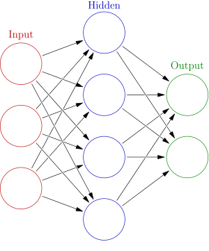

<ul>
<li><strong> <a href="https://github.com/manjunath5496/1Day-of-Python-Learning-Tutorial/blob/main/README.md">Python Tutorial</a></strong></li>
</ul>
<hr><hr>
</br>

<p><strong>Machine learning</strong>&nbsp;(<strong>ML</strong>) is the&nbsp;<a title="Branches of science" href="https://en.wikipedia.org/wiki/Branches_of_science">scientific study</a>&nbsp;of&nbsp;<a title="Algorithm" href="https://en.wikipedia.org/wiki/Algorithm">algorithms</a>&nbsp;and&nbsp;<a title="Statistical model" href="https://en.wikipedia.org/wiki/Statistical_model">statistical models</a>&nbsp;that&nbsp;<a class="mw-redirect" title="Computer systems" href="https://en.wikipedia.org/wiki/Computer_systems">computer systems</a>&nbsp;use to perform a specific task without using explicit instructions, relying on patterns and&nbsp;<a title="Inference" href="https://en.wikipedia.org/wiki/Inference">inference</a>&nbsp;instead. It is seen as a subset of&nbsp;<a title="Artificial intelligence" href="https://en.wikipedia.org/wiki/Artificial_intelligence">artificial intelligence</a>. Machine learning algorithms build a&nbsp;<a title="Mathematical model" href="https://en.wikipedia.org/wiki/Mathematical_model">mathematical model</a>&nbsp;based on sample data, known as "<a class="mw-redirect" title="Training data" href="https://en.wikipedia.org/wiki/Training_data">training data</a>", in order to make predictions or decisions without being explicitly programmed to perform the task.&nbsp;Machine learning algorithms are used in a wide variety of applications, such as&nbsp;<a title="Email filtering" href="https://en.wikipedia.org/wiki/Email_filtering">email filtering</a>&nbsp;and&nbsp;<a title="Computer vision" href="https://en.wikipedia.org/wiki/Computer_vision">computer vision</a>, where it is difficult or infeasible to develop a conventional algorithm for effectively performing the task.</p>
<p>Machine learning is closely related to&nbsp;<a title="Computational statistics" href="https://en.wikipedia.org/wiki/Computational_statistics">computational statistics</a>, which focuses on making predictions using computers. The study of&nbsp;<a title="Mathematical optimization" href="https://en.wikipedia.org/wiki/Mathematical_optimization">mathematical optimization</a>&nbsp;delivers methods, theory and application domains to the field of machine learning.&nbsp;<a title="Data mining" href="https://en.wikipedia.org/wiki/Data_mining">Data mining</a>&nbsp;is a field of study within machine learning, and focuses on&nbsp;<a title="Exploratory data analysis" href="https://en.wikipedia.org/wiki/Exploratory_data_analysis">exploratory data analysis</a>&nbsp;through&nbsp;<a title="Unsupervised learning" href="https://en.wikipedia.org/wiki/Unsupervised_learning">unsupervised learning</a>.&nbsp;In its application across business problems, machine learning is also referred to as&nbsp;<a title="Predictive analytics" href="https://en.wikipedia.org/wiki/Predictive_analytics">predictive analytics</a>.</p>

</br>

<table class="vertical-navbox nowraplinks">
<tbody>
<tr>
<th><a class="mw-selflink selflink">Machine learning</a>&nbsp;and<br /><a title="Data mining" href="https://en.wikipedia.org/wiki/Data_mining">data mining</a></th>
</tr>
<tr>
<td><a class="image" href="Kernel_Machine.png"></a></td>
</tr>
<tr>
<td>
<div id="NavFrame1" class="NavFrame collapsed">
<div class="NavHead">Problems</div>
<div class="NavContent">
<div class="hlist">
<ul>
<li><a title="Statistical classification" href="https://en.wikipedia.org/wiki/Statistical_classification">Classification</a></li>
<li><a title="Cluster analysis" href="https://en.wikipedia.org/wiki/Cluster_analysis">Clustering</a></li>
<li><a title="Regression analysis" href="https://en.wikipedia.org/wiki/Regression_analysis">Regression</a></li>
<li><a title="Anomaly detection" href="https://en.wikipedia.org/wiki/Anomaly_detection">Anomaly detection</a></li>
<li><a title="Automated machine learning" href="https://en.wikipedia.org/wiki/Automated_machine_learning">AutoML</a></li>
<li><a title="Association rule learning" href="https://en.wikipedia.org/wiki/Association_rule_learning">Association rules</a></li>
<li><a title="Reinforcement learning" href="https://en.wikipedia.org/wiki/Reinforcement_learning">Reinforcement learning</a></li>
<li><a title="Structured prediction" href="https://en.wikipedia.org/wiki/Structured_prediction">Structured prediction</a></li>
<li><a title="Feature engineering" href="https://en.wikipedia.org/wiki/Feature_engineering">Feature engineering</a></li>
<li><a title="Feature learning" href="https://en.wikipedia.org/wiki/Feature_learning">Feature learning</a></li>
<li><a title="Online machine learning" href="https://en.wikipedia.org/wiki/Online_machine_learning">Online learning</a></li>
<li><a title="Semi-supervised learning" href="https://en.wikipedia.org/wiki/Semi-supervised_learning">Semi-supervised learning</a></li>
<li><a title="Unsupervised learning" href="https://en.wikipedia.org/wiki/Unsupervised_learning">Unsupervised learning</a></li>
<li><a title="Learning to rank" href="https://en.wikipedia.org/wiki/Learning_to_rank">Learning to rank</a></li>
<li><a title="Grammar induction" href="https://en.wikipedia.org/wiki/Grammar_induction">Grammar induction</a></li>
</ul>
</div>
</div>
</div>
</td>
</tr>
<tr>
<td>
<div id="NavFrame2" class="NavFrame collapsed">
<div class="NavHead">
<div><a title="Supervised learning" href="https://en.wikipedia.org/wiki/Supervised_learning">Supervised learning</a><br /><span class="nobold">(<strong><a title="Statistical classification" href="https://en.wikipedia.org/wiki/Statistical_classification">classification</a></strong>&nbsp;&bull;&nbsp;<strong><a title="Regression analysis" href="https://en.wikipedia.org/wiki/Regression_analysis">regression</a></strong>)</span></div>
</div>
<div class="NavContent">
<div class="hlist">
<ul>
<li><a title="Decision tree learning" href="https://en.wikipedia.org/wiki/Decision_tree_learning">Decision trees</a></li>
<li><a title="Ensemble learning" href="https://en.wikipedia.org/wiki/Ensemble_learning">Ensembles</a>&nbsp;
<ul>
<li><a title="Bootstrap aggregating" href="https://en.wikipedia.org/wiki/Bootstrap_aggregating">Bagging</a></li>
<li><a title="Boosting (machine learning)" href="https://en.wikipedia.org/wiki/Boosting_(machine_learning)">Boosting</a></li>
<li><a title="Random forest" href="https://en.wikipedia.org/wiki/Random_forest">Random forest</a></li>
</ul>
</li>
<li><a title="K-nearest neighbors algorithm" href="https://en.wikipedia.org/wiki/K-nearest_neighbors_algorithm"><em>k</em>-NN</a></li>
<li><a title="Linear regression" href="https://en.wikipedia.org/wiki/Linear_regression">Linear regression</a></li>
<li><a title="Naive Bayes classifier" href="https://en.wikipedia.org/wiki/Naive_Bayes_classifier">Naive Bayes</a></li>
<li><a title="Artificial neural network" href="https://en.wikipedia.org/wiki/Artificial_neural_network">Artificial neural networks</a></li>
<li><a title="Logistic regression" href="https://en.wikipedia.org/wiki/Logistic_regression">Logistic regression</a></li>
<li><a title="Perceptron" href="https://en.wikipedia.org/wiki/Perceptron">Perceptron</a></li>
<li><a title="Relevance vector machine" href="https://en.wikipedia.org/wiki/Relevance_vector_machine">Relevance vector machine (RVM)</a></li>
<li><a title="Support-vector machine" href="https://en.wikipedia.org/wiki/Support-vector_machine">Support vector machine (SVM)</a></li>
</ul>
</div>
</div>
</div>
</td>
</tr>
<tr>
<td>
<div id="NavFrame3" class="NavFrame collapsed">
<div class="NavHead"><a title="Cluster analysis" href="https://en.wikipedia.org/wiki/Cluster_analysis">Clustering</a></div>
<div class="NavContent">
<div class="hlist">
<ul>
<li><a title="BIRCH" href="https://en.wikipedia.org/wiki/BIRCH">BIRCH</a></li>
<li><a class="mw-redirect" title="CURE data clustering algorithm" href="https://en.wikipedia.org/wiki/CURE_data_clustering_algorithm">CURE</a></li>
<li><a title="Hierarchical clustering" href="https://en.wikipedia.org/wiki/Hierarchical_clustering">Hierarchical</a></li>
<li><a title="K-means clustering" href="https://en.wikipedia.org/wiki/K-means_clustering"><em>k</em>-means</a></li>
<li><a title="Expectation&ndash;maximization algorithm" href="https://en.wikipedia.org/wiki/Expectation%E2%80%93maximization_algorithm">Expectation&ndash;maximization (EM)</a></li>
<li><a title="DBSCAN" href="https://en.wikipedia.org/wiki/DBSCAN">DBSCAN</a></li>
<li><a title="OPTICS algorithm" href="https://en.wikipedia.org/wiki/OPTICS_algorithm">OPTICS</a></li>
<li><a class="mw-redirect" title="Mean-shift" href="https://en.wikipedia.org/wiki/Mean-shift">Mean-shift</a></li>
</ul>
</div>
</div>
</div>
</td>
</tr>
<tr>
<td>
<div id="NavFrame4" class="NavFrame collapsed">
<div class="NavHead"><a title="Dimensionality reduction" href="https://en.wikipedia.org/wiki/Dimensionality_reduction">Dimensionality reduction</a></div>
<div class="NavContent">
<div class="hlist">
<ul>
<li><a title="Factor analysis" href="https://en.wikipedia.org/wiki/Factor_analysis">Factor analysis</a></li>
<li><a class="mw-redirect" title="Canonical correlation analysis" href="https://en.wikipedia.org/wiki/Canonical_correlation_analysis">CCA</a></li>
<li><a title="Independent component analysis" href="https://en.wikipedia.org/wiki/Independent_component_analysis">ICA</a></li>
<li><a title="Linear discriminant analysis" href="https://en.wikipedia.org/wiki/Linear_discriminant_analysis">LDA</a></li>
<li><a title="Non-negative matrix factorization" href="https://en.wikipedia.org/wiki/Non-negative_matrix_factorization">NMF</a></li>
<li><a title="Principal component analysis" href="https://en.wikipedia.org/wiki/Principal_component_analysis">PCA</a></li>
<li><a title="T-distributed stochastic neighbor embedding" href="https://en.wikipedia.org/wiki/T-distributed_stochastic_neighbor_embedding">t-SNE</a></li>
</ul>
</div>
</div>
</div>
</td>
</tr>
<tr>
<td>
<div id="NavFrame5" class="NavFrame collapsed">
<div class="NavHead"><a title="Structured prediction" href="https://en.wikipedia.org/wiki/Structured_prediction">Structured prediction</a></div>
<div class="NavContent">
<div class="hlist">
<ul>
<li><a title="Graphical model" href="https://en.wikipedia.org/wiki/Graphical_model">Graphical models</a>&nbsp;
<ul>
<li><a title="Bayesian network" href="https://en.wikipedia.org/wiki/Bayesian_network">Bayes net</a></li>
<li><a title="Conditional random field" href="https://en.wikipedia.org/wiki/Conditional_random_field">Conditional random field</a></li>
<li><a title="Hidden Markov model" href="https://en.wikipedia.org/wiki/Hidden_Markov_model">Hidden Markov</a></li>
</ul>
</li>
</ul>
</div>
</div>
</div>
</td>
</tr>
<tr>
<td>
<div id="NavFrame6" class="NavFrame collapsed">
<div class="NavHead"><a title="Anomaly detection" href="https://en.wikipedia.org/wiki/Anomaly_detection">Anomaly detection</a></div>
<div class="NavContent">
<div class="hlist">
<ul>
<li><a class="mw-redirect" title="K-nearest neighbors classification" href="https://en.wikipedia.org/wiki/K-nearest_neighbors_classification"><em>k</em>-NN</a></li>
<li><a title="Local outlier factor" href="https://en.wikipedia.org/wiki/Local_outlier_factor">Local outlier factor</a></li>
</ul>
</div>
</div>
</div>
</td>
</tr>
<tr>
<td>
<div id="NavFrame7" class="NavFrame collapsed">
<div class="NavHead"><a title="Artificial neural network" href="https://en.wikipedia.org/wiki/Artificial_neural_network">Artificial neural network</a></div>
<div class="NavContent">
<div class="hlist">
<ul>
<li><a title="Autoencoder" href="https://en.wikipedia.org/wiki/Autoencoder">Autoencoder</a></li>
<li><a title="Deep learning" href="https://en.wikipedia.org/wiki/Deep_learning">Deep learning</a></li>
<li><a title="DeepDream" href="https://en.wikipedia.org/wiki/DeepDream">DeepDream</a></li>
<li><a title="Multilayer perceptron" href="https://en.wikipedia.org/wiki/Multilayer_perceptron">Multilayer perceptron</a></li>
<li><a title="Recurrent neural network" href="https://en.wikipedia.org/wiki/Recurrent_neural_network">RNN</a>&nbsp;
<ul>
<li><a title="Long short-term memory" href="https://en.wikipedia.org/wiki/Long_short-term_memory">LSTM</a></li>
<li><a title="Gated recurrent unit" href="https://en.wikipedia.org/wiki/Gated_recurrent_unit">GRU</a></li>
</ul>
</li>
<li><a title="Restricted Boltzmann machine" href="https://en.wikipedia.org/wiki/Restricted_Boltzmann_machine">Restricted Boltzmann machine</a></li>
<li><a title="Generative adversarial network" href="https://en.wikipedia.org/wiki/Generative_adversarial_network">GAN</a></li>
<li><a title="Self-organizing map" href="https://en.wikipedia.org/wiki/Self-organizing_map">SOM</a></li>
<li><a title="Convolutional neural network" href="https://en.wikipedia.org/wiki/Convolutional_neural_network">Convolutional neural network</a>&nbsp;
<ul>
<li><a title="U-Net" href="https://en.wikipedia.org/wiki/U-Net">U-Net</a></li>
</ul>
</li>
</ul>
</div>
</div>
</div>
</td>
</tr>
<tr>
<td>
<div id="NavFrame8" class="NavFrame collapsed">
<div class="NavHead"><a title="Reinforcement learning" href="https://en.wikipedia.org/wiki/Reinforcement_learning">Reinforcement learning</a></div>
<div class="NavContent">
<div class="hlist">
<ul>
<li><a title="Q-learning" href="https://en.wikipedia.org/wiki/Q-learning">Q-learning</a></li>
<li><a title="State&ndash;action&ndash;reward&ndash;state&ndash;action" href="https://en.wikipedia.org/wiki/State%E2%80%93action%E2%80%93reward%E2%80%93state%E2%80%93action">SARSA</a></li>
<li><a title="Temporal difference learning" href="https://en.wikipedia.org/wiki/Temporal_difference_learning">Temporal difference (TD)</a></li>
</ul>
</div>
</div>
</div>
</td>
</tr>
<tr>
<td>
<div id="NavFrame9" class="NavFrame collapsed">
<div class="NavHead">Theory</div>
<div class="NavContent">
<div class="hlist">
<ul>
<li><a class="mw-redirect" title="Bias&ndash;variance dilemma" href="https://en.wikipedia.org/wiki/Bias%E2%80%93variance_dilemma">Bias&ndash;variance dilemma</a></li>
<li><a title="Computational learning theory" href="https://en.wikipedia.org/wiki/Computational_learning_theory">Computational learning theory</a></li>
<li><a title="Empirical risk minimization" href="https://en.wikipedia.org/wiki/Empirical_risk_minimization">Empirical risk minimization</a></li>
<li><a title="Occam learning" href="https://en.wikipedia.org/wiki/Occam_learning">Occam learning</a></li>
<li><a title="Probably approximately correct learning" href="https://en.wikipedia.org/wiki/Probably_approximately_correct_learning">PAC learning</a></li>
<li><a title="Statistical learning theory" href="https://en.wikipedia.org/wiki/Statistical_learning_theory">Statistical learning</a></li>
<li><a title="Vapnik&ndash;Chervonenkis theory" href="https://en.wikipedia.org/wiki/Vapnik%E2%80%93Chervonenkis_theory">VC theory</a></li>
</ul>
</div>
</div>
</div>
</td>
</tr>
<tr>
<td>
<div id="NavFrame10" class="NavFrame collapsed">
<div class="NavHead">Machine-learning venues</div>
<div class="NavContent">
<div class="hlist">
<ul>
<li><a title="Conference on Neural Information Processing Systems" href="https://en.wikipedia.org/wiki/Conference_on_Neural_Information_Processing_Systems">NeurIPS</a></li>
<li><a title="International Conference on Machine Learning" href="https://en.wikipedia.org/wiki/International_Conference_on_Machine_Learning">ICML</a></li>
<li><a title="Machine Learning (journal)" href="https://en.wikipedia.org/wiki/Machine_Learning_(journal)">ML</a></li>
<li><a title="Journal of Machine Learning Research" href="https://en.wikipedia.org/wiki/Journal_of_Machine_Learning_Research">JMLR</a></li>
<li><a class="external text" href="https://arxiv.org/list/cs.LG/recent" rel="nofollow">ArXiv:cs.LG</a></li>
</ul>
</div>
</div>
</div>
</td>
</tr>
<tr>
<td>
<div id="NavFrame11" class="NavFrame collapsed">
<div class="NavContent">
<div class="hlist">
<ul>
<li><a title="Glossary of artificial intelligence" href="https://en.wikipedia.org/wiki/Glossary_of_artificial_intelligence">Glossary of artificial intelligence</a></li>
</ul>
</div>
</div>
</div>
</td>
</tr>
<tr>
<td>
<div id="NavFrame12" class="NavFrame collapsed">
<div class="NavHead">Related articles</div>
<div class="NavContent">
<div class="hlist">
<ul>
<li><a title="List of datasets for machine-learning research" href="https://en.wikipedia.org/wiki/List_of_datasets_for_machine-learning_research">List of datasets for machine-learning research</a></li>
<li><a title="Outline of machine learning" href="https://en.wikipedia.org/wiki/Outline_of_machine_learning">Outline of machine learning</a></li>
</ul>
</div>
</div>
</div>
</td>
</tr>
</tbody>
</table>

</br>

<h2>Timeline of machine learning</h2>
<table class="wikitable sortable jquery-tablesorter">
<thead>
<tr style="height: 13px;">
<th class="headerSort" style="height: 13px;" tabindex="0" title="Sort ascending">Year</th>
<th class="headerSort" style="height: 13px;" tabindex="0" title="Sort ascending">Event type</th>
<th class="headerSort" style="height: 13px;" tabindex="0" title="Sort ascending">Caption</th>
<th class="headerSort" style="height: 13px;" tabindex="0" title="Sort ascending">Event</th>
</tr>
</thead>
<tbody>
<tr style="height: 26px;">
<td style="height: 26px;">1763</td>
<td style="height: 26px;">Discovery</td>
<td style="height: 26px;">The Underpinnings of&nbsp;<a title="Bayes' theorem" href="https://en.wikipedia.org/wiki/Bayes%27_theorem">Bayes' Theorem</a></td>
<td style="height: 26px;"><a title="Thomas Bayes" href="https://en.wikipedia.org/wiki/Thomas_Bayes">Thomas Bayes</a>'s work&nbsp;<em><a title="An Essay towards solving a Problem in the Doctrine of Chances" href="https://en.wikipedia.org/wiki/An_Essay_towards_solving_a_Problem_in_the_Doctrine_of_Chances">An Essay towards solving a Problem in the Doctrine of Chances</a></em>&nbsp;is published two years after his death, having been amended and edited by a friend of Bayes,&nbsp;<a title="Richard Price" href="https://en.wikipedia.org/wiki/Richard_Price">Richard Price</a>.&nbsp;The essay presents work which underpins&nbsp;<a class="mw-redirect" title="Bayes theorem" href="https://en.wikipedia.org/wiki/Bayes_theorem">Bayes theorem</a>.</td>
</tr>
<tr style="height: 26px;">
<td style="height: 26px;">1805</td>
<td style="height: 26px;">Discovery</td>
<td style="height: 26px;">Least Square</td>
<td style="height: 26px;"><a title="Adrien-Marie Legendre" href="https://en.wikipedia.org/wiki/Adrien-Marie_Legendre">Adrien-Marie Legendre</a>&nbsp;describes the "m&eacute;thode des moindres carr&eacute;s", known in English as the&nbsp;<a title="Least squares" href="https://en.wikipedia.org/wiki/Least_squares">least squares</a>&nbsp;method.&nbsp;The least squares method is used widely in&nbsp;<a class="mw-redirect" title="Data fitting" href="https://en.wikipedia.org/wiki/Data_fitting">data fitting</a>.</td>
</tr>
<tr style="height: 26px;">
<td style="height: 26px;">1812</td>
<td style="height: 26px;">&nbsp;</td>
<td style="height: 26px;"><a title="Bayes' theorem" href="https://en.wikipedia.org/wiki/Bayes%27_theorem">Bayes' Theorem</a></td>
<td style="height: 26px;"><a title="Pierre-Simon Laplace" href="https://en.wikipedia.org/wiki/Pierre-Simon_Laplace">Pierre-Simon Laplace</a>&nbsp;publishes&nbsp;<em>Th&eacute;orie Analytique des Probabilit&eacute;s</em>, in which he expands upon the work of Bayes and defines what is now known as&nbsp;<a class="mw-redirect" title="Bayes' Theorem" href="https://en.wikipedia.org/wiki/Bayes%27_Theorem">Bayes' Theorem</a>.</td>
</tr>
<tr style="height: 13px;">
<td style="height: 13px;">1913</td>
<td style="height: 13px;">Discovery</td>
<td style="height: 13px;">Markov Chains</td>
<td style="height: 13px;"><a title="Andrey Markov" href="https://en.wikipedia.org/wiki/Andrey_Markov">Andrey Markov</a>&nbsp;first describes techniques he used to analyse a poem. The techniques later become known as&nbsp;<a class="mw-redirect" title="Markov chains" href="https://en.wikipedia.org/wiki/Markov_chains">Markov chains</a>.</td>
</tr>
<tr style="height: 26px;">
<td style="height: 26px;">1950</td>
<td style="height: 26px;">&nbsp;</td>
<td style="height: 26px;">Turing's Learning Machine</td>
<td style="height: 26px;"><a title="Alan Turing" href="https://en.wikipedia.org/wiki/Alan_Turing">Alan Turing</a>&nbsp;proposes a 'learning machine' that could learn and become artificially intelligent. Turing's specific proposal foreshadows&nbsp;<a class="mw-redirect" title="Genetic algorithms" href="https://en.wikipedia.org/wiki/Genetic_algorithms">genetic algorithms</a>.</td>
</tr>
<tr style="height: 26px;">
<td style="height: 26px;">1951</td>
<td style="height: 26px;">&nbsp;</td>
<td style="height: 26px;">First Neural Network Machine</td>
<td style="height: 26px;"><a title="Marvin Minsky" href="https://en.wikipedia.org/wiki/Marvin_Minsky">Marvin Minsky</a>&nbsp;and Dean Edmonds build the first neural network machine, able to learn, the&nbsp;<a title="Stochastic neural analog reinforcement calculator" href="https://en.wikipedia.org/wiki/Stochastic_neural_analog_reinforcement_calculator">SNARC</a>.</td>
</tr>
<tr style="height: 26px;">
<td style="height: 26px;">1952</td>
<td style="height: 26px;">&nbsp;</td>
<td style="height: 26px;">Machines Playing Checkers</td>
<td style="height: 26px;"><a title="Arthur Samuel" href="https://en.wikipedia.org/wiki/Arthur_Samuel">Arthur Samuel</a>&nbsp;joins IBM's Poughkeepsie Laboratory and begins working on some of the very first machine learning programs, first creating programs that play&nbsp;<a class="mw-redirect" title="Checkers" href="https://en.wikipedia.org/wiki/Checkers">checkers</a>.</td>
</tr>
<tr style="height: 30.6875px;">
<td style="height: 30.6875px;">1957</td>
<td style="height: 30.6875px;">Discovery</td>
<td style="height: 30.6875px;">Perceptron</td>
<td style="height: 30.6875px;"><a title="Frank Rosenblatt" href="https://en.wikipedia.org/wiki/Frank_Rosenblatt">Frank Rosenblatt</a>&nbsp;invents the&nbsp;<a title="Perceptron" href="https://en.wikipedia.org/wiki/Perceptron">perceptron</a>&nbsp;while working at the&nbsp;<a class="mw-redirect" title="Cornell Aeronautical Laboratory" href="https://en.wikipedia.org/wiki/Cornell_Aeronautical_Laboratory">Cornell Aeronautical Laboratory</a>.&nbsp;The invention of the perceptron generated a great deal of excitement and was widely covered in the media.</td>
</tr>
<tr style="height: 28px;">
<td style="height: 28px;">1963</td>
<td style="height: 28px;">Achievement</td>
<td style="height: 28px;">Machines Playing Tic-Tac-Toe</td>
<td style="height: 28px;"><a title="Donald Michie" href="https://en.wikipedia.org/wiki/Donald_Michie">Donald Michie</a>&nbsp;creates a 'machine' consisting of 304 match boxes and beads, which uses&nbsp;<a title="Reinforcement learning" href="https://en.wikipedia.org/wiki/Reinforcement_learning">reinforcement learning</a>&nbsp;to play&nbsp;<a title="Tic-tac-toe" href="https://en.wikipedia.org/wiki/Tic-tac-toe">Tic-tac-toe</a>&nbsp;(also known as noughts and crosses).</td>
</tr>
<tr style="height: 28px;">
<td style="height: 28px;">1967</td>
<td style="height: 28px;">&nbsp;</td>
<td style="height: 28px;">Nearest Neighbor</td>
<td style="height: 28px;">The nearest neighbor algorithm was created, which is the start of basic pattern recognition. The algorithm was used to map routes.</td>
</tr>
<tr style="height: 41px;">
<td style="height: 41px;">1969</td>
<td style="height: 41px;">&nbsp;</td>
<td style="height: 41px;">Limitations of Neural Networks</td>
<td style="height: 41px;"><a title="Marvin Minsky" href="https://en.wikipedia.org/wiki/Marvin_Minsky">Marvin Minsky</a>&nbsp;and&nbsp;<a title="Seymour Papert" href="https://en.wikipedia.org/wiki/Seymour_Papert">Seymour Papert</a>&nbsp;publish their book&nbsp;<em><a title="Perceptrons (book)" href="https://en.wikipedia.org/wiki/Perceptrons_(book)">Perceptrons</a></em>, describing some of the limitations of perceptrons and neural networks. The interpretation that the book shows that neural networks are fundamentally limited is seen as a hindrance for research into neural networks.</td>
</tr>
<tr style="height: 43px;">
<td style="height: 43px;">1970</td>
<td style="height: 43px;">&nbsp;</td>
<td style="height: 43px;">Automatic Differentiation (Backpropagation)</td>
<td style="height: 43px;"><a title="Seppo Linnainmaa" href="https://en.wikipedia.org/wiki/Seppo_Linnainmaa">Seppo Linnainmaa</a>&nbsp;publishes the general method for automatic differentiation (AD) of discrete connected networks of nested differentiable functions.&nbsp;This corresponds to the modern version of backpropagation, but is not yet named as such.</td>
</tr>
<tr style="height: 15px;">
<td style="height: 15px;">1979</td>
<td style="height: 15px;">&nbsp;</td>
<td style="height: 15px;">Stanford Cart</td>
<td style="height: 15px;">Students at Stanford University develop a cart that can navigate and avoid obstacles in a room.</td>
</tr>
<tr style="height: 30px;">
<td style="height: 30px;">1979</td>
<td style="height: 30px;">Discovery</td>
<td style="height: 30px;">Neocognitron</td>
<td style="height: 30px;"><a title="Kunihiko Fukushima" href="https://en.wikipedia.org/wiki/Kunihiko_Fukushima">Kunihiko Fukushima</a>&nbsp;first publishes his work on the&nbsp;<a title="Neocognitron" href="https://en.wikipedia.org/wiki/Neocognitron">neocognitron</a>, a type of&nbsp;<a title="Artificial neural network" href="https://en.wikipedia.org/wiki/Artificial_neural_network">artificial neural network</a>&nbsp;(ANN).&nbsp;<a title="Neocognitron" href="https://en.wikipedia.org/wiki/Neocognitron">Neocognition</a>&nbsp;later inspires&nbsp;<a title="Convolutional neural network" href="https://en.wikipedia.org/wiki/Convolutional_neural_network">convolutional neural networks</a>&nbsp;(CNNs).</td>
</tr>
<tr style="height: 28px;">
<td style="height: 28px;">1981</td>
<td style="height: 28px;">&nbsp;</td>
<td style="height: 28px;">Explanation Based Learning</td>
<td style="height: 28px;">Gerald Dejong introduces Explanation Based Learning, where a computer algorithm analyses data and creates a general rule it can follow and discard unimportant data.</td>
</tr>
<tr style="height: 28px;">
<td style="height: 28px;">1982</td>
<td style="height: 28px;">Discovery</td>
<td style="height: 28px;">Recurrent Neural Network</td>
<td style="height: 28px;"><a title="John Hopfield" href="https://en.wikipedia.org/wiki/John_Hopfield">John Hopfield</a>&nbsp;popularizes&nbsp;<a class="mw-redirect" title="Hopfield networks" href="https://en.wikipedia.org/wiki/Hopfield_networks">Hopfield networks</a>, a type of&nbsp;<a title="Recurrent neural network" href="https://en.wikipedia.org/wiki/Recurrent_neural_network">recurrent neural network</a>&nbsp;that can serve as&nbsp;<a title="Content-addressable memory" href="https://en.wikipedia.org/wiki/Content-addressable_memory">content-addressable memory</a>&nbsp;systems.</td>
</tr>
<tr style="height: 15px;">
<td style="height: 15px;">1985</td>
<td style="height: 15px;">&nbsp;</td>
<td style="height: 15px;">NetTalk</td>
<td style="height: 15px;">A program that learns to pronounce words the same way a baby does, is developed by Terry Sejnowski.</td>
</tr>
<tr style="height: 28px;">
<td style="height: 28px;">1986</td>
<td style="height: 28px;">Application</td>
<td style="height: 28px;">Backpropagation</td>
<td style="height: 28px;"><a title="Seppo Linnainmaa" href="https://en.wikipedia.org/wiki/Seppo_Linnainmaa">Seppo Linnainmaa</a>'s reverse mode of&nbsp;<a title="Automatic differentiation" href="https://en.wikipedia.org/wiki/Automatic_differentiation">automatic differentiation</a>&nbsp;(first applied to neural networks by&nbsp;<a title="Paul Werbos" href="https://en.wikipedia.org/wiki/Paul_Werbos">Paul Werbos</a>) is used in experiments by&nbsp;<a title="David Rumelhart" href="https://en.wikipedia.org/wiki/David_Rumelhart">David Rumelhart</a>,&nbsp;<a class="mw-redirect" title="Geoff Hinton" href="https://en.wikipedia.org/wiki/Geoff_Hinton">Geoff Hinton</a>&nbsp;and&nbsp;<a title="Ronald J. Williams" href="https://en.wikipedia.org/wiki/Ronald_J._Williams">Ronald J. Williams</a>&nbsp;to learn&nbsp;<a class="mw-redirect" title="Knowledge representation" href="https://en.wikipedia.org/wiki/Knowledge_representation">internal representations</a>.</td>
</tr>
<tr style="height: 15px;">
<td style="height: 15px;">1989</td>
<td style="height: 15px;">Discovery</td>
<td style="height: 15px;">Reinforcement Learning</td>
<td style="height: 15px;">Christopher Watkins develops&nbsp;<a title="Q-learning" href="https://en.wikipedia.org/wiki/Q-learning">Q-learning</a>, which greatly improves the practicality and feasibility of&nbsp;<a title="Reinforcement learning" href="https://en.wikipedia.org/wiki/Reinforcement_learning">reinforcement learning</a>.</td>
</tr>
<tr style="height: 39px;">
<td style="height: 39px;">1989</td>
<td style="height: 39px;">Commercialization</td>
<td style="height: 39px;">Commercialization of Machine Learning on Personal Computers</td>
<td style="height: 39px;">Axcelis, Inc. releases&nbsp;<a title="Evolver (software)" href="https://en.wikipedia.org/wiki/Evolver_(software)">Evolver</a>, the first software package to commercialize the use of genetic algorithms on personal computers.</td>
</tr>
<tr style="height: 41px;">
<td style="height: 41px;">1992</td>
<td style="height: 41px;">Achievement</td>
<td style="height: 41px;">Machines Playing Backgammon</td>
<td style="height: 41px;">Gerald Tesauro develops&nbsp;<a title="TD-Gammon" href="https://en.wikipedia.org/wiki/TD-Gammon">TD-Gammon</a>, a computer&nbsp;<a title="Backgammon" href="https://en.wikipedia.org/wiki/Backgammon">backgammon</a>&nbsp;program that uses an&nbsp;<a title="Artificial neural network" href="https://en.wikipedia.org/wiki/Artificial_neural_network">artificial neural network</a>&nbsp;trained using&nbsp;<a class="mw-redirect" title="Temporal-difference learning" href="https://en.wikipedia.org/wiki/Temporal-difference_learning">temporal-difference learning</a>&nbsp;(hence the 'TD' in the name). TD-Gammon is able to rival, but not consistently surpass, the abilities of top human backgammon players.</td>
</tr>
<tr style="height: 15px;">
<td style="height: 15px;">1995</td>
<td style="height: 15px;">Discovery</td>
<td style="height: 15px;">Random Forest Algorithm</td>
<td style="height: 15px;">Tin Kam Ho publishes a paper describing&nbsp;<a title="Random forest" href="https://en.wikipedia.org/wiki/Random_forest">random decision forests</a>.</td>
</tr>
<tr style="height: 15px;">
<td style="height: 15px;">1995</td>
<td style="height: 15px;">Discovery</td>
<td style="height: 15px;">Support Vector Machines</td>
<td style="height: 15px;"><a title="Corinna Cortes" href="https://en.wikipedia.org/wiki/Corinna_Cortes">Corinna Cortes</a>&nbsp;and&nbsp;<a title="Vladimir Vapnik" href="https://en.wikipedia.org/wiki/Vladimir_Vapnik">Vladimir Vapnik</a>&nbsp;publish their work on&nbsp;<a class="mw-redirect" title="Support vector machines" href="https://en.wikipedia.org/wiki/Support_vector_machines">support vector machines</a>.</td>
</tr>
<tr style="height: 26px;">
<td style="height: 26px;">1997</td>
<td style="height: 26px;">Achievement</td>
<td style="height: 26px;">IBM Deep Blue Beats Kasparov</td>
<td style="height: 26px;">IBM's&nbsp;<a title="Deep Blue (chess computer)" href="https://en.wikipedia.org/wiki/Deep_Blue_(chess_computer)">Deep Blue</a>&nbsp;beats the world champion at chess.</td>
</tr>
<tr style="height: 28px;">
<td style="height: 28px;">1997</td>
<td style="height: 28px;">Discovery</td>
<td style="height: 28px;">LSTM</td>
<td style="height: 28px;"><a title="Sepp Hochreiter" href="https://en.wikipedia.org/wiki/Sepp_Hochreiter">Sepp Hochreiter</a>&nbsp;and&nbsp;<a title="J&uuml;rgen Schmidhuber" href="https://en.wikipedia.org/wiki/J%C3%BCrgen_Schmidhuber">J&uuml;rgen Schmidhuber</a>&nbsp;invent&nbsp;<a title="Long short-term memory" href="https://en.wikipedia.org/wiki/Long_short-term_memory">long short-term memory</a>&nbsp;(LSTM) recurrent neural networks,&nbsp;greatly improving the efficiency and practicality of recurrent neural networks.</td>
</tr>
<tr style="height: 41px;">
<td style="height: 41px;">1998</td>
<td style="height: 41px;">&nbsp;</td>
<td style="height: 41px;">MNIST database</td>
<td style="height: 41px;">A team led by&nbsp;<a title="Yann LeCun" href="https://en.wikipedia.org/wiki/Yann_LeCun">Yann LeCun</a>&nbsp;releases the&nbsp;<a title="MNIST database" href="https://en.wikipedia.org/wiki/MNIST_database">MNIST database</a>, a dataset comprising a mix of handwritten digits from&nbsp;<a class="mw-redirect" title="American Census Bureau" href="https://en.wikipedia.org/wiki/American_Census_Bureau">American Census Bureau</a>&nbsp;employees and American high school students.&nbsp;The MNIST database has since become a benchmark for evaluating handwriting recognition.</td>
</tr>
<tr style="height: 26px;">
<td style="height: 26px;">2002</td>
<td style="height: 26px;">&nbsp;</td>
<td style="height: 26px;">Torch Machine Learning Library</td>
<td style="height: 26px;"><a title="Torch (machine learning)" href="https://en.wikipedia.org/wiki/Torch_(machine_learning)">Torch</a>, a software library for machine learning, is first released.</td>
</tr>
<tr style="height: 41px;">
<td style="height: 41px;">2006</td>
<td style="height: 41px;">&nbsp;</td>
<td style="height: 41px;">The Netflix Prize</td>
<td style="height: 41px;">The&nbsp;<a title="Netflix Prize" href="https://en.wikipedia.org/wiki/Netflix_Prize">Netflix Prize</a>&nbsp;competition is launched by&nbsp;<a title="Netflix" href="https://en.wikipedia.org/wiki/Netflix">Netflix</a>. The aim of the competition was to use machine learning to beat Netflix's own recommendation software's accuracy in predicting a user's rating for a film given their ratings for previous films by at least 10%.&nbsp;The prize was won in 2009.</td>
</tr>
<tr style="height: 43px;">
<td style="height: 43px;">2009</td>
<td style="height: 43px;">Achievement</td>
<td style="height: 43px;">ImageNet</td>
<td style="height: 43px;"><a title="ImageNet" href="https://en.wikipedia.org/wiki/ImageNet">ImageNet</a>&nbsp;is created. ImageNet is a large visual database envisioned by&nbsp;<a title="Fei-Fei Li" href="https://en.wikipedia.org/wiki/Fei-Fei_Li">Fei-Fei Li</a>&nbsp;from Stanford University, who realized that the best machine learning algorithms wouldn't work well if the data didn't reflect the real world.&nbsp;For many, ImageNet was the catalyst for the AI boom&nbsp;of the 21st century.</td>
</tr>
<tr style="height: 15px;">
<td style="height: 15px;">2010</td>
<td style="height: 15px;">&nbsp;</td>
<td style="height: 15px;">Kaggle Competition</td>
<td style="height: 15px;"><a title="Kaggle" href="https://en.wikipedia.org/wiki/Kaggle">Kaggle</a>, a website that serves as a platform for machine learning competitions, is launched.</td>
</tr>
<tr style="height: 39px;">
<td style="height: 39px;">2010</td>
<td style="height: 39px;">&nbsp;</td>
<td style="height: 39px;">Wall Street Journal Profiles Machine Learning Investing</td>
<td style="height: 39px;">The WSJ Profiles new wave of investing and focuses on RebellionResearch.com which would be the subject of author Scott Patterson's Novel, Dark Pools.</td>
</tr>
<tr style="height: 28px;">
<td style="height: 28px;">2011</td>
<td style="height: 28px;">Achievement</td>
<td style="height: 28px;">Beating Humans in Jeopardy</td>
<td style="height: 28px;">Using a combination of machine learning,&nbsp;<a title="Natural language processing" href="https://en.wikipedia.org/wiki/Natural_language_processing">natural language processing</a>&nbsp;and information retrieval techniques,&nbsp;<a title="IBM" href="https://en.wikipedia.org/wiki/IBM">IBM</a>'s&nbsp;<a title="Watson (computer)" href="https://en.wikipedia.org/wiki/Watson_(computer)">Watson</a>&nbsp;beats two human champions in a&nbsp;<a title="Jeopardy!" href="https://en.wikipedia.org/wiki/Jeopardy!">Jeopardy!</a>&nbsp;competition.</td>
</tr>
<tr style="height: 28px;">
<td style="height: 28px;">2012</td>
<td style="height: 28px;">Achievement</td>
<td style="height: 28px;">Recognizing Cats on YouTube</td>
<td style="height: 28px;">The&nbsp;<a title="Google Brain" href="https://en.wikipedia.org/wiki/Google_Brain">Google Brain</a>&nbsp;team, led by&nbsp;<a title="Andrew Ng" href="https://en.wikipedia.org/wiki/Andrew_Ng">Andrew Ng</a>&nbsp;and&nbsp;<a title="Jeff Dean (computer scientist)" href="https://en.wikipedia.org/wiki/Jeff_Dean_(computer_scientist)">Jeff Dean</a>, create a neural network that learns to recognize cats by watching unlabeled images taken from frames of&nbsp;<a title="YouTube" href="https://en.wikipedia.org/wiki/YouTube">YouTube</a>&nbsp;videos.</td>
</tr>
<tr style="height: 28px;">
<td style="height: 28px;">2014</td>
<td style="height: 28px;">&nbsp;</td>
<td style="height: 28px;">Leap in Face Recognition</td>
<td style="height: 28px;"><a title="Facebook" href="https://en.wikipedia.org/wiki/Facebook">Facebook</a>&nbsp;researchers publish their work on&nbsp;<a title="DeepFace" href="https://en.wikipedia.org/wiki/DeepFace">DeepFace</a>, a system that uses neural networks that identifies faces with 97.35% accuracy. The results are an improvement of more than 27% over previous systems and rivals human performance.</td>
</tr>
<tr style="height: 30px;">
<td style="height: 30px;">2014</td>
<td style="height: 30px;">&nbsp;</td>
<td style="height: 30px;">Sibyl</td>
<td style="height: 30px;">Researchers from&nbsp;<a title="Google" href="https://en.wikipedia.org/wiki/Google">Google</a>&nbsp;detail their work on Sibyl,&nbsp;a proprietary platform for massively parallel machine learning used internally by Google to make predictions about user behavior and provide recommendations.</td>
</tr>
<tr style="height: 41px;">
<td style="height: 41px;">2016</td>
<td style="height: 41px;">Achievement</td>
<td style="height: 41px;">Beating Humans in Go</td>
<td style="height: 41px;">Google's&nbsp;<a title="AlphaGo" href="https://en.wikipedia.org/wiki/AlphaGo">AlphaGo</a>&nbsp;program becomes the first&nbsp;<a title="Computer Go" href="https://en.wikipedia.org/wiki/Computer_Go">Computer Go</a>&nbsp;program to beat an unhandicapped professional human player&nbsp;using a combination of machine learning and tree search techniques.&nbsp;Later improved as&nbsp;<a title="AlphaGo Zero" href="https://en.wikipedia.org/wiki/AlphaGo_Zero">AlphaGo Zero</a>&nbsp;and then in 2017 generalized to Chess and more two-player games with&nbsp;<a title="AlphaZero" href="https://en.wikipedia.org/wiki/AlphaZero">AlphaZero</a>.</td>
</tr>
</tbody>
</table>

</br>


<div class="toctitle" dir="ltr" lang="en">
<h2 id="mw-toc-heading">Contents</h2>
<label class="toctogglelabel" for="toctogglecheckbox"></label></div>
<ul>
<li class="toclevel-1 tocsection-1"><a href="#Overview"><span class="toctext">Overview</span></a>
<ul>
<li class="toclevel-2 tocsection-2"><a href="#Machine_learning_tasks"><span class="toctext">Machine learning tasks</span></a></li>
</ul>
</li>
<li class="toclevel-1 tocsection-3"><a href="#History_and_relationships_to_other_fields"><span class="toctext">History and relationships to other fields</span></a>
<ul>
<li class="toclevel-2 tocsection-4"><a href="#Relation_to_data_mining"><span class="toctext">Relation to data mining</span></a></li>
<li class="toclevel-2 tocsection-5"><a href="#Relation_to_optimization"><span class="toctext">Relation to optimization</span></a></li>
<li class="toclevel-2 tocsection-6"><a href="#Relation_to_statistics"><span class="toctext">Relation to statistics</span></a></li>
</ul>
</li>
<li class="toclevel-1 tocsection-7"><a href="#Theory"><span class="toctext">Theory</span></a></li>
<li class="toclevel-1 tocsection-8"><a href="#Approaches"><span class="toctext">Approaches</span></a>
<ul>
<li class="toclevel-2 tocsection-9"><a href="#Types_of_learning_algorithms"><span class="toctext">Types of learning algorithms</span></a>
<ul>
<li class="toclevel-3 tocsection-10"><a href="#Supervised_learning"><span class="toctext">Supervised learning</span></a></li>
<li class="toclevel-3 tocsection-11"><a href="#Unsupervised_learning"><span class="toctext">Unsupervised learning</span></a></li>
<li class="toclevel-3 tocsection-12"><a href="#Reinforcement_learning"><span class="toctext">Reinforcement learning</span></a></li>
<li class="toclevel-3 tocsection-13"><a href="#Self_learning"><span class="toctext">Self learning</span></a></li>
<li class="toclevel-3 tocsection-14"><a href="#Feature_learning"><span class="toctext">Feature learning</span></a></li>
<li class="toclevel-3 tocsection-15"><a href="#Sparse_dictionary_learning"><span class="toctext">Sparse dictionary learning</span></a></li>
<li class="toclevel-3 tocsection-16"><a href="#Anomaly_detection"><span class="toctext">Anomaly detection</span></a></li>
<li class="toclevel-3 tocsection-17"><a href="#Association_rules"><span class="toctext">Association rules</span></a></li>
</ul>
</li>
<li class="toclevel-2 tocsection-18"><a href="#Models"><span class="toctext">Models</span></a>
<ul>
<li class="toclevel-3 tocsection-19"><a href="#Artificial_neural_networks"><span class="toctext">Artificial neural networks</span></a></li>
<li class="toclevel-3 tocsection-20"><a href="#Decision_trees"><span class="toctext">Decision trees</span></a></li>
<li class="toclevel-3 tocsection-21"><a href="#Support_vector_machines"><span class="toctext">Support vector machines</span></a></li>
<li class="toclevel-3 tocsection-22"><a href="#Regression_analysis"><span class="toctext">Regression analysis</span></a></li>
<li class="toclevel-3 tocsection-23"><a href="#Bayesian_networks"><span class="toctext">Bayesian networks</span></a></li>
<li class="toclevel-3 tocsection-24"><a href="#Genetic_algorithms"><span class="toctext">Genetic algorithms</span></a></li>
</ul>
</li>
<li class="toclevel-2 tocsection-25"><a href="#Training_models"><span class="toctext">Training models</span></a>
<ul>
<li class="toclevel-3 tocsection-26"><a href="#Federated_learning"><span class="toctext">Federated learning</span></a></li>
</ul>
</li>
</ul>
</li>
<li class="toclevel-1 tocsection-27"><a href="#Applications"><span class="toctext">Applications</span></a></li>
<li class="toclevel-1 tocsection-28"><a href="#Limitations"><span class="toctext">Limitations</span></a>
<ul>
<li class="toclevel-2 tocsection-29"><a href="#Bias"><span class="toctext">Bias</span></a></li>
</ul>
</li>
<li class="toclevel-1 tocsection-30"><a href="#Model_assessments"><span class="toctext">Model assessments</span></a></li>
<li class="toclevel-1 tocsection-31"><a href="#Ethics"><span class="toctext">Ethics</span></a></li>
<li class="toclevel-1 tocsection-32"><a href="#Software"><span class="toctext">Software</span></a>
<ul>
<li class="toclevel-2 tocsection-33"><a href="#Free_and_open-source_software"><span class="toctext">Free and open-source software</span></a></li>
<li class="toclevel-2 tocsection-34"><a href="#Proprietary_software_with_free_and_open-source_editions"><span class="toctext">Proprietary software with free and open-source editions</span></a></li>
<li class="toclevel-2 tocsection-35"><a href="#Proprietary_software"><span class="toctext">Proprietary software</span></a></li>
</ul>
</li>
<li class="toclevel-1 tocsection-36"><a href="#Journals"><span class="toctext">Journals</span></a></li>
<li class="toclevel-1 tocsection-37"><a href="#Conferences"><span class="toctext">Conferences</span></a></li>
 <li class="toclevel-1 tocsection-38"><a href="#Books"><span class="toctext">Books</span></a></li>
  <li class="toclevel-1 tocsection-39"><a href="#Learn ML in 3 Months"><span class="toctext">Learn ML in 3 Months</span></a></li>
 <li class="toclevel-1 tocsection-40"><a href="#Data Science Resources"><span class="toctext"> Data Science Resources</span></a></li>
 

</ul>
</br>

<h2><span id="Overview" class="mw-headline">Overview</span></h2>
<p>The name&nbsp;<em>machine learning</em>&nbsp;was coined in 1959 by&nbsp;<a title="Arthur Samuel" href="https://en.wikipedia.org/wiki/Arthur_Samuel">Arthur Samuel</a>.<a title="Tom M. Mitchell" href="https://en.wikipedia.org/wiki/Tom_M._Mitchell">Tom M. Mitchell</a>&nbsp;provided a widely quoted, more formal definition of the algorithms studied in the machine learning field: "A computer program is said to learn from experience&nbsp;<em>E</em>&nbsp;with respect to some class of tasks&nbsp;<em>T</em>&nbsp;and performance measure&nbsp;<em>P</em>&nbsp;if its performance at tasks in&nbsp;<em>T</em>, as measured by&nbsp;<em>P</em>, improves with experience&nbsp;<em>E</em>."&nbsp;This definition of the tasks in which machine learning is concerned offers a fundamentally&nbsp;<a title="Operational definition" href="https://en.wikipedia.org/wiki/Operational_definition">operational definition</a>&nbsp;rather than defining the field in cognitive terms. This follows&nbsp;<a title="Alan Turing" href="https://en.wikipedia.org/wiki/Alan_Turing">Alan Turing</a>'s proposal in his paper "<a title="Computing Machinery and Intelligence" href="https://en.wikipedia.org/wiki/Computing_Machinery_and_Intelligence">Computing Machinery and Intelligence</a>", in which the question "Can machines think?" is replaced with the question "Can machines do what we (as thinking entities) can do?".&nbsp;In Turing's proposal the various characteristics that could be possessed by a&nbsp;<em>thinking machine</em>&nbsp;and the various implications in constructing one are exposed.</p>
<h3><span id="Machine_learning_tasks" class="mw-headline">Machine learning tasks</span></h3>
<p>&nbsp;</p>
<div class="thumb tright">
<div class="thumbinner"><a class="image" href="Svm_max_sep_hyperplane_with_margin.png"></a>
<div class="thumbcaption">
<div class="magnify">&nbsp;</div>
A&nbsp;<a class="mw-redirect" title="Support vector machine" href="https://en.wikipedia.org/wiki/Support_vector_machine">support vector machine</a>&nbsp;is a supervised learning model that divides the data into regions separated by a&nbsp;<a title="Linear classifier" href="https://en.wikipedia.org/wiki/Linear_classifier">linear boundary</a>. Here, the linear boundary divides the black circles from the white.</div>
</div>
</div>

</br>
<p>Machine learning tasks are classified into several broad categories. In&nbsp;<a title="Supervised learning" href="https://en.wikipedia.org/wiki/Supervised_learning">supervised learning</a>, the algorithm builds a&nbsp;<a title="Mathematical model" href="https://en.wikipedia.org/wiki/Mathematical_model">mathematical model</a>&nbsp;from a set of data that contains both the inputs and the desired outputs. For example, if the task were determining whether an image contained a certain object, the&nbsp;<a class="mw-redirect" title="Training data" href="https://en.wikipedia.org/wiki/Training_data">training data</a>&nbsp;for a supervised learning algorithm would include images with and without that object (the input), and each image would have a label (the output) designating whether it contained the object. In special cases, the input may be only partially available, or restricted to special feedback.&nbsp;<a title="Semi-supervised learning" href="https://en.wikipedia.org/wiki/Semi-supervised_learning">Semi-supervised learning</a>&nbsp;algorithms develop mathematical models from incomplete training data, where a portion of the sample input doesn't have labels.</p>
<p><a title="Statistical classification" href="https://en.wikipedia.org/wiki/Statistical_classification">Classification</a>&nbsp;algorithms and&nbsp;<a title="Regression analysis" href="https://en.wikipedia.org/wiki/Regression_analysis">regression</a>&nbsp;algorithms are types of supervised learning. Classification algorithms are used when the outputs are restricted to a&nbsp;<a class="mw-redirect" title="Discrete number" href="https://en.wikipedia.org/wiki/Discrete_number">limited set</a>&nbsp;of values. For a classification algorithm that filters emails, the input would be an incoming email, and the output would be the name of the folder in which to file the email. For an algorithm that identifies spam emails, the output would be the prediction of either "<a title="Email spam" href="https://en.wikipedia.org/wiki/Email_spam">spam</a>" or "not spam", represented by the&nbsp;<a title="Boolean data type" href="https://en.wikipedia.org/wiki/Boolean_data_type">Boolean</a>&nbsp;values true and false.&nbsp;<a title="Regression analysis" href="https://en.wikipedia.org/wiki/Regression_analysis">Regression</a>&nbsp;algorithms are named for their continuous outputs, meaning they may have any value within a range. Examples of a continuous value are the temperature, length, or price of an object.</p>
<p>In&nbsp;<a title="Unsupervised learning" href="https://en.wikipedia.org/wiki/Unsupervised_learning">unsupervised learning</a>, the algorithm builds a mathematical model from a set of data that contains only inputs and no desired output labels. Unsupervised learning algorithms are used to find structure in the data, like grouping or&nbsp;<a title="Cluster analysis" href="https://en.wikipedia.org/wiki/Cluster_analysis">clustering</a>&nbsp;of data points. Unsupervised learning can discover patterns in the data, and can group the inputs into categories, as in&nbsp;<a title="Feature learning" href="https://en.wikipedia.org/wiki/Feature_learning">feature learning</a>.&nbsp;<a title="Dimensionality reduction" href="https://en.wikipedia.org/wiki/Dimensionality_reduction">Dimensionality reduction</a>&nbsp;is the process of reducing the number of "<a title="Feature (machine learning)" href="https://en.wikipedia.org/wiki/Feature_(machine_learning)">features</a>", or inputs, in a set of data.</p>
<p><a title="Active learning (machine learning)" href="https://en.wikipedia.org/wiki/Active_learning_(machine_learning)">Active learning</a>&nbsp;algorithms access the desired outputs (training labels) for a limited set of inputs based on a budget and optimize the choice of inputs for which it will acquire training labels. When used interactively, these can be presented to a human user for labeling.&nbsp;<a title="Reinforcement learning" href="https://en.wikipedia.org/wiki/Reinforcement_learning">Reinforcement learning</a>&nbsp;algorithms are given feedback in the form of positive or negative reinforcement in a dynamic environment and are used in&nbsp;<a class="mw-redirect" title="Autonomous vehicle" href="https://en.wikipedia.org/wiki/Autonomous_vehicle">autonomous vehicles</a>&nbsp;or in learning to play a game against a human opponent. Other specialized algorithms in machine learning include&nbsp;<a class="mw-redirect" title="Topic modeling" href="https://en.wikipedia.org/wiki/Topic_modeling">topic modeling</a>, where the computer program is given a set of&nbsp;<a title="Natural language" href="https://en.wikipedia.org/wiki/Natural_language">natural language</a>&nbsp;documents and finds other documents that cover similar topics. Machine learning algorithms can be used to find the unobservable&nbsp;<a title="Probability density function" href="https://en.wikipedia.org/wiki/Probability_density_function">probability density function</a>&nbsp;in&nbsp;<a title="Density estimation" href="https://en.wikipedia.org/wiki/Density_estimation">density estimation</a>&nbsp;problems.&nbsp;<a title="Meta learning (computer science)" href="https://en.wikipedia.org/wiki/Meta_learning_(computer_science)">Meta learning</a>&nbsp;algorithms learn their own&nbsp;<a title="Inductive bias" href="https://en.wikipedia.org/wiki/Inductive_bias">inductive bias</a>&nbsp;based on previous experience. In&nbsp;<a title="Developmental robotics" href="https://en.wikipedia.org/wiki/Developmental_robotics">developmental robotics</a>,&nbsp;<a title="Robot learning" href="https://en.wikipedia.org/wiki/Robot_learning">robot learning</a>&nbsp;algorithms generate their own sequences of learning experiences, also known as a curriculum, to cumulatively acquire new skills through self-guided exploration and social interaction with humans. These robots use guidance mechanisms such as active learning, maturation, motor synergies, and imitation.</p>
<p>&nbsp;</p>

<h2><span id="History_and_relationships_to_other_fields" class="mw-headline">History and relationships to other fields</span></h2>
<p><a title="Arthur Samuel" href="https://en.wikipedia.org/wiki/Arthur_Samuel">Arthur Samuel</a>, an American pioneer in the field of&nbsp;<a class="mw-redirect" title="Computer gaming" href="https://en.wikipedia.org/wiki/Computer_gaming">computer gaming</a>&nbsp;and&nbsp;<a title="Artificial intelligence" href="https://en.wikipedia.org/wiki/Artificial_intelligence">artificial intelligence</a>, coined the term "Machine Learning" in 1959 while at&nbsp;<a title="IBM" href="https://en.wikipedia.org/wiki/IBM">IBM</a>.&nbsp;A representative book of the machine learning research during the 1960s was the Nilsson's book on Learning Machines, dealing mostly with machine learning for pattern classification.&nbsp;The interest of machine learning related to pattern recognition continued during the 1970s, as described in the book of Duda and Hart in 1973.&nbsp;&nbsp;In 1981 a report was given on using teaching strategies so that a neural network learns to recognize 40 characters (26 letters, 10 digits, and 4 special symbols) from a computer terminal.&nbsp;&nbsp;As a scientific endeavor, machine learning grew out of the quest for artificial intelligence. Already in the early days of AI as an&nbsp;<a title="Discipline (academia)" href="https://en.wikipedia.org/wiki/Discipline_(academia)">academic discipline</a>, some researchers were interested in having machines learn from data. They attempted to approach the problem with various symbolic methods, as well as what were then termed "<a title="Neural network" href="https://en.wikipedia.org/wiki/Neural_network">neural networks</a>"; these were mostly&nbsp;<a title="Perceptron" href="https://en.wikipedia.org/wiki/Perceptron">perceptrons</a>&nbsp;and&nbsp;<a title="ADALINE" href="https://en.wikipedia.org/wiki/ADALINE">other models</a>&nbsp;that were later found to be reinventions of the&nbsp;<a title="Generalized linear model" href="https://en.wikipedia.org/wiki/Generalized_linear_model">generalized linear models</a>&nbsp;of statistics.&nbsp;<a title="Probability theory" href="https://en.wikipedia.org/wiki/Probability_theory">Probabilistic</a>&nbsp;reasoning was also employed, especially in automated&nbsp;<a title="Medical diagnosis" href="https://en.wikipedia.org/wiki/Medical_diagnosis">medical diagnosis</a>.</p>
<p>However, an increasing emphasis on the&nbsp;<a class="mw-redirect" title="GOFAI" href="https://en.wikipedia.org/wiki/GOFAI">logical, knowledge-based approach</a>&nbsp;caused a rift between AI and machine learning. Probabilistic systems were plagued by theoretical and practical problems of data acquisition and representation.&nbsp;By 1980,&nbsp;<a title="Expert system" href="https://en.wikipedia.org/wiki/Expert_system">expert systems</a>&nbsp;had come to dominate AI, and statistics was out of favor.&nbsp;Work on symbolic/knowledge-based learning did continue within AI, leading to&nbsp;<a title="Inductive logic programming" href="https://en.wikipedia.org/wiki/Inductive_logic_programming">inductive logic programming</a>, but the more statistical line of research was now outside the field of AI proper, in&nbsp;<a title="Pattern recognition" href="https://en.wikipedia.org/wiki/Pattern_recognition">pattern recognition</a>&nbsp;and&nbsp;<a title="Information retrieval" href="https://en.wikipedia.org/wiki/Information_retrieval">information retrieval</a>.&nbsp;Neural networks research had been abandoned by AI and&nbsp;<a title="Computer science" href="https://en.wikipedia.org/wiki/Computer_science">computer science</a>&nbsp;around the same time. This line, too, was continued outside the AI/CS field, as "<a title="Connectionism" href="https://en.wikipedia.org/wiki/Connectionism">connectionism</a>", by researchers from other disciplines including&nbsp;<a title="John Hopfield" href="https://en.wikipedia.org/wiki/John_Hopfield">Hopfield</a>,&nbsp;<a title="David Rumelhart" href="https://en.wikipedia.org/wiki/David_Rumelhart">Rumelhart</a>&nbsp;and&nbsp;<a class="mw-redirect" title="Geoff Hinton" href="https://en.wikipedia.org/wiki/Geoff_Hinton">Hinton</a>. Their main success came in the mid-1980s with the reinvention of&nbsp;<a title="Backpropagation" href="https://en.wikipedia.org/wiki/Backpropagation">backpropagation</a>.</p>
<p>Machine learning, reorganized as a separate field, started to flourish in the 1990s. The field changed its goal from achieving artificial intelligence to tackling solvable problems of a practical nature. It shifted focus away from the&nbsp;<a title="Symbolic artificial intelligence" href="https://en.wikipedia.org/wiki/Symbolic_artificial_intelligence">symbolic approaches</a>&nbsp;it had inherited from AI, and toward methods and models borrowed from statistics and&nbsp;<a title="Probability theory" href="https://en.wikipedia.org/wiki/Probability_theory">probability theory</a>.&nbsp;It also benefited from the increasing availability of digitized information, and the ability to distribute it via the&nbsp;<a title="Internet" href="https://en.wikipedia.org/wiki/Internet">Internet</a>.</p>
<h3><span id="Relation_to_data_mining" class="mw-headline">Relation to data mining</span></h3>
<p>Machine learning and&nbsp;<a title="Data mining" href="https://en.wikipedia.org/wiki/Data_mining">data mining</a>&nbsp;often employ the same methods and overlap significantly, but while machine learning focuses on prediction, based on&nbsp;<em>known</em>&nbsp;properties learned from the training data,&nbsp;<a title="Data mining" href="https://en.wikipedia.org/wiki/Data_mining">data mining</a>&nbsp;focuses on the&nbsp;<a title="Discovery (observation)" href="https://en.wikipedia.org/wiki/Discovery_(observation)">discovery</a>&nbsp;of (previously)&nbsp;<em>unknown</em>&nbsp;properties in the data (this is the analysis step of&nbsp;<a class="mw-redirect" title="Knowledge discovery" href="https://en.wikipedia.org/wiki/Knowledge_discovery">knowledge discovery</a>&nbsp;in databases). Data mining uses many machine learning methods, but with different goals; on the other hand, machine learning also employs data mining methods as "unsupervised learning" or as a preprocessing step to improve learner accuracy. Much of the confusion between these two research communities (which do often have separate conferences and separate journals,&nbsp;<a title="ECML PKDD" href="https://en.wikipedia.org/wiki/ECML_PKDD">ECML PKDD</a>&nbsp;being a major exception) comes from the basic assumptions they work with: in machine learning, performance is usually evaluated with respect to the ability to&nbsp;<em>reproduce known</em>&nbsp;knowledge, while in knowledge discovery and data mining (KDD) the key task is the discovery of previously&nbsp;<em>unknown</em>&nbsp;knowledge. Evaluated with respect to known knowledge, an uninformed (unsupervised) method will easily be outperformed by other supervised methods, while in a typical KDD task, supervised methods cannot be used due to the unavailability of training data.</p>
<h3><span id="Relation_to_optimization" class="mw-headline">Relation to optimization</span></h3>
<p>Machine learning also has intimate ties to&nbsp;<a title="Mathematical optimization" href="https://en.wikipedia.org/wiki/Mathematical_optimization">optimization</a>: many learning problems are formulated as minimization of some&nbsp;<a title="Loss function" href="https://en.wikipedia.org/wiki/Loss_function">loss function</a>&nbsp;on a training set of examples. Loss functions express the discrepancy between the predictions of the model being trained and the actual problem instances (for example, in classification, one wants to assign a label to instances, and models are trained to correctly predict the pre-assigned labels of a set of examples). The difference between the two fields arises from the goal of generalization: while optimization algorithms can minimize the loss on a training set, machine learning is concerned with minimizing the loss on unseen samples.</p>
<h3><span id="Relation_to_statistics" class="mw-headline">Relation to statistics</span></h3>
<p>Machine learning and&nbsp;<a title="Statistics" href="https://en.wikipedia.org/wiki/Statistics">statistics</a>&nbsp;are closely related fields in terms of methods, but distinct in their principal goal: statistics draws population&nbsp;<a title="Statistical inference" href="https://en.wikipedia.org/wiki/Statistical_inference">inferences</a>&nbsp;from a&nbsp;<a title="Sample (statistics)" href="https://en.wikipedia.org/wiki/Sample_(statistics)">sample</a>, while machine learning finds generalizable predictive patterns.&nbsp;According to&nbsp;<a title="Michael I. Jordan" href="https://en.wikipedia.org/wiki/Michael_I._Jordan">Michael I. Jordan</a>, the ideas of machine learning, from methodological principles to theoretical tools, have had a long pre-history in statistics.&nbsp;He also suggested the term&nbsp;<a title="Data science" href="https://en.wikipedia.org/wiki/Data_science">data science</a>&nbsp;as a placeholder to call the overall field.</p>
<p><a title="Leo Breiman" href="https://en.wikipedia.org/wiki/Leo_Breiman">Leo Breiman</a>&nbsp;distinguished two statistical modeling paradigms: data model and algorithmic model,&nbsp;wherein "algorithmic model" means more or less the machine learning algorithms like&nbsp;<a title="Random forest" href="https://en.wikipedia.org/wiki/Random_forest">Random forest</a>.</p>
<p>Some statisticians have adopted methods from machine learning, leading to a combined field that they call&nbsp;<em>statistical learning</em>.</p>
<h2><span id="Theory" class="mw-headline"><span id="Generalization"></span>Theory</span></h2>
<p>A core objective of a learner is to generalize from its experience.&nbsp;Generalization in this context is the ability of a learning machine to perform accurately on new, unseen examples/tasks after having experienced a learning data set. The training examples come from some generally unknown probability distribution (considered representative of the space of occurrences) and the learner has to build a general model about this space that enables it to produce sufficiently accurate predictions in new cases.</p>
<p>The computational analysis of machine learning algorithms and their performance is a branch of&nbsp;<a title="Theoretical computer science" href="https://en.wikipedia.org/wiki/Theoretical_computer_science">theoretical computer science</a>&nbsp;known as&nbsp;<a title="Computational learning theory" href="https://en.wikipedia.org/wiki/Computational_learning_theory">computational learning theory</a>. Because training sets are finite and the future is uncertain, learning theory usually does not yield guarantees of the performance of algorithms. Instead, probabilistic bounds on the performance are quite common. The&nbsp;<a class="mw-redirect" title="Bias&ndash;variance decomposition" href="https://en.wikipedia.org/wiki/Bias%E2%80%93variance_decomposition">bias&ndash;variance decomposition</a>&nbsp;is one way to quantify generalization&nbsp;<a title="Errors and residuals" href="https://en.wikipedia.org/wiki/Errors_and_residuals">error</a>.</p>
<p>For the best performance in the context of generalization, the complexity of the hypothesis should match the complexity of the function underlying the data. If the hypothesis is less complex than the function, then the model has under fitted the data. If the complexity of the model is increased in response, then the training error decreases. But if the hypothesis is too complex, then the model is subject to&nbsp;<a title="Overfitting" href="https://en.wikipedia.org/wiki/Overfitting">overfitting</a>&nbsp;and generalization will be poorer.</p>
<p>In addition to performance bounds, learning theorists study the time complexity and feasibility of learning. In computational learning theory, a computation is considered feasible if it can be done in&nbsp;<a title="Time complexity" href="https://en.wikipedia.org/wiki/Time_complexity#Polynomial_time">polynomial time</a>. There are two kinds of&nbsp;<a title="Time complexity" href="https://en.wikipedia.org/wiki/Time_complexity">time complexity</a>&nbsp;results. Positive results show that a certain class of functions can be learned in polynomial time. Negative results show that certain classes cannot be learned in polynomial time.</p>
<h2><span id="Approaches" class="mw-headline">Approaches</span></h2>
<h3><span id="Types_of_learning_algorithms" class="mw-headline">Types of learning algorithms</span></h3>
<p>The types of machine learning algorithms differ in their approach, the type of data they input and output, and the type of task or problem that they are intended to solve.</p>
<h4><span id="Supervised_learning" class="mw-headline">Supervised learning</span></h4>
<p>Supervised learning algorithms build a mathematical model of a set of data that contains both the inputs and the desired outputs.&nbsp;The data is known as&nbsp;<a class="mw-redirect" title="Training data" href="https://en.wikipedia.org/wiki/Training_data">training data</a>, and consists of a set of training examples. Each training example has one or more inputs and the desired output, also known as a supervisory signal. In the mathematical model, each training example is represented by an&nbsp;<a title="Array data structure" href="https://en.wikipedia.org/wiki/Array_data_structure">array</a>&nbsp;or vector, sometimes called a feature vector, and the training data is represented by a&nbsp;<a title="Matrix (mathematics)" href="https://en.wikipedia.org/wiki/Matrix_(mathematics)">matrix</a>. Through iterative optimization of an&nbsp;<a title="Loss function" href="https://en.wikipedia.org/wiki/Loss_function">objective function</a>, supervised learning algorithms learn a function that can be used to predict the output associated with new inputs.&nbsp;An optimal function will allow the algorithm to correctly determine the output for inputs that were not a part of the training data. An algorithm that improves the accuracy of its outputs or predictions over time is said to have learned to perform that task.</p>
<p>Supervised learning algorithms include&nbsp;<a title="Statistical classification" href="https://en.wikipedia.org/wiki/Statistical_classification">classification</a>&nbsp;and&nbsp;<a title="Regression analysis" href="https://en.wikipedia.org/wiki/Regression_analysis">regression</a>.&nbsp;Classification algorithms are used when the outputs are restricted to a limited set of values, and regression algorithms are used when the outputs may have any numerical value within a range.&nbsp;<a title="Similarity learning" href="https://en.wikipedia.org/wiki/Similarity_learning">Similarity learning</a>&nbsp;is an area of supervised machine learning closely related to regression and classification, but the goal is to learn from examples using a similarity function that measures how similar or related two objects are. It has applications in&nbsp;<a title="Ranking" href="https://en.wikipedia.org/wiki/Ranking">ranking</a>,&nbsp;<a class="mw-redirect" title="Recommendation systems" href="https://en.wikipedia.org/wiki/Recommendation_systems">recommendation systems</a>, visual identity tracking, face verification, and speaker verification.</p>
<p>In the case of&nbsp;<a title="Semi-supervised learning" href="https://en.wikipedia.org/wiki/Semi-supervised_learning">semi-supervised</a>&nbsp;learning algorithms, some of the training examples are missing training labels, but they can nevertheless be used to improve the quality of a model. In&nbsp;<a title="Weak supervision" href="https://en.wikipedia.org/wiki/Weak_supervision">weakly supervised learning</a>, the training labels are noisy, limited, or imprecise; however, these labels are often cheaper to obtain, resulting in larger effective training sets.</p>
<h4><span id="Unsupervised_learning" class="mw-headline">Unsupervised learning</span></h4>
<div class="hatnote navigation-not-searchable">&nbsp;</div>
<p>Unsupervised learning algorithms take a set of data that contains only inputs, and find structure in the data, like grouping or clustering of data points. The algorithms, therefore, learn from test data that has not been labeled, classified or categorized. Instead of responding to feedback, unsupervised learning algorithms identify commonalities in the data and react based on the presence or absence of such commonalities in each new piece of data. A central application of unsupervised learning is in the field of&nbsp;<a title="Density estimation" href="https://en.wikipedia.org/wiki/Density_estimation">density estimation</a>&nbsp;in&nbsp;<a title="Statistics" href="https://en.wikipedia.org/wiki/Statistics">statistics</a>,&nbsp;though unsupervised learning encompasses other domains involving summarizing and explaining data features.</p>
<p>Cluster analysis is the assignment of a set of observations into subsets (called&nbsp;<em>clusters</em>) so that observations within the same cluster are similar according to one or more predesignated criteria, while observations drawn from different clusters are dissimilar. Different clustering techniques make different assumptions on the structure of the data, often defined by some&nbsp;<em>similarity metric</em>&nbsp;and evaluated, for example, by&nbsp;<em>internal compactness</em>, or the similarity between members of the same cluster, and&nbsp;<em>separation</em>, the difference between clusters. Other methods are based on&nbsp;<em>estimated density</em>&nbsp;and&nbsp;<em>graph connectivity</em>.</p>
<p><strong>Semi-supervised learning</strong></p>
<p>Semi-supervised learning falls between&nbsp;<a title="Unsupervised learning" href="https://en.wikipedia.org/wiki/Unsupervised_learning">unsupervised learning</a>&nbsp;(without any labeled training data) and&nbsp;<a title="Supervised learning" href="https://en.wikipedia.org/wiki/Supervised_learning">supervised learning</a>&nbsp;(with completely labeled training data). Many machine-learning researchers have found that unlabeled data, when used in conjunction with a small amount of labeled data, can produce a considerable improvement in learning accuracy.</p>
<h4><span id="Reinforcement_learning" class="mw-headline">Reinforcement learning</span></h4>
<div class="hatnote navigation-not-searchable">&nbsp;</div>
<p>Reinforcement learning is an area of machine learning concerned with how&nbsp;<a title="Software agent" href="https://en.wikipedia.org/wiki/Software_agent">software agents</a>&nbsp;ought to take&nbsp;<a title="Action selection" href="https://en.wikipedia.org/wiki/Action_selection">actions</a>&nbsp;in an environment so as to maximize some notion of cumulative reward. Due to its generality, the field is studied in many other disciplines, such as&nbsp;<a title="Game theory" href="https://en.wikipedia.org/wiki/Game_theory">game theory</a>,&nbsp;<a title="Control theory" href="https://en.wikipedia.org/wiki/Control_theory">control theory</a>,&nbsp;<a title="Operations research" href="https://en.wikipedia.org/wiki/Operations_research">operations research</a>,&nbsp;<a title="Information theory" href="https://en.wikipedia.org/wiki/Information_theory">information theory</a>,&nbsp;<a title="Simulation-based optimization" href="https://en.wikipedia.org/wiki/Simulation-based_optimization">simulation-based optimization</a>,&nbsp;<a title="Multi-agent system" href="https://en.wikipedia.org/wiki/Multi-agent_system">multi-agent systems</a>,&nbsp;<a title="Swarm intelligence" href="https://en.wikipedia.org/wiki/Swarm_intelligence">swarm intelligence</a>,&nbsp;<a title="Statistics" href="https://en.wikipedia.org/wiki/Statistics">statistics</a>&nbsp;and&nbsp;<a title="Genetic algorithm" href="https://en.wikipedia.org/wiki/Genetic_algorithm">genetic algorithms</a>. In machine learning, the environment is typically represented as a&nbsp;<a class="mw-redirect" title="Markov Decision Process" href="https://en.wikipedia.org/wiki/Markov_Decision_Process">Markov Decision Process</a>&nbsp;(MDP). Many reinforcement learning algorithms use&nbsp;<a title="Dynamic programming" href="https://en.wikipedia.org/wiki/Dynamic_programming">dynamic programming</a>&nbsp;techniques.&nbsp;Reinforcement learning algorithms do not assume knowledge of an exact mathematical model of the MDP, and are used when exact models are infeasible. Reinforcement learning algorithms are used in autonomous vehicles or in learning to play a game against a human opponent.</p>
<h4><span id="Self_learning" class="mw-headline">Self learning</span></h4>
<p>Self-learning as machine learning paradigm was introduced in 1982 along with a neural network capable of self-learning named Crossbar Adaptive Array (CAA).&nbsp;&nbsp;It is a learning with no external rewards and no external teacher advices. The CAA self-learning algorithm computes, in a crossbar fashion, both decisions about actions and emotions (feelings) about consequence situations. The system is driven by the interaction between cognition and emotion.&nbsp;&nbsp;The self-learning algorithm updates a memory matrix W =||w(a,s)|| such that in each iteration executes the following machine learning routine:</p>

```ML
 In situation s perform action a;
 Receive consequence situation s;
 Compute emotion of being in consequence situation v(s);
 Update crossbar memory  w(a,s) = w(a,s) + v(s).
```


<p>It is a system with only one input, situation s, and only one output, action (or behavior) a. There is neither a separate reinforcement input nor an advice input from the environment. The backpropagated value (secondary reinforcement) is the emotion toward the consequence situation. The CAA exists in two environments, one is behavioral environment where it behaves, and the other is genetic environment, wherefrom it initially and only once receives initial emotions about situations to be encountered in the behavioral environment. After receiving the genome (species) vector from the genetic environment, the CAA learns a goal seeking behavior, in an environment that contains both desirable and undesirable situations.&nbsp;</p>
<h4><span id="Feature_learning" class="mw-headline">Feature learning</span></h4>
<p>Several learning algorithms aim at discovering better representations of the inputs provided during training.&nbsp;Classic examples include&nbsp;<a class="mw-redirect" title="Principal components analysis" href="https://en.wikipedia.org/wiki/Principal_components_analysis">principal components analysis</a>&nbsp;and cluster analysis. Feature learning algorithms, also called representation learning algorithms, often attempt to preserve the information in their input but also transform it in a way that makes it useful, often as a pre-processing step before performing classification or predictions. This technique allows reconstruction of the inputs coming from the unknown data-generating distribution, while not being necessarily faithful to configurations that are implausible under that distribution. This replaces manual&nbsp;<a title="Feature engineering" href="https://en.wikipedia.org/wiki/Feature_engineering">feature engineering</a>, and allows a machine to both learn the features and use them to perform a specific task.</p>
<p>Feature learning can be either supervised or unsupervised. In supervised feature learning, features are learned using labeled input data. Examples include&nbsp;<a title="Artificial neural network" href="https://en.wikipedia.org/wiki/Artificial_neural_network">artificial neural networks</a>,&nbsp;<a title="Multilayer perceptron" href="https://en.wikipedia.org/wiki/Multilayer_perceptron">multilayer perceptrons</a>, and supervised&nbsp;<a class="mw-redirect" title="Dictionary learning" href="https://en.wikipedia.org/wiki/Dictionary_learning">dictionary learning</a>. In unsupervised feature learning, features are learned with unlabeled input data. Examples include dictionary learning,&nbsp;<a title="Independent component analysis" href="https://en.wikipedia.org/wiki/Independent_component_analysis">independent component analysis</a>,&nbsp;<a title="Autoencoder" href="https://en.wikipedia.org/wiki/Autoencoder">autoencoders</a>,&nbsp;<a title="Matrix decomposition" href="https://en.wikipedia.org/wiki/Matrix_decomposition">matrix factorization</a>&nbsp;and various forms of&nbsp;<a title="Cluster analysis" href="https://en.wikipedia.org/wiki/Cluster_analysis">clustering</a>.<sup id="cite_ref-jurafsky_35-0" class="reference"></sup></p>
<p><a class="mw-redirect" title="Manifold learning" href="https://en.wikipedia.org/wiki/Manifold_learning">Manifold learning</a>&nbsp;algorithms attempt to do so under the constraint that the learned representation is low-dimensional.&nbsp;<a class="mw-redirect" title="Sparse coding" href="https://en.wikipedia.org/wiki/Sparse_coding">Sparse coding</a>&nbsp;algorithms attempt to do so under the constraint that the learned representation is sparse, meaning that the mathematical model has many zeros.&nbsp;<a title="Multilinear subspace learning" href="https://en.wikipedia.org/wiki/Multilinear_subspace_learning">Multilinear subspace learning</a>&nbsp;algorithms aim to learn low-dimensional representations directly from&nbsp;<a title="Tensor" href="https://en.wikipedia.org/wiki/Tensor">tensor</a>&nbsp;representations for multidimensional data, without reshaping them into higher-dimensional vectors.&nbsp;<a title="Deep learning" href="https://en.wikipedia.org/wiki/Deep_learning">Deep learning</a>&nbsp;algorithms discover multiple levels of representation, or a hierarchy of features, with higher-level, more abstract features defined in terms of (or generating) lower-level features. It has been argued that an intelligent machine is one that learns a representation that disentangles the underlying factors of variation that explain the observed data.</p>
<p>Feature learning is motivated by the fact that machine learning tasks such as classification often require input that is mathematically and computationally convenient to process. However, real-world data such as images, video, and sensory data has not yielded to attempts to algorithmically define specific features. An alternative is to discover such features or representations through examination, without relying on explicit algorithms.</p>
<h4><span id="Sparse_dictionary_learning" class="mw-headline">Sparse dictionary learning</span></h4>
<p>Sparse dictionary learning is a feature learning method where a training example is represented as a linear combination of&nbsp;<a title="Basis function" href="https://en.wikipedia.org/wiki/Basis_function">basis functions</a>, and is assumed to be a&nbsp;<a title="Sparse matrix" href="https://en.wikipedia.org/wiki/Sparse_matrix">sparse matrix</a>. The method is&nbsp;<a class="mw-redirect" title="Strongly NP-hard" href="https://en.wikipedia.org/wiki/Strongly_NP-hard">strongly NP-hard</a>&nbsp;and difficult to solve approximately.&nbsp;A popular&nbsp;<a title="Heuristic" href="https://en.wikipedia.org/wiki/Heuristic">heuristic</a>&nbsp;method for sparse dictionary learning is the&nbsp;<a title="K-SVD" href="https://en.wikipedia.org/wiki/K-SVD">K-SVD</a>&nbsp;algorithm. Sparse dictionary learning has been applied in several contexts. In classification, the problem is to determine the class to which a previously unseen training example belongs. For a dictionary where each class has already been built, a new training example is associated with the class that is best sparsely represented by the corresponding dictionary. Sparse dictionary learning has also been applied in&nbsp;<a class="mw-redirect" title="Image de-noising" href="https://en.wikipedia.org/wiki/Image_de-noising">image de-noising</a>. The key idea is that a clean image patch can be sparsely represented by an image dictionary, but the noise cannot.</p>
<h4><span id="Anomaly_detection" class="mw-headline">Anomaly detection</span></h4>
<p>In&nbsp;<a title="Data mining" href="https://en.wikipedia.org/wiki/Data_mining">data mining</a>, anomaly detection, also known as outlier detection, is the identification of rare items, events or observations which raise suspicions by differing significantly from the majority of the data.&nbsp;Typically, the anomalous items represent an issue such as&nbsp;<a title="Bank fraud" href="https://en.wikipedia.org/wiki/Bank_fraud">bank fraud</a>, a structural defect, medical problems or errors in a text. Anomalies are referred to as&nbsp;<a title="Outlier" href="https://en.wikipedia.org/wiki/Outlier">outliers</a>, novelties, noise, deviations and exceptions.</p>
<p>In particular, in the context of abuse and network intrusion detection, the interesting objects are often not rare objects, but unexpected bursts in activity. This pattern does not adhere to the common statistical definition of an outlier as a rare object, and many outlier detection methods (in particular, unsupervised algorithms) will fail on such data, unless it has been aggregated appropriately. Instead, a cluster analysis algorithm may be able to detect the micro-clusters formed by these patterns.</p>
<p>Three broad categories of anomaly detection techniques exist.&nbsp;Unsupervised anomaly detection techniques detect anomalies in an unlabeled test data set under the assumption that the majority of the instances in the data set are normal, by looking for instances that seem to fit least to the remainder of the data set. Supervised anomaly detection techniques require a data set that has been labeled as "normal" and "abnormal" and involves training a classifier (the key difference to many other statistical classification problems is the inherently unbalanced nature of outlier detection). Semi-supervised anomaly detection techniques construct a model representing normal behavior from a given normal training data set and then test the likelihood of a test instance to be generated by the model.</p>
<h4><span id="Association_rules" class="mw-headline">Association rules</span></h4>
<div class="hatnote navigation-not-searchable">&nbsp;</div>
<p>Association rule learning is a&nbsp;<a title="Rule-based machine learning" href="https://en.wikipedia.org/wiki/Rule-based_machine_learning">rule-based machine learning</a>&nbsp;method for discovering relationships between variables in large databases. It is intended to identify strong rules discovered in databases using some measure of "interestingness".</p>
<p>Rule-based machine learning is a general term for any machine learning method that identifies, learns, or evolves "rules" to store, manipulate or apply knowledge. The defining characteristic of a rule-based machine learning algorithm is the identification and utilization of a set of relational rules that collectively represent the knowledge captured by the system. This is in contrast to other machine learning algorithms that commonly identify a singular model that can be universally applied to any instance in order to make a prediction.&nbsp;Rule-based machine learning approaches include&nbsp;<a title="Learning classifier system" href="https://en.wikipedia.org/wiki/Learning_classifier_system">learning classifier systems</a>, association rule learning, and&nbsp;<a title="Artificial immune system" href="https://en.wikipedia.org/wiki/Artificial_immune_system">artificial immune systems</a>.</p>
<p>Based on the concept of strong rules,&nbsp;<a title="Rakesh Agrawal (computer scientist)" href="https://en.wikipedia.org/wiki/Rakesh_Agrawal_(computer_scientist)">Rakesh Agrawal</a>,&nbsp;<a title="Tomasz Imieliski" href="https://en.wikipedia.org/wiki/Tomasz_Imieli%C5%84ski">Tomasz Imieliski</a>&nbsp;and Arun Swami introduced association rules for discovering regularities between products in large-scale transaction data recorded by&nbsp;<a class="mw-redirect" title="Point-of-sale" href="https://en.wikipedia.org/wiki/Point-of-sale">point-of-sale</a>&nbsp;(POS) systems in supermarkets.&nbsp;For example, the rule&nbsp;<span class="mwe-math-element"></span>&nbsp;found in the sales data of a supermarket would indicate that if a customer buys onions and potatoes together, they are likely to also buy hamburger meat. Such information can be used as the basis for decisions about marketing activities such as promotional&nbsp;<a title="Pricing" href="https://en.wikipedia.org/wiki/Pricing">pricing</a>&nbsp;or&nbsp;<a title="Product placement" href="https://en.wikipedia.org/wiki/Product_placement">product placements</a>. In addition to&nbsp;<a class="mw-redirect" title="Market basket analysis" href="https://en.wikipedia.org/wiki/Market_basket_analysis">market basket analysis</a>, association rules are employed today in application areas including&nbsp;<a class="mw-redirect" title="Web usage mining" href="https://en.wikipedia.org/wiki/Web_usage_mining">Web usage mining</a>,&nbsp;<a class="mw-redirect" title="Intrusion detection" href="https://en.wikipedia.org/wiki/Intrusion_detection">intrusion detection</a>,&nbsp;<a title="Continuous production" href="https://en.wikipedia.org/wiki/Continuous_production">continuous production</a>, and&nbsp;<a title="Bioinformatics" href="https://en.wikipedia.org/wiki/Bioinformatics">bioinformatics</a>. In contrast with&nbsp;<a class="mw-redirect" title="Sequence mining" href="https://en.wikipedia.org/wiki/Sequence_mining">sequence mining</a>, association rule learning typically does not consider the order of items either within a transaction or across transactions.</p>
<p>Learning classifier systems (LCS) are a family of rule-based machine learning algorithms that combine a discovery component, typically a&nbsp;<a title="Genetic algorithm" href="https://en.wikipedia.org/wiki/Genetic_algorithm">genetic algorithm</a>, with a learning component, performing either&nbsp;<a title="Supervised learning" href="https://en.wikipedia.org/wiki/Supervised_learning">supervised learning</a>,&nbsp;<a title="Reinforcement learning" href="https://en.wikipedia.org/wiki/Reinforcement_learning">reinforcement learning</a>, or&nbsp;<a title="Unsupervised learning" href="https://en.wikipedia.org/wiki/Unsupervised_learning">unsupervised learning</a>. They seek to identify a set of context-dependent rules that collectively store and apply knowledge in a&nbsp;<a title="Piecewise" href="https://en.wikipedia.org/wiki/Piecewise">piecewise</a>&nbsp;manner in order to make predictions.</p>
<p>Inductive logic programming (ILP) is an approach to rule-learning using&nbsp;<a title="Logic programming" href="https://en.wikipedia.org/wiki/Logic_programming">logic programming</a>&nbsp;as a uniform representation for input examples, background knowledge, and hypotheses. Given an encoding of the known background knowledge and a set of examples represented as a logical database of facts, an ILP system will derive a hypothesized logic program that&nbsp;<a class="mw-redirect" title="Entailment" href="https://en.wikipedia.org/wiki/Entailment">entails</a>&nbsp;all positive and no negative examples.&nbsp;<a title="Inductive programming" href="https://en.wikipedia.org/wiki/Inductive_programming">Inductive programming</a>&nbsp;is a related field that considers any kind of programming languages for representing hypotheses (and not only logic programming), such as&nbsp;<a title="Functional programming" href="https://en.wikipedia.org/wiki/Functional_programming">functional programs</a>.</p>
<p>Inductive logic programming is particularly useful in&nbsp;<a title="Bioinformatics" href="https://en.wikipedia.org/wiki/Bioinformatics">bioinformatics</a>&nbsp;and&nbsp;<a title="Natural language processing" href="https://en.wikipedia.org/wiki/Natural_language_processing">natural language processing</a>.&nbsp;<a title="Gordon Plotkin" href="https://en.wikipedia.org/wiki/Gordon_Plotkin">Gordon Plotkin</a>&nbsp;and&nbsp;<a title="Ehud Shapiro" href="https://en.wikipedia.org/wiki/Ehud_Shapiro">Ehud Shapiro</a>&nbsp;laid the initial theoretical foundation for inductive machine learning in a logical setting.&nbsp;Shapiro built their first implementation (Model Inference System) in 1981: a Prolog program that inductively inferred logic programs from positive and negative examples.&nbsp;The term&nbsp;<em>inductive</em>&nbsp;here refers to&nbsp;<a title="Inductive reasoning" href="https://en.wikipedia.org/wiki/Inductive_reasoning">philosophical</a>&nbsp;induction, suggesting a theory to explain observed facts, rather than&nbsp;<a title="Mathematical induction" href="https://en.wikipedia.org/wiki/Mathematical_induction">mathematical</a>&nbsp;induction, proving a property for all members of a well-ordered set.</p>
<h3><span id="Models" class="mw-headline">Models</span></h3>
<p>Performing machine learning involves creating a&nbsp;<a title="Statistical model" href="https://en.wikipedia.org/wiki/Statistical_model">model</a>, which is trained on some training data and then can process additional data to make predictions. Various types of models have been used and researched for machine learning systems.</p>
<h4><span id="Artificial_neural_networks" class="mw-headline">Artificial neural networks</span></h4>
<div class="hatnote navigation-not-searchable">&nbsp;</div>
<div class="thumb tright">
<div class="thumbinner"><a class="image" href="Colored_neural_network.png"></a>
<div class="thumbcaption">
<div class="magnify">&nbsp;</div>
An artificial neural network is an interconnected group of nodes, akin to the vast network of&nbsp;<a title="Neuron" href="https://en.wikipedia.org/wiki/Neuron">neurons</a>&nbsp;in a&nbsp;<a title="Brain" href="https://en.wikipedia.org/wiki/Brain">brain</a>. Here, each circular node represents an&nbsp;<a title="Artificial neuron" href="https://en.wikipedia.org/wiki/Artificial_neuron">artificial neuron</a>&nbsp;and an arrow represents a connection from the output of one artificial neuron to the input of another.</div>
<div class="thumbcaption">&nbsp;</div>
</div>
</div>
<p>Artificial neural networks (ANNs), or&nbsp;<a title="Connectionism" href="https://en.wikipedia.org/wiki/Connectionism">connectionist</a>&nbsp;systems, are computing systems vaguely inspired by the&nbsp;<a class="mw-redirect" title="Biological neural network" href="https://en.wikipedia.org/wiki/Biological_neural_network">biological neural networks</a>&nbsp;that constitute animal&nbsp;<a title="Brain" href="https://en.wikipedia.org/wiki/Brain">brains</a>. Such systems "learn" to perform tasks by considering examples, generally without being programmed with any task-specific rules.</p>
<p>An ANN is a model based on a collection of connected units or nodes called "<a title="Artificial neuron" href="https://en.wikipedia.org/wiki/Artificial_neuron">artificial neurons</a>", which loosely model the&nbsp;<a title="Neuron" href="https://en.wikipedia.org/wiki/Neuron">neurons</a>&nbsp;in a biological&nbsp;<a title="Brain" href="https://en.wikipedia.org/wiki/Brain">brain</a>. Each connection, like the&nbsp;<a title="Synapse" href="https://en.wikipedia.org/wiki/Synapse">synapses</a>&nbsp;in a biological&nbsp;<a title="Brain" href="https://en.wikipedia.org/wiki/Brain">brain</a>, can transmit information, a "signal", from one artificial neuron to another. An artificial neuron that receives a signal can process it and then signal additional artificial neurons connected to it. In common ANN implementations, the signal at a connection between artificial neurons is a&nbsp;<a title="Real number" href="https://en.wikipedia.org/wiki/Real_number">real number</a>, and the output of each artificial neuron is computed by some non-linear function of the sum of its inputs. The connections between artificial neurons are called "edges". Artificial neurons and edges typically have a&nbsp;<a class="mw-redirect" title="Weight (mathematics)" href="https://en.wikipedia.org/wiki/Weight_(mathematics)">weight</a>&nbsp;that adjusts as learning proceeds. The weight increases or decreases the strength of the signal at a connection. Artificial neurons may have a threshold such that the signal is only sent if the aggregate signal crosses that threshold. Typically, artificial neurons are aggregated into layers. Different layers may perform different kinds of transformations on their inputs. Signals travel from the first layer (the input layer) to the last layer (the output layer), possibly after traversing the layers multiple times.</p>
<p>The original goal of the ANN approach was to solve problems in the same way that a&nbsp;<a title="Human brain" href="https://en.wikipedia.org/wiki/Human_brain">human brain</a>&nbsp;would. However, over time, attention moved to performing specific tasks, leading to deviations from&nbsp;<a title="Biology" href="https://en.wikipedia.org/wiki/Biology">biology</a>. Artificial neural networks have been used on a variety of tasks, including&nbsp;<a title="Computer vision" href="https://en.wikipedia.org/wiki/Computer_vision">computer vision</a>,&nbsp;<a title="Speech recognition" href="https://en.wikipedia.org/wiki/Speech_recognition">speech recognition</a>,&nbsp;<a title="Machine translation" href="https://en.wikipedia.org/wiki/Machine_translation">machine translation</a>,&nbsp;<a title="Social network" href="https://en.wikipedia.org/wiki/Social_network">social network</a>&nbsp;filtering,&nbsp;<a title="General game playing" href="https://en.wikipedia.org/wiki/General_game_playing">playing board and video games</a>&nbsp;and&nbsp;<a title="Medical diagnosis" href="https://en.wikipedia.org/wiki/Medical_diagnosis">medical diagnosis</a>.</p>
<p><a title="Deep learning" href="https://en.wikipedia.org/wiki/Deep_learning">Deep learning</a>&nbsp;consists of multiple hidden layers in an artificial neural network. This approach tries to model the way the human brain processes light and sound into vision and hearing. Some successful applications of deep learning are&nbsp;<a title="Computer vision" href="https://en.wikipedia.org/wiki/Computer_vision">computer vision</a>&nbsp;and&nbsp;<a title="Speech recognition" href="https://en.wikipedia.org/wiki/Speech_recognition">speech recognition</a>.</p>

<h4><span id="Decision_trees" class="mw-headline">Decision trees</span></h4>
<p>Decision tree learning uses a&nbsp;<a title="Decision tree" href="https://en.wikipedia.org/wiki/Decision_tree">decision tree</a>&nbsp;as a&nbsp;<a title="Predictive modelling" href="https://en.wikipedia.org/wiki/Predictive_modelling">predictive model</a>&nbsp;to go from observations about an item (represented in the branches) to conclusions about the item's target value (represented in the leaves). It is one of the predictive modeling approaches used in statistics, data mining and machine learning. Tree models where the target variable can take a discrete set of values are called classification trees; in these tree structures,&nbsp;<a class="mw-redirect" title="Leaf node" href="https://en.wikipedia.org/wiki/Leaf_node">leaves</a>&nbsp;represent class labels and branches represent&nbsp;<a title="Logical conjunction" href="https://en.wikipedia.org/wiki/Logical_conjunction">conjunctions</a>&nbsp;of features that lead to those class labels. Decision trees where the target variable can take continuous values (typically&nbsp;<a class="mw-redirect" title="Real numbers" href="https://en.wikipedia.org/wiki/Real_numbers">real numbers</a>) are called regression trees. In decision analysis, a decision tree can be used to visually and explicitly represent decisions and&nbsp;<a class="mw-redirect" title="Decision making" href="https://en.wikipedia.org/wiki/Decision_making">decision making</a>. In data mining, a decision tree describes data, but the resulting classification tree can be an input for decision making.</p>
<h4><span id="Support_vector_machines" class="mw-headline">Support vector machines</span></h4>
<p>Support vector machines (SVMs), also known as support vector networks, are a set of related&nbsp;<a title="Supervised learning" href="https://en.wikipedia.org/wiki/Supervised_learning">supervised learning</a>&nbsp;methods used for classification and regression. Given a set of training examples, each marked as belonging to one of two categories, an SVM training algorithm builds a model that predicts whether a new example falls into one category or the other.&nbsp;An SVM training algorithm is a non-<a title="Probabilistic classification" href="https://en.wikipedia.org/wiki/Probabilistic_classification">probabilistic</a>,&nbsp;<a class="mw-redirect" title="Binary classifier" href="https://en.wikipedia.org/wiki/Binary_classifier">binary</a>,&nbsp;<a title="Linear classifier" href="https://en.wikipedia.org/wiki/Linear_classifier">linear classifier</a>, although methods such as&nbsp;<a title="Platt scaling" href="https://en.wikipedia.org/wiki/Platt_scaling">Platt scaling</a>&nbsp;exist to use SVM in a probabilistic classification setting. In addition to performing linear classification, SVMs can efficiently perform a non-linear classification using what is called the&nbsp;<a class="mw-redirect" title="Kernel trick" href="https://en.wikipedia.org/wiki/Kernel_trick">kernel trick</a>, implicitly mapping their inputs into high-dimensional feature spaces.</p>

<div class="thumb tright">
<div class="thumbinner"><a class="image" href="Linear_regression.png"></a>
<div class="thumbcaption">
<div class="magnify">&nbsp;</div>
Illustration of linear regression on a data set.</div>
</div>
</div>
<h4>&nbsp;Regression analysis</h4>
<p>Regression analysis encompasses a large variety of statistical methods to estimate the relationship between input variables and their associated features. Its most common form is&nbsp;<a title="Linear regression" href="https://en.wikipedia.org/wiki/Linear_regression">linear regression</a>, where a single line is drawn to best fit the given data according to a mathematical criterion such as&nbsp;<a title="Ordinary least squares" href="https://en.wikipedia.org/wiki/Ordinary_least_squares">ordinary least squares</a>. The latter is oftentimes extended by&nbsp;<a title="Regularization (mathematics)" href="https://en.wikipedia.org/wiki/Regularization_(mathematics)">regularization (mathematics)</a>&nbsp;methods to mitigate overfitting and high bias, as can be seen in&nbsp;<a class="mw-redirect" title="Ridge regression" href="https://en.wikipedia.org/wiki/Ridge_regression">ridge regression</a>. When dealing with non-linear problems, go-to models include&nbsp;<a title="Polynomial regression" href="https://en.wikipedia.org/wiki/Polynomial_regression">polynomial regression</a>&nbsp;(e.g. used for trendline fitting in Microsoft Excel),&nbsp;<a title="Logistic regression" href="https://en.wikipedia.org/wiki/Logistic_regression">Logistic regression</a>&nbsp;(often used in&nbsp;<a title="Statistical classification" href="https://en.wikipedia.org/wiki/Statistical_classification">statistical classification</a>) or even&nbsp;<a title="Kernel regression" href="https://en.wikipedia.org/wiki/Kernel_regression">kernel regression</a>, which introduces non-linearity by taking advantage of the&nbsp;<a class="mw-redirect" title="Kernel trick" href="https://en.wikipedia.org/wiki/Kernel_trick">kernel trick</a>&nbsp;to implicitly map input variables to higher dimensional space.</p>
<h4><span id="Bayesian_networks" class="mw-headline">Bayesian networks</span></h4>
<div class="hatnote navigation-not-searchable">&nbsp;</div>
<div class="thumb tright">
<div class="thumbinner"><a class="image" href="220px-SimpleBayesNetNodes.png"></a>
<div class="thumbcaption">
<div class="magnify">&nbsp;</div>
A simple Bayesian network. Rain influences whether the sprinkler is activated, and both rain and the sprinkler influence whether the grass is wet.</div>
<div class="thumbcaption">&nbsp;</div>
</div>
</div>
<p>A Bayesian network, belief network or directed acyclic graphical model is a probabilistic&nbsp;<a title="Graphical model" href="https://en.wikipedia.org/wiki/Graphical_model">graphical model</a>&nbsp;that represents a set of&nbsp;<a class="mw-redirect" title="Random variables" href="https://en.wikipedia.org/wiki/Random_variables">random variables</a>&nbsp;and their&nbsp;<a title="Conditional independence" href="https://en.wikipedia.org/wiki/Conditional_independence">conditional independence</a>&nbsp;with a&nbsp;<a title="Directed acyclic graph" href="https://en.wikipedia.org/wiki/Directed_acyclic_graph">directed acyclic graph</a>&nbsp;(DAG). For example, a Bayesian network could represent the probabilistic relationships between diseases and symptoms. Given symptoms, the network can be used to compute the probabilities of the presence of various diseases. Efficient algorithms exist that perform&nbsp;<a title="Inference" href="https://en.wikipedia.org/wiki/Inference">inference</a>&nbsp;and learning. Bayesian networks that model sequences of variables, like&nbsp;<a title="Speech recognition" href="https://en.wikipedia.org/wiki/Speech_recognition">speech signals</a>&nbsp;or&nbsp;<a class="mw-redirect" title="Peptide sequence" href="https://en.wikipedia.org/wiki/Peptide_sequence">protein sequences</a>, are called&nbsp;<a title="Dynamic Bayesian network" href="https://en.wikipedia.org/wiki/Dynamic_Bayesian_network">dynamic Bayesian networks</a>. Generalizations of Bayesian networks that can represent and solve decision problems under uncertainty are called&nbsp;<a title="Influence diagram" href="https://en.wikipedia.org/wiki/Influence_diagram">influence diagrams</a>.</p>
<h4><span id="Genetic_algorithms" class="mw-headline">Genetic algorithms</span></h4>
<p>A genetic algorithm (GA) is a&nbsp;<a title="Search algorithm" href="https://en.wikipedia.org/wiki/Search_algorithm">search algorithm</a>&nbsp;and&nbsp;<a title="Heuristic (computer science)" href="https://en.wikipedia.org/wiki/Heuristic_(computer_science)">heuristic</a>&nbsp;technique that mimics the process of&nbsp;<a title="Natural selection" href="https://en.wikipedia.org/wiki/Natural_selection">natural selection</a>, using methods such as&nbsp;<a title="Mutation (genetic algorithm)" href="https://en.wikipedia.org/wiki/Mutation_(genetic_algorithm)">mutation</a>&nbsp;and&nbsp;<a title="Crossover (genetic algorithm)" href="https://en.wikipedia.org/wiki/Crossover_(genetic_algorithm)">crossover</a>&nbsp;to generate new&nbsp;<a title="Chromosome (genetic algorithm)" href="https://en.wikipedia.org/wiki/Chromosome_(genetic_algorithm)">genotypes</a>&nbsp;in the hope of finding good solutions to a given problem. In machine learning, genetic algorithms were used in the 1980s and 1990s.&nbsp;Conversely, machine learning techniques have been used to improve the performance of genetic and&nbsp;<a title="Evolutionary algorithm" href="https://en.wikipedia.org/wiki/Evolutionary_algorithm">evolutionary algorithms</a>.</p>
<h3><span id="Training_models" class="mw-headline">Training models</span></h3>
<p>Usually, machine learning models require a lot of data in order for them to perform well. Usually, when training a machine learning model, one needs to collect a large, representative sample of data from a training set. Data from the training set can be as varied as a corpus of text, a collection of images, and data collected from individual users of a service.&nbsp;<a title="Overfitting" href="https://en.wikipedia.org/wiki/Overfitting">Overfitting</a>&nbsp;is something to watch out for when training a machine learning model.</p>
<h4><span id="Federated_learning" class="mw-headline">Federated learning</span></h4>
<p>Federated learning is a new approach to training machine learning models that decentralizes the training process, allowing for users' privacy to be maintained by not needing to send their data to a centralized server. This also increases efficiency by decentralizing the training process to many devices. For example,&nbsp;<a title="Gboard" href="https://en.wikipedia.org/wiki/Gboard">Gboard</a>&nbsp;uses federated machine learning to train search query prediction models on users' mobile phones without having to send individual searches back to&nbsp;<a title="Google" href="https://en.wikipedia.org/wiki/Google">Google</a>.</p>
<h2><span id="Applications" class="mw-headline">Applications</span></h2>
<p>There are many applications for machine learning, including:</p>
<div class="div-col columns column-width">
<ul>
<li><a title="Precision agriculture" href="https://en.wikipedia.org/wiki/Precision_agriculture">Agriculture</a></li>
<li><a title="Computational anatomy" href="https://en.wikipedia.org/wiki/Computational_anatomy">Anatomy</a></li>
<li><a title="Adaptive website" href="https://en.wikipedia.org/wiki/Adaptive_website">Adaptive websites</a></li>
<li><a title="Affective computing" href="https://en.wikipedia.org/wiki/Affective_computing">Affective computing</a></li>
<li><a class="mw-redirect" title="Banking" href="https://en.wikipedia.org/wiki/Banking">Banking</a></li>
<li><a title="Bioinformatics" href="https://en.wikipedia.org/wiki/Bioinformatics">Bioinformatics</a></li>
<li><a class="mw-redirect" title="Brain&ndash;machine interface" href="https://en.wikipedia.org/wiki/Brain%E2%80%93machine_interface">Brain&ndash;machine interfaces</a></li>
<li><a title="Cheminformatics" href="https://en.wikipedia.org/wiki/Cheminformatics">Cheminformatics</a></li>
<li><a title="Citizen science" href="https://en.wikipedia.org/wiki/Citizen_science">Citizen science</a></li>
<li><a title="Network simulation" href="https://en.wikipedia.org/wiki/Network_simulation">Computer networks</a></li>
<li><a title="Computer vision" href="https://en.wikipedia.org/wiki/Computer_vision">Computer vision</a></li>
<li><a class="mw-redirect" title="Credit-card fraud" href="https://en.wikipedia.org/wiki/Credit-card_fraud">Credit-card fraud</a>&nbsp;detection</li>
<li><a title="Data quality" href="https://en.wikipedia.org/wiki/Data_quality">Data quality</a></li>
<li><a class="mw-redirect" title="DNA sequence" href="https://en.wikipedia.org/wiki/DNA_sequence">DNA sequence</a>&nbsp;classification</li>
<li><a title="Computational economics" href="https://en.wikipedia.org/wiki/Computational_economics">Economics</a></li>
<li><a title="Financial market" href="https://en.wikipedia.org/wiki/Financial_market">Financial market</a>&nbsp;analysis</li>
<li><a title="General game playing" href="https://en.wikipedia.org/wiki/General_game_playing">General game playing</a></li>
<li><a title="Handwriting recognition" href="https://en.wikipedia.org/wiki/Handwriting_recognition">Handwriting recognition</a></li>
<li><a title="Information retrieval" href="https://en.wikipedia.org/wiki/Information_retrieval">Information retrieval</a></li>
<li><a title="Insurance" href="https://en.wikipedia.org/wiki/Insurance">Insurance</a></li>
<li><a title="Internet fraud" href="https://en.wikipedia.org/wiki/Internet_fraud">Internet fraud</a>&nbsp;detection</li>
<li><a title="Computational linguistics" href="https://en.wikipedia.org/wiki/Computational_linguistics">Linguistics</a></li>
<li><a title="Machine learning control" href="https://en.wikipedia.org/wiki/Machine_learning_control">Machine learning control</a></li>
<li><a title="Machine perception" href="https://en.wikipedia.org/wiki/Machine_perception">Machine perception</a></li>
<li><a title="Machine translation" href="https://en.wikipedia.org/wiki/Machine_translation">Machine translation</a></li>
<li><a title="Marketing" href="https://en.wikipedia.org/wiki/Marketing">Marketing</a></li>
<li><a class="mw-redirect" title="Automated medical diagnosis" href="https://en.wikipedia.org/wiki/Automated_medical_diagnosis">Medical diagnosis</a></li>
<li><a title="Natural language processing" href="https://en.wikipedia.org/wiki/Natural_language_processing">Natural language processing</a></li>
<li><a class="mw-redirect" title="Natural language understanding" href="https://en.wikipedia.org/wiki/Natural_language_understanding">Natural language understanding</a></li>
<li><a title="Online advertising" href="https://en.wikipedia.org/wiki/Online_advertising">Online advertising</a></li>
<li><a title="Mathematical optimization" href="https://en.wikipedia.org/wiki/Mathematical_optimization">Optimization</a></li>
<li><a title="Recommender system" href="https://en.wikipedia.org/wiki/Recommender_system">Recommender systems</a></li>
<li><a title="Robot locomotion" href="https://en.wikipedia.org/wiki/Robot_locomotion">Robot locomotion</a></li>
<li><a class="mw-redirect" title="Search engines" href="https://en.wikipedia.org/wiki/Search_engines">Search engines</a></li>
<li><a title="Sentiment analysis" href="https://en.wikipedia.org/wiki/Sentiment_analysis">Sentiment analysis</a></li>
<li><a class="mw-redirect" title="Sequence mining" href="https://en.wikipedia.org/wiki/Sequence_mining">Sequence mining</a></li>
<li><a title="Software engineering" href="https://en.wikipedia.org/wiki/Software_engineering">Software engineering</a></li>
<li><a title="Speech recognition" href="https://en.wikipedia.org/wiki/Speech_recognition">Speech recognition</a></li>
<li><a title="Structural health monitoring" href="https://en.wikipedia.org/wiki/Structural_health_monitoring">Structural health monitoring</a></li>
<li><a title="Syntactic pattern recognition" href="https://en.wikipedia.org/wiki/Syntactic_pattern_recognition">Syntactic pattern recognition</a></li>
<li><a title="Telecommunication" href="https://en.wikipedia.org/wiki/Telecommunication">Telecommunication</a></li>
<li><a title="Automated theorem proving" href="https://en.wikipedia.org/wiki/Automated_theorem_proving">Theorem proving</a></li>
<li><a title="Time series" href="https://en.wikipedia.org/wiki/Time_series">Time series forecasting</a></li>
<li><a title="User behavior analytics" href="https://en.wikipedia.org/wiki/User_behavior_analytics">User behavior analytics</a></li>
</ul>
</div>
<p>In 2006, the media-services provider&nbsp;<a title="Netflix" href="https://en.wikipedia.org/wiki/Netflix">Netflix</a>&nbsp;held the first "<a title="Netflix Prize" href="https://en.wikipedia.org/wiki/Netflix_Prize">Netflix Prize</a>" competition to find a program to better predict user preferences and improve the accuracy on its existing Cinematch movie recommendation algorithm by at least 10%. A joint team made up of researchers from&nbsp;<a title="AT&amp;T Labs" href="https://en.wikipedia.org/wiki/AT%26T_Labs">AT&amp;T Labs</a>-Research in collaboration with the teams Big Chaos and Pragmatic Theory built an&nbsp;<a class="mw-redirect" title="Ensemble Averaging" href="https://en.wikipedia.org/wiki/Ensemble_Averaging">ensemble model</a>&nbsp;to win the Grand Prize in 2009 for $1&nbsp;million.&nbsp;Shortly after the prize was awarded, Netflix realized that viewers' ratings were not the best indicators of their viewing patterns ("everything is a recommendation") and they changed their recommendation engine accordingly.&nbsp;In 2010 The Wall Street Journal wrote about the firm Rebellion Research and their use of machine learning to predict the financial crisis.&nbsp;In 2012, co-founder of&nbsp;<a title="Sun Microsystems" href="https://en.wikipedia.org/wiki/Sun_Microsystems">Sun Microsystems</a>,&nbsp;<a title="Vinod Khosla" href="https://en.wikipedia.org/wiki/Vinod_Khosla">Vinod Khosla</a>, predicted that 80% of medical doctors' jobs would be lost in the next two decades to automated machine learning medical diagnostic software.&nbsp;In 2014, it was reported that a machine learning algorithm had been applied in the field of art history to study fine art paintings, and that it may have revealed previously unrecognized influences among artists.&nbsp;In 2019&nbsp;<a title="Springer Nature" href="https://en.wikipedia.org/wiki/Springer_Nature">Springer Nature</a>&nbsp;published the first research book created using machine learning.</p>
<h2><span id="Limitations" class="mw-headline">Limitations</span></h2>
<p>Although machine learning has been transformative in some fields, machine-learning programs often fail to deliver expected results.&nbsp;Reasons for this are numerous: lack of (suitable) data, lack of access to the data, data bias, privacy problems, badly chosen tasks and algorithms, wrong tools and people, lack of resources, and evaluation problems.</p>
<p>In 2018, a self-driving car from&nbsp;<a title="Uber" href="https://en.wikipedia.org/wiki/Uber">Uber</a>&nbsp;failed to detect a pedestrian, who was killed after a collision.&nbsp;Attempts to use machine learning in healthcare with the&nbsp;<a title="Watson (computer)" href="https://en.wikipedia.org/wiki/Watson_(computer)">IBM Watson</a>&nbsp;system failed to deliver even after years of time and billions of investment.</p>
<h3><span id="Bias" class="mw-headline">Bias</span></h3>
<p>Machine learning approaches in particular can suffer from different data biases. A machine learning system trained on current customers only may not be able to predict the needs of new customer groups that are not represented in the training data. When trained on man-made data, machine learning is likely to pick up the same constitutional and unconscious biases already present in society.&nbsp;Language models learned from data have been shown to contain human-like biases.&nbsp;Machine learning systems used for criminal risk assessment have been found to be biased against black people.&nbsp;In 2015, Google photos would often tag black people as gorillas,&nbsp;and in 2018 this still was not well resolved, but Google reportedly was still using the workaround to remove all gorillas from the training data, and thus was not able to recognize real gorillas at all.&nbsp;Similar issues with recognizing non-white people have been found in many other systems.&nbsp;In 2016, Microsoft tested a&nbsp;<a title="Chatbot" href="https://en.wikipedia.org/wiki/Chatbot">chatbot</a>&nbsp;that learned from Twitter, and it quickly picked up racist and sexist language.&nbsp;Because of such challenges, the effective use of machine learning may take longer to be adopted in other domains.&nbsp;Concern for&nbsp;<a title="Fairness (machine learning)" href="https://en.wikipedia.org/wiki/Fairness_(machine_learning)">fairness</a>&nbsp;in machine learning, that is, reducing bias in machine learning and propelling its use for human good is increasingly expressed by artificial intelligence scientists, including&nbsp;<a title="Fei-Fei Li" href="https://en.wikipedia.org/wiki/Fei-Fei_Li">Fei-Fei Li</a>, who reminds engineers that "There&rsquo;s nothing artificial about AI...It&rsquo;s inspired by people, it&rsquo;s created by people, and&mdash;most importantly&mdash;it impacts people. It is a powerful tool we are only just beginning to understand, and that is a profound responsibility.&rdquo;</p>
<h2><span id="Model_assessments" class="mw-headline">Model assessments</span></h2>
<p>Classification machine learning models can be validated by accuracy estimation techniques like the&nbsp;<a class="mw-redirect" title="Test set" href="https://en.wikipedia.org/wiki/Test_set">Holdout</a>&nbsp;method, which splits the data in a training and test set (conventionally 2/3 training set and 1/3 test set designation) and evaluates the performance of the training model on the test set. In comparison, the K-fold-<a title="Cross-validation (statistics)" href="https://en.wikipedia.org/wiki/Cross-validation_(statistics)">cross-validation</a>&nbsp;method randomly partitions the data into K subsets and then K experiments are performed each respectively considering 1 subset for evaluation and the remaining K-1 subsets for training the model. In addition to the holdout and cross-validation methods,&nbsp;<a title="Bootstrapping" href="https://en.wikipedia.org/wiki/Bootstrapping">bootstrap</a>, which samples n instances with replacement from the dataset, can be used to assess model accuracy.</p>
<p>In addition to overall accuracy, investigators frequently report&nbsp;<a title="Sensitivity and specificity" href="https://en.wikipedia.org/wiki/Sensitivity_and_specificity">sensitivity and specificity</a>&nbsp;meaning True Positive Rate (TPR) and True Negative Rate (TNR) respectively. Similarly, investigators sometimes report the&nbsp;<a class="mw-redirect" title="False Positive Rate" href="https://en.wikipedia.org/wiki/False_Positive_Rate">False Positive Rate</a>&nbsp;(FPR) as well as the&nbsp;<a class="mw-redirect" title="False Negative Rate" href="https://en.wikipedia.org/wiki/False_Negative_Rate">False Negative Rate</a>&nbsp;(FNR). However, these rates are ratios that fail to reveal their numerators and denominators. The&nbsp;<a class="mw-redirect" title="Total Operating Characteristic" href="https://en.wikipedia.org/wiki/Total_Operating_Characteristic">Total Operating Characteristic</a>&nbsp;(TOC) is an effective method to express a model's diagnostic ability. TOC shows the numerators and denominators of the previously mentioned rates, thus TOC provides more information than the commonly used&nbsp;<a class="mw-redirect" title="Receiver Operating Characteristic" href="https://en.wikipedia.org/wiki/Receiver_Operating_Characteristic">Receiver Operating Characteristic</a>&nbsp;(ROC) and ROC's associated Area Under the Curve (AUC).</p>
<h2><span id="Ethics" class="mw-headline">Ethics</span></h2>
<p>Machine learning poses a host of&nbsp;<a title="Machine ethics" href="https://en.wikipedia.org/wiki/Machine_ethics">ethical questions</a>. Systems which are trained on datasets collected with biases may exhibit these biases upon use (<a title="Algorithmic bias" href="https://en.wikipedia.org/wiki/Algorithmic_bias">algorithmic bias</a>), thus digitizing cultural prejudices.&nbsp;For example, using job hiring data from a firm with racist hiring policies may lead to a machine learning system duplicating the bias by scoring job applicants against similarity to previous successful applicants.&nbsp;Responsible&nbsp;<a title="Data collection" href="https://en.wikipedia.org/wiki/Data_collection">collection of data</a>&nbsp;and documentation of algorithmic rules used by a system thus is a critical part of machine learning.</p>
<p>Because human languages contain biases, machines trained on language&nbsp;<em><a title="Text corpus" href="https://en.wikipedia.org/wiki/Text_corpus">corpora</a></em>&nbsp;will necessarily also learn these biases.</p>
<p>Other forms of ethical challenges, not related to personal biases, are more seen in health care. There are concerns among health care professionals that these systems might not be designed in the public's interest but as income-generating machines. This is especially true in the United States where there is a long-standing ethical dilemma of improving health care, but also increasing profits. For example, the algorithms could be designed to provide patients with unnecessary tests or medication in which the algorithm's proprietary owners hold stakes. There is huge potential for machine learning in health care to provide professionals a great tool to diagnose, medicate, and even plan recovery paths for patients, but this will not happen until the personal biases mentioned previously, and these "greed" biases are addressed.</p>
<h2><span id="Software" class="mw-headline">Software</span></h2>
<p><a title="Software suite" href="https://en.wikipedia.org/wiki/Software_suite">Software suites</a>&nbsp;containing a variety of machine learning algorithms include the following:</p>
<h3><span id="Free_and_open-source_software" class="mw-headline">Free and open-source software</span></h3>
<div class="div-col columns column-width">
<ul>
<li><a title="Microsoft Cognitive Toolkit" href="https://en.wikipedia.org/wiki/Microsoft_Cognitive_Toolkit">CNTK</a></li>
<li><a title="Deeplearning4j" href="https://en.wikipedia.org/wiki/Deeplearning4j">Deeplearning4j</a></li>
<li><a title="ELKI" href="https://en.wikipedia.org/wiki/ELKI">ELKI</a></li>
<li><a title="Keras" href="https://en.wikipedia.org/wiki/Keras">Keras</a></li>
<li><a title="Caffe (software)" href="https://en.wikipedia.org/wiki/Caffe_(software)">Caffe</a></li>
<li><a title="ML.NET" href="https://en.wikipedia.org/wiki/ML.NET">ML.NET</a></li>
<li><a title="Apache Mahout" href="https://en.wikipedia.org/wiki/Apache_Mahout">Mahout</a></li>
<li><a title="Mallet (software project)" href="https://en.wikipedia.org/wiki/Mallet_(software_project)">Mallet</a></li>
<li><a title="Mlpack" href="https://en.wikipedia.org/wiki/Mlpack">mlpack</a></li>
<li><a class="mw-redirect" title="MXNet" href="https://en.wikipedia.org/wiki/MXNet">MXNet</a></li>
<li><a title="Neural Lab" href="https://en.wikipedia.org/wiki/Neural_Lab">Neural Lab</a></li>
<li><a title="GNU Octave" href="https://en.wikipedia.org/wiki/GNU_Octave">GNU Octave</a></li>
<li><a title="OpenNN" href="https://en.wikipedia.org/wiki/OpenNN">OpenNN</a></li>
<li><a title="Orange (software)" href="https://en.wikipedia.org/wiki/Orange_(software)">Orange</a></li>
<li><a title="Perl Data Language" href="https://en.wikipedia.org/wiki/Perl_Data_Language">Perl Data Language</a></li>
<li><a title="Scikit-learn" href="https://en.wikipedia.org/wiki/Scikit-learn">scikit-learn</a></li>
<li><a title="Shogun (toolbox)" href="https://en.wikipedia.org/wiki/Shogun_(toolbox)">Shogun</a></li>
<li><a title="Apache Spark" href="https://en.wikipedia.org/wiki/Apache_Spark#MLlib_Machine_Learning_Library">Spark MLlib</a></li>
<li><a title="Apache SystemML" href="https://en.wikipedia.org/wiki/Apache_SystemML">Apache SystemML</a></li>
<li><a title="TensorFlow" href="https://en.wikipedia.org/wiki/TensorFlow">TensorFlow</a></li>
<li><a title="ROOT" href="https://en.wikipedia.org/wiki/ROOT">ROOT</a>&nbsp;(TMVA with ROOT)</li>
<li><a title="Torch (machine learning)" href="https://en.wikipedia.org/wiki/Torch_(machine_learning)">Torch</a>&nbsp;/&nbsp;<a title="PyTorch" href="https://en.wikipedia.org/wiki/PyTorch">PyTorch</a></li>
<li><a title="Weka (machine learning)" href="https://en.wikipedia.org/wiki/Weka_(machine_learning)">Weka</a>&nbsp;/&nbsp;<a class="mw-redirect" title="MOA (Massive Online Analysis)" href="https://en.wikipedia.org/wiki/MOA_(Massive_Online_Analysis)">MOA</a></li>
<li><a title="Yooreeka" href="https://en.wikipedia.org/wiki/Yooreeka">Yooreeka</a></li>
<li><a title="R (programming language)" href="https://en.wikipedia.org/wiki/R_(programming_language)">R</a></li>
</ul>
</div>
<h3><span id="Proprietary_software_with_free_and_open-source_editions" class="mw-headline">Proprietary software with free and open-source editions</span></h3>
<div class="div-col columns column-width">
<ul>
<li><a title="KNIME" href="https://en.wikipedia.org/wiki/KNIME">KNIME</a></li>
<li><a title="RapidMiner" href="https://en.wikipedia.org/wiki/RapidMiner">RapidMiner</a></li>
</ul>
</div>
<h3><span id="Proprietary_software" class="mw-headline">Proprietary software</span></h3>
<div class="div-col columns column-width">
<ul>
<li><a class="mw-redirect" title="Amazon Machine Learning" href="https://en.wikipedia.org/wiki/Amazon_Machine_Learning">Amazon Machine Learning</a></li>
<li><a title="Angoss" href="https://en.wikipedia.org/wiki/Angoss">Angoss</a>&nbsp;KnowledgeSTUDIO</li>
<li><a class="mw-redirect" title="Azure Machine Learning" href="https://en.wikipedia.org/wiki/Azure_Machine_Learning">Azure Machine Learning</a></li>
<li><a title="Ayasdi" href="https://en.wikipedia.org/wiki/Ayasdi">Ayasdi</a></li>
<li><a title="IBM Data Science Experience" href="https://en.wikipedia.org/wiki/IBM_Data_Science_Experience">IBM Data Science Experience</a></li>
<li><a title="Google APIs" href="https://en.wikipedia.org/wiki/Google_APIs">Google Prediction API</a></li>
<li><a title="SPSS Modeler" href="https://en.wikipedia.org/wiki/SPSS_Modeler">IBM SPSS Modeler</a></li>
<li><a title="KXEN Inc." href="https://en.wikipedia.org/wiki/KXEN_Inc.">KXEN Modeler</a></li>
<li><a title="LIONsolver" href="https://en.wikipedia.org/wiki/LIONsolver">LIONsolver</a></li>
<li><a class="mw-redirect" title="Mathematica" href="https://en.wikipedia.org/wiki/Mathematica">Mathematica</a></li>
<li><a title="MATLAB" href="https://en.wikipedia.org/wiki/MATLAB">MATLAB</a></li>
<li><a title="Microsoft Azure" href="https://en.wikipedia.org/wiki/Microsoft_Azure">Microsoft Azure</a></li>
<li><a title="Neural Designer" href="https://en.wikipedia.org/wiki/Neural_Designer">Neural Designer</a></li>
<li><a title="NeuroSolutions" href="https://en.wikipedia.org/wiki/NeuroSolutions">NeuroSolutions</a></li>
<li><a title="Oracle Data Mining" href="https://en.wikipedia.org/wiki/Oracle_Data_Mining">Oracle Data Mining</a></li>
<li><a title="Oracle Cloud" href="https://en.wikipedia.org/wiki/Oracle_Cloud#Platform_as_a_Service_(PaaS)">Oracle AI Platform Cloud Service</a></li>
<li><a title="RCASE" href="https://en.wikipedia.org/wiki/RCASE">RCASE</a></li>
<li><a title="SAS (software)" href="https://en.wikipedia.org/wiki/SAS_(software)#Components">SAS Enterprise Miner</a></li>
<li><a title="SequenceL" href="https://en.wikipedia.org/wiki/SequenceL">SequenceL</a></li>
<li><a title="Splunk" href="https://en.wikipedia.org/wiki/Splunk">Splunk</a></li>
<li><a class="mw-redirect" title="STATISTICA" href="https://en.wikipedia.org/wiki/STATISTICA">STATISTICA</a>&nbsp;Data Miner</li>
</ul>
</div>
<h2><span id="Journals" class="mw-headline">Journals</span></h2>
<ul>
<li><em><a title="Journal of Machine Learning Research" href="https://en.wikipedia.org/wiki/Journal_of_Machine_Learning_Research">Journal of Machine Learning Research</a></em></li>
<li><a title="Machine Learning (journal)" href="https://en.wikipedia.org/wiki/Machine_Learning_(journal)"><em>Machine Learning</em></a></li>
<li><em><a title="Nature Machine Intelligence" href="https://en.wikipedia.org/wiki/Nature_Machine_Intelligence">Nature Machine Intelligence</a></em></li>
<li><a title="Neural Computation (journal)" href="https://en.wikipedia.org/wiki/Neural_Computation_(journal)"><em>Neural Computation</em></a></li>
</ul>
<h2><span id="Conferences" class="mw-headline">Conferences</span></h2>
<ul>
<li><a title="Conference on Neural Information Processing Systems" href="https://en.wikipedia.org/wiki/Conference_on_Neural_Information_Processing_Systems">Conference on Neural Information Processing Systems</a></li>
<li><a title="International Conference on Machine Learning" href="https://en.wikipedia.org/wiki/International_Conference_on_Machine_Learning">International Conference on Machine Learning</a></li>
</ul>

</br>


<h2 id ="Books">Books </h2>


</br>


<h2>AI Books </h2>


<ul>

                             

 <li><a target="_blank" href="https://github.com/manjunath5496/Open-Access-CS-Books/blob/master/ar(1).pdf" style="text-decoration:none;">Semantic Systems In the Era of Knowledge Graphs: 16th International Conference on Semantic Systems, SEMANTiCS 2020 Amsterdam, The Netherlands, September 710, 2020 Proceedings </a></li>

 <li><a target="_blank" href="https://github.com/manjunath5496/Open-Access-CS-Books/blob/master/ar(2).pdf" style="text-decoration:none;">Principles of Security
and Trust: 8th International Conference, POST 2019 Held as Part of the European Joint Conferences on Theory and Practice of Software, ETAPS 2019 Prague, Czech Republic, April 611, 2019, Proceedings</a></li>

<li><a target="_blank" href="https://github.com/manjunath5496/Open-Access-CS-Books/blob/master/ar(3).pdf" style="text-decoration:none;">Proceedings, 2019, MaxEnt 2019</a></li>
 <li><a target="_blank" href="https://github.com/manjunath5496/Open-Access-CS-Books/blob/master/ar(4).pdf" style="text-decoration:none;">Models, Methods
and Tools for Product Service Design: The Manutelligence Project</a></li>                              
<li><a target="_blank" href="https://github.com/manjunath5496/Open-Access-CS-Books/blob/master/ar(5).pdf" style="text-decoration:none;">Symmetry in Classical
and Fuzzy Algebraic Hypercompositional Structures</a></li>
<li><a target="_blank" href="https://github.com/manjunath5496/Open-Access-CS-Books/blob/master/ar(6).pdf" style="text-decoration:none;">Essential Speech
and Language Technology for Dutch</a></li>
 <li><a target="_blank" href="https://github.com/manjunath5496/Open-Access-CS-Books/blob/master/ar(7).pdf" style="text-decoration:none;">New Trends in the Use of
Artificial Intelligence for the Industry 4.0</a></li>

 <li><a target="_blank" href="https://github.com/manjunath5496/Open-Access-CS-Books/blob/master/ar(8).pdf" style="text-decoration:none;"> Second Generation
General System Theory: Perspectives in Philosophy and Approaches in Complex Systems </a></li>
   <li><a target="_blank" href="https://github.com/manjunath5496/Open-Access-CS-Books/blob/master/ar(9).pdf" style="text-decoration:none;">Language
strategies for the domain of colour</a></li>
  
   
 <li><a target="_blank" href="https://github.com/manjunath5496/Open-Access-CS-Books/blob/master/ar(10).pdf" style="text-decoration:none;">Automated Machine
Learning: Methods, Systems, Challenges</a></li>                              
<li><a target="_blank" href="https://github.com/manjunath5496/Open-Access-CS-Books/blob/master/ar(11).pdf" style="text-decoration:none;">Rights for Robots: Artificial Intelligence, Animal and Environmental Law</a></li>
<li><a target="_blank" href="https://github.com/manjunath5496/Open-Access-CS-Books/blob/master/ar(12).pdf" style="text-decoration:none;">Machine Learning for Cyber
Physical Systems: Selected papers from the International Conference ML4CPS 2020</a></li>
<li><a target="_blank" href="https://github.com/manjunath5496/Open-Access-CS-Books/blob/master/ar(13).pdf" style="text-decoration:none;">Wireless Sensor
and Actuator Networks for Smart Cities</a></li>

<li><a target="_blank" href="https://github.com/manjunath5496/Open-Access-CS-Books/blob/master/ar(14).pdf" style="text-decoration:none;">Digital
Entrepreneurship: Impact on Business and Society</a></li>
                              
<li><a target="_blank" href="https://github.com/manjunath5496/Open-Access-CS-Books/blob/master/ar(15).pdf" style="text-decoration:none;">The Future
of Software Quality Assurance</a></li>

<li><a target="_blank" href="https://github.com/manjunath5496/Open-Access-CS-Books/blob/master/ar(16).pdf" style="text-decoration:none;">Flexible
Electronics: Fabrication and Ubiquitous Integration</a></li>

  <li><a target="_blank" href="https://github.com/manjunath5496/Open-Access-CS-Books/blob/master/ar(17).pdf" style="text-decoration:none;">The Democratization of Artificial Intelligence</a></li>   
  
<li><a target="_blank" href="https://github.com/manjunath5496/Open-Access-CS-Books/blob/master/ar(18).pdf" style="text-decoration:none;">A Rushed Quality </a></li> 

  
<li><a target="_blank" href="https://github.com/manjunath5496/Open-Access-CS-Books/blob/master/ar(19).pdf" style="text-decoration:none;">Artificial Intelligence in
Oncology Drug Discovery and Development</a></li> 

<li><a target="_blank" href="https://github.com/manjunath5496/Open-Access-CS-Books/blob/master/ar(20).pdf" style="text-decoration:none;">Dynamic Spectrum
Management: From Cognitive Radio to Blockchain and Artificial Intelligence</a></li>

<li><a target="_blank" href="https://github.com/manjunath5496/Open-Access-CS-Books/blob/master/ar(21).pdf" style="text-decoration:none;">Handbook on
Craniofacial Superimposition: The MEPROCS Project</a></li>
<li><a target="_blank" href="https://github.com/manjunath5496/Open-Access-CS-Books/blob/master/ar(22).pdf" style="text-decoration:none;">Evaluating
Information Retrieval and Access Tasks: NTCIR's Legacy of Research Impact</a></li> 
 <li><a target="_blank" href="https://github.com/manjunath5496/Open-Access-CS-Books/blob/master/ar(23).pdf" style="text-decoration:none;">Anti-fragile
ICT Systems</a></li> 
 

   <li><a target="_blank" href="https://github.com/manjunath5496/Open-Access-CS-Books/blob/master/ar(24).pdf" style="text-decoration:none;">Human and Machine Consciousness</a></li>
 
   <li><a target="_blank" href="https://github.com/manjunath5496/Open-Access-CS-Books/blob/master/ar(25).pdf" style="text-decoration:none;">Molecular
Modeling in Drug Design</a></li>                              
 <li><a target="_blank" href="https://github.com/manjunath5496/Open-Access-CS-Books/blob/master/ar(26).pdf" style="text-decoration:none;">Industry 4.0 and Regional
Transformations</a></li>
 <li><a target="_blank" href="https://github.com/manjunath5496/Open-Access-CS-Books/blob/master/ar(27).pdf" style="text-decoration:none;">Electronic Evidence</a></li>
   
 
   <li><a target="_blank" href="https://github.com/manjunath5496/Open-Access-CS-Books/blob/master/ar(28).pdf" style="text-decoration:none;">Proceedings, 2019, XoveTIC 2019</a></li>
 
   <li><a target="_blank" href="https://github.com/manjunath5496/Open-Access-CS-Books/blob/master/ar(29).pdf" style="text-decoration:none;">Internet Health Report 2019 </a></li>                              

  <li><a target="_blank" href="https://github.com/manjunath5496/Open-Access-CS-Books/blob/master/ar(30).pdf" style="text-decoration:none;">An Introduction
to Ethics in Robotics and AI</a></li>
 
   <li><a target="_blank" href="https://github.com/manjunath5496/Open-Access-CS-Books/blob/master/ar(31).pdf" style="text-decoration:none;">On the path to AI: Law's prophecies and the conceptual foundations of the machine learning age</a></li> 
    <li><a target="_blank" href="https://github.com/manjunath5496/Open-Access-CS-Books/blob/master/ar(32).pdf" style="text-decoration:none;">Tech Giants, Artificial
Intelligence, and the Future of Journalism</a></li> 

   <li><a target="_blank" href="https://github.com/manjunath5496/Open-Access-CS-Books/blob/master/ar(33).pdf" style="text-decoration:none;">Linked
Democracy: Foundations, Tools, and Applications</a></li>                              

  <li><a target="_blank" href="https://github.com/manjunath5496/Open-Access-CS-Books/blob/master/ar(34).pdf" style="text-decoration:none;">Methodological
Investigations in Agent-Based Modelling With Applications for the Social Sciences</a></li> 
 
  <li><a target="_blank" href="https://github.com/manjunath5496/Open-Access-CS-Books/blob/master/ar(35).pdf" style="text-decoration:none;">How mobile
robots can self-organise a vocabulary</a></li> 

  <li><a target="_blank" href="https://github.com/manjunath5496/Open-Access-CS-Books/blob/master/ar(36).pdf" style="text-decoration:none;">Pattern Discrimination</a></li> 
 
<li><a target="_blank" href="https://github.com/manjunath5496/Open-Access-CS-Books/blob/master/ar(37).pdf" style="text-decoration:none;">The Global Race for Technological Superiority: Discover the Security Implications</a></li>
 <li><a target="_blank" href="https://github.com/manjunath5496/Open-Access-CS-Books/blob/master/ar(38).pdf" style="text-decoration:none;">The Amazing
Journey of Reason from DNA to Artificial Intelligence</a></li>
<li><a target="_blank" href="https://github.com/manjunath5496/Open-Access-CS-Books/blob/master/ar(39).pdf" style="text-decoration:none;">Machine Sensation: Anthropomorphism and 'Natural' Interaction with Nonhumans</a></li>
 <li><a target="_blank" href="https://github.com/manjunath5496/Open-Access-CS-Books/blob/master/ar(40).pdf" style="text-decoration:none;">New Trends
in Fuzzy Set Theory and Related Items</a></li>                              
<li><a target="_blank" href="https://github.com/manjunath5496/Open-Access-CS-Books/blob/master/ar(41).pdf" style="text-decoration:none;">Informational Lights
from Service Science for the progression of Society</a></li>
<li><a target="_blank" href="https://github.com/manjunath5496/Open-Access-CS-Books/blob/master/ar(42).pdf" style="text-decoration:none;">Moral Reasoning at Work: 
Rethinking Ethics in Organizations</a></li>
 
  <li><a target="_blank" href="https://github.com/manjunath5496/Open-Access-CS-Books/blob/master/ar(43).pdf" style="text-decoration:none;">Impossible Worlds</a></li>
 <li><a target="_blank" href="https://github.com/manjunath5496/Open-Access-CS-Books/blob/master/ar(44).pdf" style="text-decoration:none;">Environments of Intelligence</a></li>
   <li><a target="_blank" href="https://github.com/manjunath5496/Open-Access-CS-Books/blob/master/ar(45).pdf" style="text-decoration:none;">Decomposability
of Tensors</a></li>  
   
<li><a target="_blank" href="https://github.com/manjunath5496/Open-Access-CS-Books/blob/master/ar(46).pdf" style="text-decoration:none;">Monitoring Online Perception of
Environmental Issues On Coasts of Sicily</a></li> 
                             
<li><a target="_blank" href="https://github.com/manjunath5496/Open-Access-CS-Books/blob/master/ar(47).pdf" style="text-decoration:none;">Artificial Intelligence
And The Internet Of Things</a></li>
<li><a target="_blank" href="https://github.com/manjunath5496/Open-Access-CS-Books/blob/master/ar(48).pdf" style="text-decoration:none;">Linked Open Data 
Creating Knowledge Out of Interlinked Data: Results of the LOD2 Project</a></li>

<li><a target="_blank" href="https://github.com/manjunath5496/Open-Access-CS-Books/blob/master/ar(49).pdf" style="text-decoration:none;">Physiology, Psychoacoustics
and Cognition in Normal and Impaired Hearing</a></li>
                              
<li><a target="_blank" href="https://github.com/manjunath5496/Open-Access-CS-Books/blob/master/ar(50).pdf" style="text-decoration:none;">Intelligent
Human Computer Interaction: 9th International Conference, IHCI 2017 Evry, France, December 1113, 2017 Proceedings</a></li>
<li><a target="_blank" href="https://github.com/manjunath5496/Open-Access-CS-Books/blob/master/ar(51).pdf" style="text-decoration:none;">Programming
Languages and Systems: 27th European Symposium on Programming, ESOP 2018 Held as Part of the European Joint Conferences on Theory and Practice of Software, ETAPS 2018
Thessaloniki, Greece, April 1420, 2018 Proceedings</a></li>
<li><a target="_blank" href="https://github.com/manjunath5496/Open-Access-CS-Books/blob/master/ar(52).pdf" style="text-decoration:none;">Supercomputing Frontiers: 
4th Asian Conference, SCFA 2018 Singapore, March 2629, 2018 Proceedings</a></li>

<li><a target="_blank" href="https://github.com/manjunath5496/Open-Access-CS-Books/blob/master/ar(53).pdf" style="text-decoration:none;">Computer Aided
Verification: 32nd International Conference, CAV 2020 Los Angeles, CA, USA, July 2124, 2020 Proceedings, Part II</a></li>
 
<li><a target="_blank" href="https://github.com/manjunath5496/Open-Access-CS-Books/blob/master/ar(54).pdf" style="text-decoration:none;">New Metropolitan
Perspectives: Knowledge Dynamics, Innovation-driven Policies Towards the Territories' Attractiveness Volume 1 </a></li>

<li><a target="_blank" href="https://github.com/manjunath5496/Open-Access-CS-Books/blob/master/ar(55).pdf" style="text-decoration:none;">The Impact of Digital
Technologies on Public Health in Developed and Developing Countries: 18th International Conference, ICOST 2020 Hammamet, Tunisia, June 2426, 2020 Proceedings</a></li>
 
  <li><a target="_blank" href="https://github.com/manjunath5496/Open-Access-CS-Books/blob/master/ar(56).pdf" style="text-decoration:none;">Diversity And Universality
In Causal Cognition </a></li>                              

  <li><a target="_blank" href="https://github.com/manjunath5496/Open-Access-CS-Books/blob/master/ar(57).pdf" style="text-decoration:none;">Machine Learning With
Radiation Oncology Big Data</a></li>
 
   <li><a target="_blank" href="https://github.com/manjunath5496/Open-Access-CS-Books/blob/master/ar(58).pdf" style="text-decoration:none;">Art Markets and
Digital Histories</a></li>
    <li><a target="_blank" href="https://github.com/manjunath5496/Open-Access-CS-Books/blob/master/ar(59).pdf" style="text-decoration:none;">Artificial Intelligence
for Smart and Sustainable Energy Systems and Applications</a></li>
 
  <li><a target="_blank" href="https://github.com/manjunath5496/Open-Access-CS-Books/blob/master/ar(60).pdf" style="text-decoration:none;">Intelligent
Optimization Modelling in Energy Forecasting</a></li>
 
   <li><a target="_blank" href="https://github.com/manjunath5496/Open-Access-CS-Books/blob/master/ar(61).pdf" style="text-decoration:none;"> Intrinsic Motivations And
Open-ended Development In Animals, Humans, And Robots</a></li>
 
   <li><a target="_blank" href="https://github.com/manjunath5496/Open-Access-CS-Books/blob/master/ar(62).pdf" style="text-decoration:none;">Machine Learning,
Low-Rank Approximations and Reduced Order Modeling in Computational Mechanics</a></li>
 
   <li><a target="_blank" href="https://github.com/manjunath5496/Open-Access-CS-Books/blob/master/ar(63).pdf" style="text-decoration:none;">Memristors for
Neuromorphic Circuits and Artificial Intelligence Applications</a></li>                              

  <li><a target="_blank" href="https://github.com/manjunath5496/Open-Access-CS-Books/blob/master/ar(64).pdf" style="text-decoration:none;">Modelling and
Management of Irrigation System</a></li>
 
   <li><a target="_blank" href="https://github.com/manjunath5496/Open-Access-CS-Books/blob/master/ar(65).pdf" style="text-decoration:none;">Technological Eco-
Innovations for the Quality Control and the Decontamination of Polluted Waters and Soils </a></li> 

   <li><a target="_blank" href="https://github.com/manjunath5496/Open-Access-CS-Books/blob/master/ar(66).pdf" style="text-decoration:none;">Towards New Promising Discoveries
for Lung Cancer Patients: A Selection of Papers from the First Joint Meeting on Lung Cancer of the FHU OncoAge (Nice, France) and the MD Anderson Cancer Center (Houston, TX, USA)</a></li> 
 
   <li><a target="_blank" href="https://github.com/manjunath5496/Open-Access-CS-Books/blob/master/ar(67).pdf" style="text-decoration:none;">UAV or Drones for Remote
Sensing Applications: Volume 1</a></li>                              

  <li><a target="_blank" href="https://github.com/manjunath5496/Open-Access-CS-Books/blob/master/ar(68).pdf" style="text-decoration:none;">Language in Disruptive Technology</a></li> 
 
  
   <li><a target="_blank" href="https://github.com/manjunath5496/Open-Access-CS-Books/blob/master/ar(69).pdf" style="text-decoration:none;">Learning and Execution of Object Manipulation Tasks on Humanoid Robots</a></li>                              

  <li><a target="_blank" href="https://github.com/manjunath5496/Open-Access-CS-Books/blob/master/ar(70).pdf" style="text-decoration:none;">Collaborative Technologies and Data
Science in Artificial Intelligence Applications</a></li> 
  
 
 <li><a target="_blank" href="https://github.com/manjunath5496/Open-Access-CS-Books/blob/master/ar(71).pdf" style="text-decoration:none;">Alleys of Your Mind:
Augmented Intelligence and Its Traumas</a></li>
 
 <li><a target="_blank" href="https://github.com/manjunath5496/Open-Access-CS-Books/blob/master/ar(72).pdf" style="text-decoration:none;">Bisociative
Knowledge Discovery: An Introduction to Concept, Algorithms, Tools, and Applications</a></li> 
 
 
 <li><a target="_blank" href="https://github.com/manjunath5496/Open-Access-CS-Books/blob/master/ar(73).pdf" style="text-decoration:none;">Natural Computing
and Beyond</a></li>
  <li><a target="_blank" href="https://github.com/manjunath5496/Open-Access-CS-Books/blob/master/ar(74).pdf" style="text-decoration:none;">Computer and
Information Sciences: 31st International Symposium, ISCIS 2016 Krakw, Poland, October 2728, 2016 Proceedings</a></li>
    <li><a target="_blank" href="https://github.com/manjunath5496/Open-Access-CS-Books/blob/master/ar(75).pdf" style="text-decoration:none;">Security of Networks
and Services in an All-Connected World: 11th IFIP WG 6.6 International Conference on Autonomous Infrastructure, Management, and Security, AIMS 2017 Zurich, Switzerland, July 1013, 2017 Proceedings</a></li>                        
<li><a target="_blank" href="https://github.com/manjunath5496/Open-Access-CS-Books/blob/master/ar(76).pdf" style="text-decoration:none;">Earth Observation
Open Science and Innovation</a></li>

 <li><a target="_blank" href="https://github.com/manjunath5496/Open-Access-CS-Books/blob/master/ar(77).pdf" style="text-decoration:none;">Foundations
of Software Science and Computation Structures: 21st International Conference, FOSSACS 2018 Held as Part of the European Joint Conferences on Theory and Practice of Software, ETAPS 2018 Thessaloniki, Greece, April 1420, 2018 Proceedings</a></li> 
 
 
 <li><a target="_blank" href="https://github.com/manjunath5496/Open-Access-CS-Books/blob/master/ar(78).pdf" style="text-decoration:none;">Foundations of Trusted
Autonomy</a></li>
  <li><a target="_blank" href="https://github.com/manjunath5496/Open-Access-CS-Books/blob/master/ar(79).pdf" style="text-decoration:none;">Language Technologies
for the Challenges of the Digital Age: 27th International Conference, GSCL 2017 Berlin, Germany, September 1314, 2017 Proceedings</a></li>


 <li><a target="_blank" href="https://github.com/manjunath5496/Open-Access-CS-Books/blob/master/ar(80).pdf" style="text-decoration:none;">Knowledge Graphs and
Big Data Processing</a></li> 
 
 
 <li><a target="_blank" href="https://github.com/manjunath5496/Open-Access-CS-Books/blob/master/ar(81).pdf" style="text-decoration:none;">Leveraging Data Science for Global Health</a></li>
  <li><a target="_blank" href="https://github.com/manjunath5496/Open-Access-CS-Books/blob/master/ar(82).pdf" style="text-decoration:none;">Representation
Learning for Natural Language Processing</a></li>

 <li><a target="_blank" href="https://github.com/manjunath5496/Open-Access-CS-Books/blob/master/ar(83).pdf" style="text-decoration:none;">Language Development In
The Digital Age</a></li>
  <li><a target="_blank" href="https://github.com/manjunath5496/Open-Access-CS-Books/blob/master/ar(84).pdf" style="text-decoration:none;">Modelling and
Analysis of Sustainability Related Issues in New Era</a></li>

 <li><a target="_blank" href="https://github.com/manjunath5496/Open-Access-CS-Books/blob/master/ar(85).pdf" style="text-decoration:none;">Neutrosophic
Multi-Criteria Decision Making</a></li>
  <li><a target="_blank" href="https://github.com/manjunath5496/Open-Access-CS-Books/blob/master/ar(86).pdf" style="text-decoration:none;">Quantum Structures In Cognitive
And Social Science</a></li>

 <li><a target="_blank" href="https://github.com/manjunath5496/Open-Access-CS-Books/blob/master/ar(87).pdf" style="text-decoration:none;">Religion and the
New Technologies</a></li>
  <li><a target="_blank" href="https://github.com/manjunath5496/Open-Access-CS-Books/blob/master/ar(88).pdf" style="text-decoration:none;">Haptics: Science,
Technology, Applications: 12th International Conference, EuroHaptics 2020 Leiden, The Netherlands, September 69, 2020 Proceedings</a></li>
  <li><a target="_blank" href="https://github.com/manjunath5496/Open-Access-CS-Books/blob/master/ar(89).pdf" style="text-decoration:none;">Re-enacting Sensorimotor
Experience For Cognition</a></li>
  
  
  <li><a target="_blank" href="https://github.com/manjunath5496/Open-Access-CS-Books/blob/master/ar(90).pdf" style="text-decoration:none;"> Neural Computation In Embodied
Closed-loop Systems For The Generation Of Complex Behavior: From Biology To Technology</a></li>
  <li><a target="_blank" href="https://github.com/manjunath5496/Open-Access-CS-Books/blob/master/ar(91).pdf" style="text-decoration:none;">Application of
Bioinformatics in Cancers</a></li>

 <li><a target="_blank" href="https://github.com/manjunath5496/Open-Access-CS-Books/blob/master/ar(92).pdf" style="text-decoration:none;">Artificial
Superintelligence: Coordination and Strategy</a></li>
  <li><a target="_blank" href="https://github.com/manjunath5496/Open-Access-CS-Books/blob/master/ar(93).pdf" style="text-decoration:none;">Flood Forecasting
Using Machine Learning Methods</a></li>
  <li><a target="_blank" href="https://github.com/manjunath5496/Open-Access-CS-Books/blob/master/ar(94).pdf" style="text-decoration:none;">Intelligent Control
in Energy Systems</a></li> 
  
   <li><a target="_blank" href="https://github.com/manjunath5496/Open-Access-CS-Books/blob/master/ar(95).pdf" style="text-decoration:none;">Augmentation Of Brain Function:
Facts, Fiction And Controversy, Volume I: Brain-machine Interfaces</a></li>  
  
<li><a target="_blank" href="https://github.com/manjunath5496/Open-Access-CS-Books/blob/master/ar(96).pdf" style="text-decoration:none;">Machine Learning
and Embedded Computing in Advanced Driver Assistance Systems (ADAS)</a></li> 
  
  
<li><a target="_blank" href="https://github.com/manjunath5496/Open-Access-CS-Books/blob/master/ar(97).pdf" style="text-decoration:none;">Machine Learning
Techniques Applied to Geoscience Information System and Remote Sensing</a></li>

<li><a target="_blank" href="https://github.com/manjunath5496/Open-Access-CS-Books/blob/master/ar(98).pdf" style="text-decoration:none;">Human Pose Estimation
with Implicit Shape Models</a></li> 
  
   <li><a target="_blank" href="https://github.com/manjunath5496/Open-Access-CS-Books/blob/master/ar(99).pdf" style="text-decoration:none;">Tracking Extended Objects
with Active Models and Negative Measurements</a></li>  
  
<li><a target="_blank" href="https://github.com/manjunath5496/Open-Access-CS-Books/blob/master/ar(100).pdf" style="text-decoration:none;">Computer Vision Metrics: Survey, Taxonomy, and Analysis</a></li>  
  
 <li><a target="_blank" href="https://github.com/manjunath5496/Open-Access-CS-Books/blob/master/ar(101).pdf" style="text-decoration:none;">Seeing the Past
with Computers: Experiments with Augmented Reality and Computer Vision for History</a></li> 
  
   <li><a target="_blank" href="https://github.com/manjunath5496/Open-Access-CS-Books/blob/master/ar(102).pdf" style="text-decoration:none;">Modeling Of Visual
Cognition, Body Sense, Motor Control And Their Integrations</a></li> 
  
   
 <li><a target="_blank" href="https://github.com/manjunath5496/Open-Access-CS-Books/blob/master/ar(103).pdf" style="text-decoration:none;">Applied Artificial
Neural Networks</a></li> 
  
   <li><a target="_blank" href="https://github.com/manjunath5496/Open-Access-CS-Books/blob/master/ar(104).pdf" style="text-decoration:none;">Imaging: Sensors
and Technologies</a></li>  
   
 <li><a target="_blank" href="https://github.com/manjunath5496/Open-Access-CS-Books/blob/master/ar(105).pdf" style="text-decoration:none;">Intelligent Imaging
and Analysis</a></li> 
 
<li><a target="_blank" href="https://github.com/manjunath5496/Open-Access-CS-Books/blob/master/ar(106).pdf" style="text-decoration:none;">Integrating Computational
And Neural Findings In Visual Object Perception</a></li> 
  
   <li><a target="_blank" href="https://github.com/manjunath5496/Open-Access-CS-Books/blob/master/ar(107).pdf" style="text-decoration:none;">New Industry 4.0 Advances in Industrial IoT and Visual Computing for Manufacturing Processes</a></li> 
  
<li><a target="_blank" href="https://github.com/manjunath5496/Open-Access-CS-Books/blob/master/ar(108).pdf" style="text-decoration:none;">Video-to-Video Face Recognition for
Low-Quality Surveillance Data</a></li> 
  
   <li><a target="_blank" href="https://github.com/manjunath5496/Open-Access-CS-Books/blob/master/ar(109).pdf" style="text-decoration:none;">Projection-Based Clustering
through Self-Organization and Swarm Intelligence</a></li>  
   
 <li><a target="_blank" href="https://github.com/manjunath5496/Open-Access-CS-Books/blob/master/ar(110).pdf" style="text-decoration:none;">Data Journeys
in the Sciences </a></li>  
   
<li><a target="_blank" href="https://github.com/manjunath5496/Open-Access-CS-Books/blob/master/ar(111).pdf" style="text-decoration:none;">Fundamentals of Clinical Data Science</a></li> 
  
   
 <li><a target="_blank" href="https://github.com/manjunath5496/Open-Access-CS-Books/blob/master/ar(112).pdf" style="text-decoration:none;">Audiovisual Speech Recognition:
Correspondence Between Brain And Behavior</a></li> 
  
   <li><a target="_blank" href="https://github.com/manjunath5496/Open-Access-CS-Books/blob/master/ar(113).pdf" style="text-decoration:none;">Deep Learning Applications with
Practical Measured Results in Electronics Industries</a></li>  
   
<li><a target="_blank" href="https://github.com/manjunath5496/Open-Access-CS-Books/blob/master/ar(114).pdf" style="text-decoration:none;">Proceedings of the International Conference on Advances in Statistical Modelling of Ordinal Data, Naples, 24-26 October 2018</a></li>
 <li><a target="_blank" href="https://github.com/manjunath5496/Open-Access-CS-Books/blob/master/ar(115).pdf" style="text-decoration:none;">Facing The Other: Novel
Theories And Methods In Face Perception Research</a></li>  
   
 <li><a target="_blank" href="https://github.com/manjunath5496/Open-Access-CS-Books/blob/master/ar(116).pdf" style="text-decoration:none;">An Update Algorithm for Restricted Random Walk Clusters</a></li>   
   
   <li><a target="_blank" href="https://github.com/manjunath5496/Open-Access-CS-Books/blob/master/ar(117).pdf" style="text-decoration:none;">Geoinformatics in
Citizen Science</a></li>  
   
 <li><a target="_blank" href="https://github.com/manjunath5496/Open-Access-CS-Books/blob/master/ar(118).pdf" style="text-decoration:none;">Learning to Understand Remote
Sensing Images</a></li>  
   
  <li><a target="_blank" href="https://github.com/manjunath5496/Open-Access-CS-Books/blob/master/ar(119).pdf" style="text-decoration:none;">Exact Algorithms for Size Constrained
Clustering</a></li> 
  
   <li><a target="_blank" href="https://github.com/manjunath5496/Open-Access-CS-Books/blob/master/ar(120).pdf" style="text-decoration:none;">Molecular
Computing and Bioinformatics</a></li>  
   
 <li><a target="_blank" href="https://github.com/manjunath5496/Open-Access-CS-Books/blob/master/ar(121).pdf" style="text-decoration:none;">Process Modelling
and Simulation</a></li>   
   
   <li><a target="_blank" href="https://github.com/manjunath5496/Open-Access-CS-Books/blob/master/ar(122).pdf" style="text-decoration:none;">The Impact Of
Learning To Read On Visual Processing</a></li>  
     
<li><a target="_blank" href="https://github.com/manjunath5496/Open-Access-CS-Books/blob/master/ar(123).pdf" style="text-decoration:none;">Understanding
Social Signals: How Do We Recognize The Intentions Of Others?</a></li>  
   
 <li><a target="_blank" href="https://github.com/manjunath5496/Open-Access-CS-Books/blob/master/ar(124).pdf" style="text-decoration:none;">Using Noise To
Characterize Vision</a></li>   
   
 <li><a target="_blank" href="https://github.com/manjunath5496/Open-Access-CS-Books/blob/master/ar(125).pdf" style="text-decoration:none;">Biodiversity
Databases: Techniques, Politics, and Applications</a></li>   
   
   <li><a target="_blank" href="https://github.com/manjunath5496/Open-Access-CS-Books/blob/master/ar(126).pdf" style="text-decoration:none;">
New Methods to Improve Large-Scale Microscopy Image Analysis with Prior Knowledge and Uncertainty</a></li> 
   
<li><a target="_blank" href="https://github.com/manjunath5496/Open-Access-CS-Books/blob/master/ar(127).pdf" style="text-decoration:none;">Knowledge
Management, Innovation and Big Data: Implications for Sustainability, Policy Making and Competitiveness</a></li>  
   
 <li><a target="_blank" href="https://github.com/manjunath5496/Open-Access-CS-Books/blob/master/ar(128).PDF" style="text-decoration:none;">Unraveling
Neuroprotective And Neurodegenerative Signals In Neurodegeneration</a></li>   
   
   <li><a target="_blank" href="https://github.com/manjunath5496/Open-Access-CS-Books/blob/master/ar(129).pdf" style="text-decoration:none;">Secondary
Analysis of Electronic Health Records</a></li>   
   
   <li><a target="_blank" href="https://github.com/manjunath5496/Open-Access-CS-Books/blob/master/ar(130).pdf" style="text-decoration:none;">The Future Internet:
Future Internet Assembly 2012: From Promises to Reality</a></li>    
   
<li><a target="_blank" href="https://github.com/manjunath5496/Open-Access-CS-Books/blob/master/ar(131).PDF" style="text-decoration:none;">Towards Translating Research
To Clinical Practice: Novel Strategies For Discovery And Validation Of Biomarkers For Brain Injury</a></li>   
   
   <li><a target="_blank" href="https://github.com/manjunath5496/Open-Access-CS-Books/blob/master/ar(132).pdf" style="text-decoration:none;">Data-driven Methods for Fault
Localization in Process Technology</a></li>   
   
 <li><a target="_blank" href="https://github.com/manjunath5496/Open-Access-CS-Books/blob/master/ar(133).pdf" style="text-decoration:none;">Reading by Numbers</a></li>     
   
 
 <li><a target="_blank" href="https://github.com/manjunath5496/Open-Access-CS-Books/blob/master/ar(134).pdf" style="text-decoration:none;">Large-Scale Pattern-
Based Information Extraction from the World Wide Web</a></li>

 <li><a target="_blank" href="https://github.com/manjunath5496/Open-Access-CS-Books/blob/master/ar(135).pdf" style="text-decoration:none;">Computational
Conflict Research</a></li>

<li><a target="_blank" href="https://github.com/manjunath5496/Open-Access-CS-Books/blob/master/ar(136).pdf" style="text-decoration:none;">Privacy on the Line:
The Politics of Wiretapping and Encryption</a></li>
 <li><a target="_blank" href="https://github.com/manjunath5496/Open-Access-CS-Books/blob/master/ar(137).pdf" style="text-decoration:none;">Data and Text
Processing for Health and Life Sciences</a></li>                              
<li><a target="_blank" href="https://github.com/manjunath5496/Open-Access-CS-Books/blob/master/ar(138).pdf" style="text-decoration:none;">Relational exploration: Combining description logics and formal concept analysis for knowledge specification</a></li>
<li><a target="_blank" href="https://github.com/manjunath5496/Open-Access-CS-Books/blob/master/ar(139).pdf" style="text-decoration:none;">Applied
Econometrics</a></li>
 <li><a target="_blank" href="https://github.com/manjunath5496/Open-Access-CS-Books/blob/master/ar(140).pdf" style="text-decoration:none;">Big Data in
Context: Legal, Social and Technological Insights</a></li>

 <li><a target="_blank" href="https://github.com/manjunath5496/Open-Access-CS-Books/blob/master/ar(141).pdf" style="text-decoration:none;"> Graphs for Pattern Recognition</a></li>
   <li><a target="_blank" href="https://github.com/manjunath5496/Open-Access-CS-Books/blob/master/ar(142).pdf" style="text-decoration:none;">The Pacific Symposium on Biocomputing (PSB) 2015 </a></li>                             
 <li><a target="_blank" href="https://github.com/manjunath5496/Open-Access-CS-Books/blob/master/ar(143).pdf" style="text-decoration:none;">Advanced Location-Based Technologies and Services</a></li>                              
<li><a target="_blank" href="https://github.com/manjunath5496/Open-Access-CS-Books/blob/master/ar(144).pdf" style="text-decoration:none;">When Chemistry Meets
Biology - Generating Innovative Concepts, Methods And Tools For Scientific Discovery In The Plant Sciences</a></li>
<li><a target="_blank" href="https://github.com/manjunath5496/Open-Access-CS-Books/blob/master/ar(145).pdf" style="text-decoration:none;">Biological Ontologies And
Semantic Biology</a></li>
<li><a target="_blank" href="https://github.com/manjunath5496/Open-Access-CS-Books/blob/master/ar(146).pdf" style="text-decoration:none;">Comprehensive Systems Biomedicine</a></li>
                              
<li><a target="_blank" href="https://github.com/manjunath5496/Open-Access-CS-Books/blob/master/ar(147).pdf" style="text-decoration:none;">Computational Systems Biology of Pathogen-Host Interactions</a></li>

<li><a target="_blank" href="https://github.com/manjunath5496/Open-Access-CS-Books/blob/master/ar(148).pdf" style="text-decoration:none;">Systems Analytics
and Integration of Big Omics Data</a></li>

  <li><a target="_blank" href="https://github.com/manjunath5496/Open-Access-CS-Books/blob/master/ar(149).pdf" style="text-decoration:none;">Engaging Researchers with
Data Management: The Cookbook</a></li>   
  
<li><a target="_blank" href="https://github.com/manjunath5496/Open-Access-CS-Books/blob/master/ar(150).pdf" style="text-decoration:none;">Big Data Research
for Social Sciences and Social Impact</a></li> 

<li><a target="_blank" href="https://github.com/manjunath5496/Open-Access-CS-Books/blob/master/ar(151).pdf" style="text-decoration:none;">Observing Geohazards
from Space </a></li>

<li><a target="_blank" href="https://github.com/manjunath5496/Open-Access-CS-Books/blob/master/ar(152).pdf" style="text-decoration:none;">Generation of Neuroinformatics Infrastructure </a></li>
<li><a target="_blank" href="https://github.com/manjunath5496/Open-Access-CS-Books/blob/master/ar(153).pdf" style="text-decoration:none;">Google Earth
Engine Applications</a></li> 

<li><a target="_blank" href="https://github.com/manjunath5496/Open-Access-CS-Books/blob/master/ar(154).pdf" style="text-decoration:none;">Elements of
Robotics</a></li> 
 

   <li><a target="_blank" href="https://github.com/manjunath5496/Open-Access-CS-Books/blob/master/ar(155).pdf" style="text-decoration:none;">Realtime Analysis of Large-Scale Data</a></li>
 
   <li><a target="_blank" href="https://github.com/manjunath5496/Open-Access-CS-Books/blob/master/ar(156).pdf" style="text-decoration:none;">Symmetry with
Operator Theory and Equations</a></li>                              
 <li><a target="_blank" href="https://github.com/manjunath5496/Open-Access-CS-Books/blob/master/ar(157).pdf" style="text-decoration:none;">Fuzzy
Mathematics</a></li>
 <li><a target="_blank" href="https://github.com/manjunath5496/Open-Access-CS-Books/blob/master/ar(158).pdf" style="text-decoration:none;">Efficient Learning Machines:
Theories, Concepts, and Applications for Engineers and System Designers</a></li>
   
 
   <li><a target="_blank" href="https://github.com/manjunath5496/Open-Access-CS-Books/blob/master/ar(159).pdf" style="text-decoration:none;">Non-Knowledge and Digital Cultures</a></li>
 
   <li><a target="_blank" href="https://github.com/manjunath5496/Open-Access-CS-Books/blob/master/ar(160).pdf" style="text-decoration:none;">Robust and Regularized
Algorithms for Vehicle Tractive Force Prediction and Mass Estimation</a></li>                              

  <li><a target="_blank" href="https://github.com/manjunath5496/Open-Access-CS-Books/blob/master/ar(161).pdf" style="text-decoration:none;">Efficient Algorithms for
Large-Scale Image Analysis</a></li>
 
   <li><a target="_blank" href="https://github.com/manjunath5496/Open-Access-CS-Books/blob/master/ar(162).pdf" style="text-decoration:none;">Finite Difference
Computing with PDEs: A Modern Software Approach</a></li> 
    <li><a target="_blank" href="https://github.com/manjunath5496/Open-Access-CS-Books/blob/master/ar(163).pdf" style="text-decoration:none;">Portraits of Automated Facial Recognition</a></li> 

   <li><a target="_blank" href="https://github.com/manjunath5496/Open-Access-CS-Books/blob/master/ar(164).pdf" style="text-decoration:none;">Ontology Alignment using Biologically-inspired Optimisation Algorithms</a></li>                              

  <li><a target="_blank" href="https://github.com/manjunath5496/Open-Access-CS-Books/blob/master/ar(165).pdf" style="text-decoration:none;">Efficient Reinforcement Learning Using Gaussian Processes</a></li> 
 
  <li><a target="_blank" href="https://github.com/manjunath5496/Open-Access-CS-Books/blob/master/ar(166).pdf" style="text-decoration:none;">Deterministic Sampling
for Nonlinear Dynamic State Estimation</a></li> 

  <li><a target="_blank" href="https://github.com/manjunath5496/Open-Access-CS-Books/blob/master/ar(167).pdf" style="text-decoration:none;">Nonlinear Gaussian Filtering:
Theory, Algorithms, and Applications</a></li> 
 
<li><a target="_blank" href="https://github.com/manjunath5496/Open-Access-CS-Books/blob/master/ar(168).pdf" style="text-decoration:none;">Solving PDEs in
Python: The FEniCS Tutorial I</a></li>
 <li><a target="_blank" href="https://github.com/manjunath5496/Open-Access-CS-Books/blob/master/ar(169).pdf" style="text-decoration:none;">Programming for
Computations  MATLAB/Octave</a></li>
<li><a target="_blank" href="https://github.com/manjunath5496/Open-Access-CS-Books/blob/master/ar(170).pdf" style="text-decoration:none;">Bitcoin and Beyond:
Cryptocurrencies, Blockchains, and Global Governance</a></li>
 <li><a target="_blank" href="https://github.com/manjunath5496/Open-Access-CS-Books/blob/master/ar(171).pdf" style="text-decoration:none;">Computer Algebra in
Scientific Computing</a></li>                              
<li><a target="_blank" href="https://github.com/manjunath5496/Open-Access-CS-Books/blob/master/ar(172).pdf" style="text-decoration:none;">Algorithms
for Scheduling Problems</a></li>
<li><a target="_blank" href="https://github.com/manjunath5496/Open-Access-CS-Books/blob/master/ar(173).pdf" style="text-decoration:none;">Information-theoretic
causal inference of lexical flow</a></li>
 
  <li><a target="_blank" href="https://github.com/manjunath5496/Open-Access-CS-Books/blob/master/ar(174).pdf" style="text-decoration:none;">Variational Integrators and Generating Functions for Stochastic Hamiltonian Systems</a></li>
 <li><a target="_blank" href="https://github.com/manjunath5496/Open-Access-CS-Books/blob/master/ar(175).pdf" style="text-decoration:none;">Finite Difference
Computing with Exponential Decay Models</a></li>
   <li><a target="_blank" href="https://github.com/manjunath5496/Open-Access-CS-Books/blob/master/ar(176).pdf" style="text-decoration:none;">The Everyday Life of an
Algorithm</a></li>  
   
<li><a target="_blank" href="https://github.com/manjunath5496/Open-Access-CS-Books/blob/master/ar(177).pdf" style="text-decoration:none;">Exact and
Heuristic Scheduling Algorithms</a></li> 
                             
<li><a target="_blank" href="https://github.com/manjunath5496/Open-Access-CS-Books/blob/master/ar(178).pdf" style="text-decoration:none;">Open Data Structures</a></li>
<li><a target="_blank" href="https://github.com/manjunath5496/Open-Access-CS-Books/blob/master/ar(179).pdf" style="text-decoration:none;">Addressing Load balancing Issues Related to Elastic Cloud Using Biomimetic Algorithms</a></li>

<li><a target="_blank" href="https://github.com/manjunath5496/Open-Access-CS-Books/blob/master/ar(180).pdf" style="text-decoration:none;">A Contribution to Resource-Aware
Architectures for Humanoid Robots</a></li>
                              
<li><a target="_blank" href="https://github.com/manjunath5496/Open-Access-CS-Books/blob/master/ar(181).pdf" style="text-decoration:none;">Error-Correction
Coding and Decoding</a></li>
<li><a target="_blank" href="https://github.com/manjunath5496/Open-Access-CS-Books/blob/master/ar(182).pdf" style="text-decoration:none;">Software for Exascale
Computing - SPPEXA 2016-2019 </a></li>
<li><a target="_blank" href="https://github.com/manjunath5496/Open-Access-CS-Books/blob/master/ar(183).pdf" style="text-decoration:none;">Repetitive Structures In
Biological Sequences: Algorithms And Applications</a></li>

<li><a target="_blank" href="https://github.com/manjunath5496/Open-Access-CS-Books/blob/master/ar(184).pdf" style="text-decoration:none;">Software Architectures for Humanoid Robotics</a></li>
 
<li><a target="_blank" href="https://github.com/manjunath5496/Open-Access-CS-Books/blob/master/ar(185).pdf" style="text-decoration:none;">Computational
Intelligence in Photovoltaic Systems</a></li>

<li><a target="_blank" href="https://github.com/manjunath5496/Open-Access-CS-Books/blob/master/ar(186).pdf" style="text-decoration:none;">Deliberation
Representation Equity</a></li>
                             
<li><a target="_blank" href="https://github.com/manjunath5496/Open-Access-CS-Books/blob/master/ar(187).pdf" style="text-decoration:none;">Evolutionary
Computation</a></li>
                             
  <li><a target="_blank" href="https://github.com/manjunath5496/Open-Access-CS-Books/blob/master/ar(188).pdf" style="text-decoration:none;">Quantum
Information and Foundations</a></li>
 
<li><a target="_blank" href="https://github.com/manjunath5496/Open-Access-CS-Books/blob/master/ar(189).pdf" style="text-decoration:none;">Tools and Algorithms
for the Construction and Analysis of Systems: 26th International Conference, TACAS 2020 Held as Part of the European Joint Conferences on Theory and Practice of Software, ETAPS 2020 Dublin, Ireland, April 2530, 2020 Proceedings, Part I</a></li>
    <li><a target="_blank" href="https://github.com/manjunath5496/Open-Access-CS-Books/blob/master/ar(190).pdf" style="text-decoration:none;">Tools and Algorithms
for the Construction and Analysis of Systems: 24th International Conference, TACAS 2018 Held as Part of the European Joint Conferences on Theory and Practice of Software, ETAPS 2018 Thessaloniki, Greece, April 1420, 2018 Proceedings, Part I</a></li>
 
  <li><a target="_blank" href="https://github.com/manjunath5496/Open-Access-CS-Books/blob/master/ar(191).pdf" style="text-decoration:none;">Tools and Algorithms
for the Construction and Analysis of Systems: 24th International Conference, TACAS 2018 Held as Part of the European Joint Conferences on Theory and Practice of Software, ETAPS 2018 Thessaloniki, Greece, April 1420, 2018 Proceedings, Part II  </a></li>
 
   <li><a target="_blank" href="https://github.com/manjunath5496/Open-Access-CS-Books/blob/master/ar(192).pdf" style="text-decoration:none;">Tools and Algorithms
for the Construction and Analysis of Systems: 25th International Conference, TACAS 2019 Held as Part of the European Joint Conferences on Theory and Practice of Software, ETAPS 2019 Prague, Czech Republic, April 611, 2019 Proceedings, Part I</a></li>
 
   <li><a target="_blank" href="https://github.com/manjunath5496/Open-Access-CS-Books/blob/master/ar(193).pdf" style="text-decoration:none;">Tools and Algorithms
for the Construction and Analysis of Systems: 25th International Conference, TACAS 2019 Held as Part of the European Joint Conferences on Theory and Practice of Software, ETAPS 2019 Prague, Czech Republic, April 611, 2019 Proceedings, Part II</a></li>
 
   <li><a target="_blank" href="https://github.com/manjunath5496/Open-Access-CS-Books/blob/master/ar(194).pdf" style="text-decoration:none;">Tools and Algorithms
for the Construction and Analysis of Systems: 25 Years of TACAS: TOOLympics Held as Part of ETAPS 2019 Prague, Czech Republic, April 611, 2019 Proceedings, Part III</a></li>                              

<li><a target="_blank" href="https://github.com/manjunath5496/Open-Access-CS-Books/blob/master/ar(195).pdf" style="text-decoration:none;">50 Years After The Perceptron,
25 Years After PDP: Neural Computation In Language Sciences</a></li>
 
   <li><a target="_blank" href="https://github.com/manjunath5496/Open-Access-CS-Books/blob/master/ar(196).pdf" style="text-decoration:none;">Script Effects as the
Hidden Drive of the Mind, Cognition, and Culture</a></li> 

   <li><a target="_blank" href="https://github.com/manjunath5496/Open-Access-CS-Books/blob/master/ar(197).pdf" style="text-decoration:none;">Connectionist Representations of Tonal Music: Discovering Musical Patterns by Interpreting Artificial Neural Networks</a></li> 
 
   <li><a target="_blank" href="https://github.com/manjunath5496/Open-Access-CS-Books/blob/master/ar(198).pdf" style="text-decoration:none;">Mathematical
Aspects Of Logic Programming Semantics</a></li>                              

  <li><a target="_blank" href="https://github.com/manjunath5496/Open-Access-CS-Books/blob/master/ar(199).pdf" style="text-decoration:none;">Traumatic Brain Injury As a Systems Neuroscience Problem</a></li> 
 
  
   <li><a target="_blank" href="https://github.com/manjunath5496/Open-Access-CS-Books/blob/master/ar(200).pdf" style="text-decoration:none;">Neural and Computational Modeling of Movement Control</a></li>                              

  <li><a target="_blank" href="https://github.com/manjunath5496/Open-Access-CS-Books/blob/master/ar(201).pdf" style="text-decoration:none;">Artificial Neural Networks as Models of Neural Information Processing</a></li> 
  
 
 <li><a target="_blank" href="https://github.com/manjunath5496/Open-Access-CS-Books/blob/master/ar(202).pdf" style="text-decoration:none;">Brain Oscillations in Human Communication</a></li>
 
 <li><a target="_blank" href="https://github.com/manjunath5496/Open-Access-CS-Books/blob/master/ar(203).pdf" style="text-decoration:none;">From Ecology to Brain Development: Bridging Separate Evolutionary Paradigms</a></li> 
 
 
 <li><a target="_blank" href="https://github.com/manjunath5496/Open-Access-CS-Books/blob/master/ar(204).pdf" style="text-decoration:none;">Mood and Cognition in Old Age</a></li>
  <li><a target="_blank" href="https://github.com/manjunath5496/Open-Access-CS-Books/blob/master/ar(205).pdf" style="text-decoration:none;">Claim Models: Granular Forms and Machine Learning Forms</a></li>
    <li><a target="_blank" href="https://github.com/manjunath5496/Open-Access-CS-Books/blob/master/ar(206).pdf" style="text-decoration:none;">
Information Theory in Neuroscience</a></li>                        
<li><a target="_blank" href="https://github.com/manjunath5496/Open-Access-CS-Books/blob/master/ar(207).pdf" style="text-decoration:none;">Kernel Methods
and Hybrid Evolutionary Algorithms in Energy Forecasting</a></li>

 <li><a target="_blank" href="https://github.com/manjunath5496/Open-Access-CS-Books/blob/master/ar(208).pdf" style="text-decoration:none;">Neural Masses and Fields: Modelling the Dynamics of Brain Activity</a></li> 
 
 
 <li><a target="_blank" href="https://github.com/manjunath5496/Open-Access-CS-Books/blob/master/ar(209).pdf" style="text-decoration:none;">Short-Term Load
Forecasting by Artificial Intelligent Technologies</a></li>

 <li><a target="_blank" href="https://github.com/manjunath5496/Open-Access-CS-Books/blob/master/math(32).pdf" style="text-decoration:none;">Introduction
to Scientific Programming with Python</a></li> 
  <li><a target="_blank" href="https://github.com/manjunath5496/Open-Access-CS-Books/blob/master/math(33).pdf" style="text-decoration:none;">Software for Exascale
Computing - SPPEXA 2016-2019</a></li>   

  <li><a target="_blank" href="https://github.com/manjunath5496/Open-Access-CS-Books/blob/master/math(34).pdf" style="text-decoration:none;">Data Privacy and Trust
in Cloud Computing: Building trust in the cloud through assurance and accountability</a></li> 
 <li><a target="_blank" href="https://github.com/manjunath5496/Open-Access-CS-Books/blob/master/math(36).pdf" style="text-decoration:none;">Programming for
Computations - Python</a></li> 

<li><a target="_blank" href="https://github.com/manjunath5496/Open-Access-CS-Books/blob/master/ak(1).pdf" style="text-decoration:none;">Introduction to Machine Learning</a></li>

 <li><a target="_blank" href="https://github.com/manjunath5496/Open-Access-CS-Books/blob/master/ak(2).pdf" style="text-decoration:none;">Automate the Boring Stuff with Python: Practical Programming for Total Beginners</a></li>

<li><a target="_blank" href="https://github.com/manjunath5496/Open-Access-CS-Books/blob/master/ak(3).pdf" style="text-decoration:none;">Cracking Codes with Python: An Introduction to Building and Breaking Ciphers</a></li>
 <li><a target="_blank" href="https://github.com/manjunath5496/Open-Access-CS-Books/blob/master/ak(4).pdf" style="text-decoration:none;">A Programmer's Guide to
Data Mining</a></li>                              
<li><a target="_blank" href="https://github.com/manjunath5496/Open-Access-CS-Books/blob/master/ak(5).pdf" style="text-decoration:none;">An Introduction to Data Science</a></li>
<li><a target="_blank" href="https://github.com/manjunath5496/Open-Access-CS-Books/blob/master/ak(6).pdf" style="text-decoration:none;">Practical Regression and Anova using R</a></li>
 <li><a target="_blank" href="https://github.com/manjunath5496/Open-Access-CS-Books/blob/master/ak(7).pdf" style="text-decoration:none;">A First Course in
Design and Analysis of Experiments</a></li>

 <li><a target="_blank" href="https://github.com/manjunath5496/Open-Access-CS-Books/blob/master/ak(8).pdf" style="text-decoration:none;"> Hadoop Illuminated </a></li>
   <li><a target="_blank" href="https://github.com/manjunath5496/Open-Access-CS-Books/blob/master/ak(9).pdf" style="text-decoration:none;">Invent Your Own
Computer Games with Python</a></li>
  
   
 <li><a target="_blank" href="https://github.com/manjunath5496/Open-Access-CS-Books/blob/master/ak(10).pdf" style="text-decoration:none;">Neural Data Mining with Python sources</a></li>                              
<li><a target="_blank" href="https://github.com/manjunath5496/Open-Access-CS-Books/blob/master/ak(11).pdf" style="text-decoration:none;">Learning statistics with R:
A tutorial for psychology students and other beginners</a></li>
<li><a target="_blank" href="https://github.com/manjunath5496/Open-Access-CS-Books/blob/master/ak(12).pdf" style="text-decoration:none;">Data-Intensive Text Processing
with MapReduce</a></li>
<li><a target="_blank" href="https://github.com/manjunath5496/Open-Access-CS-Books/blob/master/ak(13).pdf" style="text-decoration:none;">The Little MongoDB Book</a></li>

<li><a target="_blank" href="https://github.com/manjunath5496/Open-Access-CS-Books/blob/master/ak(14).pdf" style="text-decoration:none;">Neural Networks and Deep Learning</a></li>
                              
<li><a target="_blank" href="https://github.com/manjunath5496/Open-Access-CS-Books/blob/master/ak(15).pdf" style="text-decoration:none;">NoSQL Databases</a></li>

<li><a target="_blank" href="https://github.com/manjunath5496/Open-Access-CS-Books/blob/master/ak(16).pdf" style="text-decoration:none;">Programming Computer Vision
with Python</a></li>

  <li><a target="_blank" href="https://github.com/manjunath5496/Open-Access-CS-Books/blob/master/ak(17).pdf" style="text-decoration:none;">Python for you and me</a></li>   
  
<li><a target="_blank" href="https://github.com/manjunath5496/Open-Access-CS-Books/blob/master/ak(18).pdf" style="text-decoration:none;">Python for Everybody: Exploring Data Using Python 3</a></li> 

  
<li><a target="_blank" href="https://github.com/manjunath5496/Open-Access-CS-Books/blob/master/ak(19).pdf" style="text-decoration:none;">Python Practice Book</a></li> 

<li><a target="_blank" href="https://github.com/manjunath5496/Open-Access-CS-Books/blob/master/ak(20).pdf" style="text-decoration:none;">Think Bayes:
Bayesian Statistics Made Simple</a></li>

<li><a target="_blank" href="https://github.com/manjunath5496/Open-Access-CS-Books/blob/master/ak(21).pdf" style="text-decoration:none;">How to Think Like a Computer Scientist: 
Learning with Python</a></li>
<li><a target="_blank" href="https://github.com/manjunath5496/Open-Access-CS-Books/blob/master/ak(22).pdf" style="text-decoration:none;">Think Stats:
Exploratory Data Analysis in Python</a></li> 
 <li><a target="_blank" href="https://github.com/manjunath5496/Open-Access-CS-Books/blob/master/ak(23).pdf" style="text-decoration:none;">Machine Learning, Neural and Statistical Classification</a></li> 
 
<li><a target="_blank" href="https://github.com/manjunath5496/Open-Access-CS-Books/blob/master/ak(24).pdf" style="text-decoration:none;">The R Inferno</a></li>
 
   <li><a target="_blank" href="https://github.com/manjunath5496/Open-Access-CS-Books/blob/master/ak(25).pdf" style="text-decoration:none;">An Introduction to R</a></li>                              
 <li><a target="_blank" href="https://github.com/manjunath5496/Open-Access-CS-Books/blob/master/ak(26).pdf" style="text-decoration:none;">Spatial Epidemiology Notes:
Applications and Vignettes in R</a></li>
 <li><a target="_blank" href="https://github.com/manjunath5496/Open-Access-CS-Books/blob/master/ak(27).pdf" style="text-decoration:none;">Think Python:
How to Think Like a Computer Scientist</a></li>
   
<li><a target="_blank" href="https://github.com/manjunath5496/Open-Access-CS-Books/blob/master/av(8).pdf" style="text-decoration:none;"> SQL for Web Nerds </a></li>
 
<li><a target="_blank" href="https://github.com/manjunath5496/Open-Access-CS-Books/blob/master/int(1).pdf" style="text-decoration:none;"> Interpretable Machine Learning: 
A Guide for Making Black Box Models Explainable </a></li>
 
<li><a target="_blank" href="https://github.com/manjunath5496/Open-Access-CS-Books/blob/master/vk(1).pdf" style="text-decoration:none;">Explainable Deep Learning:
A Field Guide for the Uninitiated</a></li>

 <li><a target="_blank" href="https://github.com/manjunath5496/Open-Access-CS-Books/blob/master/vk(2).pdf" style="text-decoration:none;">Types of Machine Learning Algorithms</a></li>

<li><a target="_blank" href="https://github.com/manjunath5496/Open-Access-CS-Books/blob/master/vk(3).pdf" style="text-decoration:none;">Reinforcement
Learning: An Introduction</a></li>
 <li><a target="_blank" href="https://github.com/manjunath5496/Open-Access-CS-Books/blob/master/vk(4).pdf" style="text-decoration:none;">
Machines That Learn in the Wild</a></li>                              
<li><a target="_blank" href="https://github.com/manjunath5496/Open-Access-CS-Books/blob/master/vk(5).pdf" style="text-decoration:none;">Mathematics for Machine Learning</a></li>
<li><a target="_blank" href="https://github.com/manjunath5496/Open-Access-CS-Books/blob/master/vk(6).pdf" style="text-decoration:none;">A Brief Introduction to
Neural Networks</a></li>
 <li><a target="_blank" href="https://github.com/manjunath5496/Open-Access-CS-Books/blob/master/vk(7).pdf" style="text-decoration:none;">The Nature of Code</a></li>


<li><a target="_blank" href="https://github.com/manjunath5496/Open-Access-CS-Books/blob/master/vk(8).pdf" style="text-decoration:none;"> Introduction to Statistical Thought</a></li>
  


  <li><a target="_blank" href="https://github.com/manjunath5496/Open-Access-CS-Books/blob/master/vk(9).pdf" style="text-decoration:none;">Introduction to Bayesian Statistics</a></li>
  
   
 <li><a target="_blank" href="https://github.com/manjunath5496/Open-Access-CS-Books/blob/master/vk(10).pdf" style="text-decoration:none;">Mathematics for Computer Science</a></li>                              

<li><a target="_blank" href="https://github.com/manjunath5496/Open-Access-CS-Books/blob/master/nk(19).pdf" style="text-decoration:none;">Scientific Computing</a></li> 

 <li><a target="_blank" href="https://github.com/manjunath5496/Open-Access-CS-Books/blob/master/dk(1).pdf" style="text-decoration:none;">500 Lines or Less: Experienced Programmers Solve Interesting Problems</a></li>

 <li><a target="_blank" href="https://github.com/manjunath5496/Open-Access-CS-Books/blob/master/dk(2).pdf" style="text-decoration:none;">Brief Introduction to Educational Implications of Artificial Intelligence</a></li>

<li><a target="_blank" href="https://github.com/manjunath5496/Open-Access-CS-Books/blob/master/dk(3).pdf" style="text-decoration:none;">Algorithms and Data Structures: With Applications to Graphics and Geometry</a></li>
 <li><a target="_blank" href="https://github.com/manjunath5496/Open-Access-CS-Books/blob/master/dk(4).pdf" style="text-decoration:none;">Algorithms</a></li>                              
<li><a target="_blank" href="https://github.com/manjunath5496/Open-Access-CS-Books/blob/master/dk(5).pdf" style="text-decoration:none;">Applied Data Science</a></li>
<li><a target="_blank" href="https://github.com/manjunath5496/Open-Access-CS-Books/blob/master/dk(6).pdf" style="text-decoration:none;">Artificial Intelligence through Prolog</a></li>
 <li><a target="_blank" href="https://github.com/manjunath5496/Open-Access-CS-Books/blob/master/dk(7).pdf" style="text-decoration:none;">Basics of Modelling and Visualization</a></li>

 <li><a target="_blank" href="https://github.com/manjunath5496/Open-Access-CS-Books/blob/master/dk(8).pdf" style="text-decoration:none;"> Fundamentals of Computer Vision </a></li>
  


  <li><a target="_blank" href="https://github.com/manjunath5496/Open-Access-CS-Books/blob/master/dk(9).pdf" style="text-decoration:none;">CS 473: Algorithms</a></li>
  
   
 <li><a target="_blank" href="https://github.com/manjunath5496/Open-Access-CS-Books/blob/master/dk(10).pdf" style="text-decoration:none;">Foundations of Data Science</a></li>                              


<li><a target="_blank" href="https://github.com/manjunath5496/Open-Access-CS-Books/blob/master/dk(11).pdf" style="text-decoration:none;">Introduction to Autonomous Robots</a></li>
<li><a target="_blank" href="https://github.com/manjunath5496/Open-Access-CS-Books/blob/master/dk(12).pdf" style="text-decoration:none;">Global Optimization Algorithms  Theory and Application</a></li>
<li><a target="_blank" href="https://github.com/manjunath5496/Open-Access-CS-Books/blob/master/dk(13).pdf" style="text-decoration:none;">Clever Algorithms: Nature-Inspired Programming Recipes</a></li>

<li><a target="_blank" href="https://github.com/manjunath5496/Open-Access-CS-Books/blob/master/dk(14).pdf" style="text-decoration:none;">Combinatorial Optimization: Exact and Approximate Algorithms</a></li>
                              
<li><a target="_blank" href="https://github.com/manjunath5496/Open-Access-CS-Books/blob/master/dk(15).pdf" style="text-decoration:none;">Elementary Algorithms</a></li>

<li><a target="_blank" href="https://github.com/manjunath5496/Open-Access-CS-Books/blob/master/dk(16).pdf" style="text-decoration:none;">Introduction to Computing: Explorations in Language, Logic, and Machines</a></li>

  <li><a target="_blank" href="https://github.com/manjunath5496/Open-Access-CS-Books/blob/master/dk(17).pdf" style="text-decoration:none;">A First Encounter with Machine Learning</a></li>   
  
<li><a target="_blank" href="https://github.com/manjunath5496/Open-Access-CS-Books/blob/master/dk(18).pdf" style="text-decoration:none;">Statistical inference for data science: A companion to the Coursera Statistical Inference Course</a></li> 

  
<li><a target="_blank" href="https://github.com/manjunath5496/Open-Access-CS-Books/blob/master/dk(19).pdf" style="text-decoration:none;">Python Machine Learning Projects</a></li> 

<li><a target="_blank" href="https://github.com/manjunath5496/Open-Access-CS-Books/blob/master/dk(20).pdf" style="text-decoration:none;">A Field Guide to Genetic Programming</a></li>

<li><a target="_blank" href="https://github.com/manjunath5496/Open-Access-CS-Books/blob/master/dk(21).pdf" style="text-decoration:none;">Problem Solving with Algorithms and Data Structures</a></li>
<li><a target="_blank" href="https://github.com/manjunath5496/Open-Access-CS-Books/blob/master/dk(22).pdf" style="text-decoration:none;">Python for Everybody: Exploring Data Using Python 3</a></li> 
 <li><a target="_blank" href="https://github.com/manjunath5496/Open-Access-CS-Books/blob/master/dk(23).pdf" style="text-decoration:none;">Think Complexity</a></li> 
 

   <li><a target="_blank" href="https://github.com/manjunath5496/Open-Access-CS-Books/blob/master/dk(24).pdf" style="text-decoration:none;">A Genetic Algorithm Tutorial</a></li>
 
 <li><a target="_blank" href="https://github.com/manjunath5496/Open-Access-CS-Books/blob/master/dk(25).pdf" style="text-decoration:none;">S-BPMIllustrated</a></li>                              
 <li><a target="_blank" href="https://github.com/manjunath5496/Open-Access-CS-Books/blob/master/dk(26).pdf" style="text-decoration:none;">Building Skills in Object-Oriented Design</a></li>
 <li><a target="_blank" href="https://github.com/manjunath5496/Open-Access-CS-Books/blob/master/dk(27).pdf" style="text-decoration:none;">Basic Internet Security</a></li>
   
 
   <li><a target="_blank" href="https://github.com/manjunath5496/Open-Access-CS-Books/blob/master/dk(28).pdf" style="text-decoration:none;">Business Processes and
Information Technology</a></li>
 
   <li><a target="_blank" href="https://github.com/manjunath5496/Open-Access-CS-Books/blob/master/dk(29).pdf" style="text-decoration:none;">CODING THEORY:
a first course </a></li>                              

  <li><a target="_blank" href="https://github.com/manjunath5496/Open-Access-CS-Books/blob/master/dk(30).pdf" style="text-decoration:none;">Cognitive Patterns:
Problem-Solving Frameworks for Object Technology</a></li>
 
   <li><a target="_blank" href="https://github.com/manjunath5496/Open-Access-CS-Books/blob/master/dk(31).pdf" style="text-decoration:none;">Database Design</a></li> 
    <li><a target="_blank" href="https://github.com/manjunath5496/Open-Access-CS-Books/blob/master/dk(32).pdf" style="text-decoration:none;">Don't Just Roll The Dice</a></li> 

   <li><a target="_blank" href="https://github.com/manjunath5496/Open-Access-CS-Books/blob/master/dk(33).pdf" style="text-decoration:none;">Introduction to
Programming using Fortran 95/2003/2008</a></li>                              

  <li><a target="_blank" href="https://github.com/manjunath5496/Open-Access-CS-Books/blob/master/dk(34).pdf" style="text-decoration:none;">Foundations of Programming:
Building Better Software</a></li> 
 
  <li><a target="_blank" href="https://github.com/manjunath5496/Open-Access-CS-Books/blob/master/dk(35).pdf" style="text-decoration:none;">Hacking Secret
Ciphers with Python</a></li> 

  <li><a target="_blank" href="https://github.com/manjunath5496/Open-Access-CS-Books/blob/master/dk(36).pdf" style="text-decoration:none;">Hacking the Xbox</a></li> 
 
<li><a target="_blank" href="https://github.com/manjunath5496/Open-Access-CS-Books/blob/master/dk(37).pdf" style="text-decoration:none;">High Performance Computing</a></li>
 <li><a target="_blank" href="https://github.com/manjunath5496/Open-Access-CS-Books/blob/master/dk(38).pdf" style="text-decoration:none;">How To Be a Programmer: A Short,
Comprehensive, and Personal Summary</a></li>
<li><a target="_blank" href="https://github.com/manjunath5496/Open-Access-CS-Books/blob/master/dk(39).pdf" style="text-decoration:none;">How To Code in Python 3</a></li>
 <li><a target="_blank" href="https://github.com/manjunath5496/Open-Access-CS-Books/blob/master/dk(40).pdf" style="text-decoration:none;">Information Security for Journalists</a></li>                              
<li><a target="_blank" href="https://github.com/manjunath5496/Open-Access-CS-Books/blob/master/dk(41).pdf" style="text-decoration:none;">The Little Book of Semaphores</a></li>
<li><a target="_blank" href="https://github.com/manjunath5496/Open-Access-CS-Books/blob/master/dk(42).pdf" style="text-decoration:none;">Math in Society</a></li>
 
  <li><a target="_blank" href="https://github.com/manjunath5496/Open-Access-CS-Books/blob/master/dk(43).pdf" style="text-decoration:none;">Subject-Oriented
Business Process Management</a></li>
 <li><a target="_blank" href="https://github.com/manjunath5496/Open-Access-CS-Books/blob/master/dk(44).pdf" style="text-decoration:none;">Non-Programmer's Tutorial for Python
2.6</a></li>
   <li><a target="_blank" href="https://github.com/manjunath5496/Open-Access-CS-Books/blob/master/dk(45).pdf" style="text-decoration:none;">Open Source
Development with CVS</a></li>  
   
<li><a target="_blank" href="https://github.com/manjunath5496/Open-Access-CS-Books/blob/master/dk(46).pdf" style="text-decoration:none;">Programming on Parallel Machines</a></li> 
                             
<li><a target="_blank" href="https://github.com/manjunath5496/Open-Access-CS-Books/blob/master/dk(47).pdf" style="text-decoration:none;">Producing Open Source Software:
How to Run a Successful Free Software Project</a></li>
<li><a target="_blank" href="https://github.com/manjunath5496/Open-Access-CS-Books/blob/master/dk(48).pdf" style="text-decoration:none;">ProGit</a></li>

<li><a target="_blank" href="https://github.com/manjunath5496/Open-Access-CS-Books/blob/master/dk(49).pdf" style="text-decoration:none;">Programming Fundamentals - A Modular
Structured Approach using C++</a></li>
                              
<li><a target="_blank" href="https://github.com/manjunath5496/Open-Access-CS-Books/blob/master/dk(50).pdf" style="text-decoration:none;">Java, Java, Java
Object-Oriented Problem Solving</a></li>
<li><a target="_blank" href="https://github.com/manjunath5496/Open-Access-CS-Books/blob/master/dk(51).pdf" style="text-decoration:none;">Readings in Database Systems</a></li>
<li><a target="_blank" href="https://github.com/manjunath5496/Open-Access-CS-Books/blob/master/dk(52).pdf" style="text-decoration:none;">Software Innovation:
Eight work-style heuristics for creative system developers</a></li>

<li><a target="_blank" href="https://github.com/manjunath5496/Open-Access-CS-Books/blob/master/dk(53).pdf" style="text-decoration:none;">Version Control with Subversion</a></li>
 
<li><a target="_blank" href="https://github.com/manjunath5496/Open-Access-CS-Books/blob/master/dk(54).pdf" style="text-decoration:none;">The Promise and Peril
of Big Data </a></li>

<li><a target="_blank" href="https://github.com/manjunath5496/Open-Access-CS-Books/blob/master/dk(55).pdf" style="text-decoration:none;">Complexity Issues in Coding Theory</a></li>
 
<li><a target="_blank" href="https://github.com/manjunath5496/Open-Access-CS-Books/blob/master/dk(56).pdf" style="text-decoration:none;">Opening Science:
The Evolving Guide on How the Internet is Changing Research, Collaboration and Scholarly Publishing </a></li>

<li><a target="_blank" href="https://github.com/manjunath5496/Open-Access-CS-Books/blob/master/dk(57).pdf" style="text-decoration:none;">Programming Ruby</a></li>
  
   <li><a target="_blank" href="https://github.com/manjunath5496/Open-Access-CS-Books/blob/master/dk(58).pdf" style="text-decoration:none;">From Algorithms to Z-Scores:
Probabilistic and Statistical Modeling in Computer Science</a></li>
    <li><a target="_blank" href="https://github.com/manjunath5496/Open-Access-CS-Books/blob/master/dk(59).pdf" style="text-decoration:none;">Bayesian Reasoning and Machine Learning</a></li>
 
  <li><a target="_blank" href="https://github.com/manjunath5496/Open-Access-CS-Books/blob/master/dk(60).pdf" style="text-decoration:none;">Fast Lane to Python: A quick, sensible route to the joys of Python coding </a></li>
 
   <li><a target="_blank" href="https://github.com/manjunath5496/Open-Access-CS-Books/blob/master/dk(61).pdf" style="text-decoration:none;"> Making Games with
Python and Pygame</a></li>
 
   <li><a target="_blank" href="https://github.com/manjunath5496/Open-Access-CS-Books/blob/master/dk(62).pdf" style="text-decoration:none;">P9489 Practicals and Exercises</a></li>
 
   <li><a target="_blank" href="https://github.com/manjunath5496/Open-Access-CS-Books/blob/master/dk(63).pdf" style="text-decoration:none;">Programming Computer Vision
with Python</a></li>                              

  <li><a target="_blank" href="https://github.com/manjunath5496/Open-Access-CS-Books/blob/master/dk(64).pdf" style="text-decoration:none;">Python Guide Documentation</a></li>
 
   <li><a target="_blank" href="https://github.com/manjunath5496/Open-Access-CS-Books/blob/master/dk(65).pdf" style="text-decoration:none;">Introduction to Scientific Computing in Python</a></li> 

   <li><a target="_blank" href="https://github.com/manjunath5496/Open-Access-CS-Books/blob/master/dk(66).pdf" style="text-decoration:none;">Scipy
Lecture Notes</a></li> 
 
   <li><a target="_blank" href="https://github.com/manjunath5496/Open-Access-CS-Books/blob/master/dk(67).pdf" style="text-decoration:none;">Think DSP:
Digital Signal Processing in Python</a></li>                              

  <li><a target="_blank" href="https://github.com/manjunath5496/Open-Access-CS-Books/blob/master/dk(68).pdf" style="text-decoration:none;">Programming in Standard ML</a></li> 
 
  
   <li><a target="_blank" href="https://github.com/manjunath5496/Open-Access-CS-Books/blob/master/dk(69).pdf" style="text-decoration:none;">Issues in
Open Research Data</a></li>                              

  <li><a target="_blank" href="https://github.com/manjunath5496/Open-Access-CS-Books/blob/master/dk(70).pdf" style="text-decoration:none;">Learn You a Haskell for Great Good!</a></li> 
  
 
 <li><a target="_blank" href="https://github.com/manjunath5496/Open-Access-CS-Books/blob/master/dk(71).pdf" style="text-decoration:none;">The Not So Short
Introduction to LATEX 2e</a></li>
 
 <li><a target="_blank" href="https://github.com/manjunath5496/Open-Access-CS-Books/blob/master/dk(72).pdf" style="text-decoration:none;">The Art of Insight
in Science and Engineering</a></li> 
 
 
 <li><a target="_blank" href="https://github.com/manjunath5496/Open-Access-CS-Books/blob/master/dk(73).pdf" style="text-decoration:none;">Stuff Goes Bad: Erlang in Anger</a></li>
  <li><a target="_blank" href="https://github.com/manjunath5496/Open-Access-CS-Books/blob/master/dk(74).pdf" style="text-decoration:none;">Performance and Evaluation
of Lisp Systems </a></li>
  <li><a target="_blank" href="https://github.com/manjunath5496/Open-Access-CS-Books/blob/master/q(1).rar" style="text-decoration:none;">Linear Regression Using R: An Introduction to Data Modeling </a></li>  
  <li><a target="_blank" href="https://github.com/manjunath5496/100-Days-of-Machine-Learning-Tutorial/blob/main/10694.pdf" style="text-decoration:none;">Types of Machine Learning Algorithms </a></li> 
  
  </ul>
</br>

<h2>Math Books </h2>


<ul>

                             

 <li><a target="_blank" href="https://github.com/manjunath5496/Open-Access-CS-Books/blob/master/math(1).pdf" style="text-decoration:none;">Linear Algebra: A
Course for Physicists and Engineers</a></li>

 <li><a target="_blank" href="https://github.com/manjunath5496/Open-Access-CS-Books/blob/master/math(2).pdf" style="text-decoration:none;">Probability and
Statistics: A Course for Physicists and Engineers</a></li>

<li><a target="_blank" href="https://github.com/manjunath5496/Open-Access-CS-Books/blob/master/math(3).pdf" style="text-decoration:none;">Statistical Modelling:
Proceedings of the 19th International Workshop on Statistical Modelling Florence (Italy) 4-8 July, 2004</a></li>
 <li><a target="_blank" href="https://github.com/manjunath5496/Open-Access-CS-Books/blob/master/math(4).pdf" style="text-decoration:none;">Advances in Proof-Theoretic
Semantics</a></li>                              
<li><a target="_blank" href="https://github.com/manjunath5496/Open-Access-CS-Books/blob/master/math(5).pdf" style="text-decoration:none;">Bayesian
Methods in the Search for MH370</a></li>
<li><a target="_blank" href="https://github.com/manjunath5496/Open-Access-CS-Books/blob/master/math(6).pdf" style="text-decoration:none;">Empirical Research
in Statistics Education</a></li>
 <li><a target="_blank" href="https://github.com/manjunath5496/Open-Access-CS-Books/blob/master/math(7).pdf" style="text-decoration:none;">Quantization on Nilpotent
Lie Groups</a></li>

 <li><a target="_blank" href="https://github.com/manjunath5496/Open-Access-CS-Books/blob/master/math(8).pdf" style="text-decoration:none;"> Statistics and Data Science:
new challenges, new generations </a></li>
   <li><a target="_blank" href="https://github.com/manjunath5496/Open-Access-CS-Books/blob/master/math(9).pdf" style="text-decoration:none;">New Developments
in Statistical Information Theory Based on Entropy and Divergence Measures</a></li>
  
   
 <li><a target="_blank" href="https://github.com/manjunath5496/Open-Access-CS-Books/blob/master/math(10).pdf" style="text-decoration:none;">Stochastic
Processes: Theory and Applications</a></li>                              
<li><a target="_blank" href="https://github.com/manjunath5496/Open-Access-CS-Books/blob/master/math(11).pdf" style="text-decoration:none;">Stochastic Dynamic Programming</a></li>

<li><a target="_blank" href="https://github.com/manjunath5496/Open-Access-CS-Books/blob/master/math(12).pdf" style="text-decoration:none;">Measure Theory in Non-Smooth Spaces</a></li>
<li><a target="_blank" href="https://github.com/manjunath5496/Open-Access-CS-Books/blob/master/math(13).pdf" style="text-decoration:none;">Finite Difference
Computing with Exponential Decay Models</a></li>

<li><a target="_blank" href="https://github.com/manjunath5496/Open-Access-CS-Books/blob/master/math(14).pdf" style="text-decoration:none;">Teaching and Learning
of Calculus</a></li>
                              
<li><a target="_blank" href="https://github.com/manjunath5496/Open-Access-CS-Books/blob/master/math(15).pdf" style="text-decoration:none;">Spectral and High Order
Methods for Partial Differential Equations ICOSAHOM 2018: Selected Papers from the ICOSAHOM Conference, London, UK, July 913, 2018</a></li>

<li><a target="_blank" href="https://github.com/manjunath5496/Open-Access-CS-Books/blob/master/math(16).pdf" style="text-decoration:none;">Elements of Causal Inference:
Foundations and Learning Algorithms</a></li>

  <li><a target="_blank" href="https://github.com/manjunath5496/Open-Access-CS-Books/blob/master/math(17).pdf" style="text-decoration:none;">Progress in Commutative Algebra 2</a></li>   
  
<li><a target="_blank" href="https://github.com/manjunath5496/Open-Access-CS-Books/blob/master/math(18).pdf" style="text-decoration:none;">Tensor Network Contractions:
Methods and Applications to Quantum Many-Body Systems</a></li> 

  
<li><a target="_blank" href="https://github.com/manjunath5496/Open-Access-CS-Books/blob/master/math(19).pdf" style="text-decoration:none;">Advanced
Mathematical Methods: Theory and Applications</a></li> 

<li><a target="_blank" href="https://github.com/manjunath5496/Open-Access-CS-Books/blob/master/math(20).pdf" style="text-decoration:none;">Discrete
Mathematics and Symmetry</a></li>

<li><a target="_blank" href="https://github.com/manjunath5496/Open-Access-CS-Books/blob/master/math(21).pdf" style="text-decoration:none;">Fractional
Calculus: Theory and Applications</a></li>
<li><a target="_blank" href="https://github.com/manjunath5496/Open-Access-CS-Books/blob/master/math(22).pdf" style="text-decoration:none;">Fractional
Differential Equations: Theory, Methods and Applications</a></li> 
 <li><a target="_blank" href="https://github.com/manjunath5496/Open-Access-CS-Books/blob/master/math(23).pdf" style="text-decoration:none;">Integral Transforms
and Operational Calculus</a></li> 
 

   <li><a target="_blank" href="https://github.com/manjunath5496/Open-Access-CS-Books/blob/master/math(24).pdf" style="text-decoration:none;">Mathematical
Analysis and Applications</a></li>
 
   <li><a target="_blank" href="https://github.com/manjunath5496/Open-Access-CS-Books/blob/master/math(25).pdf" style="text-decoration:none;">Numerical Analysis
or Numerical Method in Symmetry</a></li>                              
 <li><a target="_blank" href="https://github.com/manjunath5496/Open-Access-CS-Books/blob/master/math(26).pdf" style="text-decoration:none;">Operators of
Fractional Calculus and Their Applications</a></li>
 <li><a target="_blank" href="https://github.com/manjunath5496/Open-Access-CS-Books/blob/master/math(27).pdf" style="text-decoration:none;">Advanced Problems in
Mathematics: Preparing for University</a></li>
   
 
   <li><a target="_blank" href="https://github.com/manjunath5496/Open-Access-CS-Books/blob/master/math(28).pdf" style="text-decoration:none;">Special Functions:
Fractional Calculus and the Pathway for Entropy</a></li>
 
   <li><a target="_blank" href="https://github.com/manjunath5496/Open-Access-CS-Books/blob/master/math(29).pdf" style="text-decoration:none;">The Craft of
Fractional Modelling in Science and Engineering </a></li>                              


 <li><a target="_blank" href="https://github.com/manjunath5496/Open-Access-CS-Books/blob/master/math(30).pdf" style="text-decoration:none;">Advances in
Discrete Differential Geometry</a></li>
 
   <li><a target="_blank" href="https://github.com/manjunath5496/Open-Access-CS-Books/blob/master/math(31).pdf" style="text-decoration:none;">Early Algebra: Research into its Nature, its Learning, its Teaching</a></li> 
   

                            

 
  <li><a target="_blank" href="https://github.com/manjunath5496/Open-Access-CS-Books/blob/master/math(35).pdf" style="text-decoration:none;">Functional Differential Geometry</a></li> 

 
 
<li><a target="_blank" href="https://github.com/manjunath5496/Open-Access-CS-Books/blob/master/math(37).pdf" style="text-decoration:none;">Differential
Geometry</a></li>
 <li><a target="_blank" href="https://github.com/manjunath5496/Open-Access-CS-Books/blob/master/math(38).pdf" style="text-decoration:none;">Fuzzy Sets, Fuzzy
Logic and Their Applications</a></li>
<li><a target="_blank" href="https://github.com/manjunath5496/Open-Access-CS-Books/blob/master/math(39).pdf" style="text-decoration:none;">Graph-Theoretic
Problems and Their New Applications</a></li>
 <li><a target="_blank" href="https://github.com/manjunath5496/Open-Access-CS-Books/blob/master/math(40).pdf" style="text-decoration:none;">Interactions
between Group Theory, Symmetry and Cryptology</a></li>                              
<li><a target="_blank" href="https://github.com/manjunath5496/Open-Access-CS-Books/blob/master/math(41).pdf" style="text-decoration:none;">Measure,
Integration and Real Analysis</a></li>
<li><a target="_blank" href="https://github.com/manjunath5496/Open-Access-CS-Books/blob/master/math(42).pdf" style="text-decoration:none;">Teaching Mathematics At
Secondary Level</a></li>
 
  <li><a target="_blank" href="https://github.com/manjunath5496/Open-Access-CS-Books/blob/master/math(43).pdf" style="text-decoration:none;">New Trends
in Fuzzy Set Theory and Related Items</a></li>
 <li><a target="_blank" href="https://github.com/manjunath5496/Open-Access-CS-Books/blob/master/math(44).pdf" style="text-decoration:none;">Algebra in Cuneiform: Introduction to an Old Babylonian Geometrical Technique</a></li>
   <li><a target="_blank" href="https://github.com/manjunath5496/Open-Access-CS-Books/blob/master/math(45).pdf" style="text-decoration:none;">Uncertainty
Quantification Techniques in Statistics</a></li>  
   
<li><a target="_blank" href="https://github.com/manjunath5496/Open-Access-CS-Books/blob/master/math(46).pdf" style="text-decoration:none;">Fading Foundations: Probability and the Regress Problem</a></li> 
                             
<li><a target="_blank" href="https://github.com/manjunath5496/Open-Access-CS-Books/blob/master/math(47).pdf" style="text-decoration:none;">Bayesian Methods for Statistical Analysis</a></li>
<li><a target="_blank" href="https://github.com/manjunath5496/Open-Access-CS-Books/blob/master/math(48).pdf" style="text-decoration:none;">Applied and
Computational Statistics</a></li>

<li><a target="_blank" href="https://github.com/manjunath5496/Open-Access-CS-Books/blob/master/math(49).pdf" style="text-decoration:none;">Improving Bayesian Reasoning:
What Works And Why?</a></li>
                              
<li><a target="_blank" href="https://github.com/manjunath5496/Open-Access-CS-Books/blob/master/math(50).pdf" style="text-decoration:none;">Information
Geometry</a></li>
<li><a target="_blank" href="https://github.com/manjunath5496/Open-Access-CS-Books/blob/master/math(51).pdf" style="text-decoration:none;">Research on
Teaching and Learning Probability</a></li>

 <li><a target="_blank" href="https://github.com/manjunath5496/Open-Access-CS-Books/blob/master/av(1).pdf" style="text-decoration:none;">Introduction to Probability</a></li>

 <li><a target="_blank" href="https://github.com/manjunath5496/Open-Access-CS-Books/blob/master/av(2).pdf" style="text-decoration:none;">Probabilistic Models in the Study of Language</a></li>

<li><a target="_blank" href="https://github.com/manjunath5496/Open-Access-CS-Books/blob/master/av(3).pdf" style="text-decoration:none;">A First Course in Linear Algebra</a></li>
 <li><a target="_blank" href="https://github.com/manjunath5496/Open-Access-CS-Books/blob/master/av(4).pdf" style="text-decoration:none;">Linear Algebra, Theory And Applications</a></li>                              
<li><a target="_blank" href="https://github.com/manjunath5496/Open-Access-CS-Books/blob/master/av(5).pdf" style="text-decoration:none;">Linear Algebra</a></li>
<li><a target="_blank" href="https://github.com/manjunath5496/Open-Access-CS-Books/blob/master/av(6).pdf" style="text-decoration:none;">Probability and Statistics Cookbook</a></li>
 <li><a target="_blank" href="https://github.com/manjunath5496/Open-Access-CS-Books/blob/master/av(7).PDF" style="text-decoration:none;">Elementary Differential Equations</a></li>


 <li><a target="_blank" href="https://github.com/manjunath5496/Open-Access-CS-Books/blob/master/nk(1).pdf" style="text-decoration:none;">Active Calculus - Multivariable</a></li>

 <li><a target="_blank" href="https://github.com/manjunath5496/Open-Access-CS-Books/blob/master/nk(2).pdf" style="text-decoration:none;">An Introduction to Matlab and Mathcad</a></li>

<li><a target="_blank" href="https://github.com/manjunath5496/Open-Access-CS-Books/blob/master/nk(3).pdf" style="text-decoration:none;">Abstract Algebra:
Theory and Applications</a></li>
 <li><a target="_blank" href="https://github.com/manjunath5496/Open-Access-CS-Books/blob/master/nk(4).pdf" style="text-decoration:none;">Active Prelude to Calculus</a></li>                              
<li><a target="_blank" href="https://github.com/manjunath5496/Open-Access-CS-Books/blob/master/nk(5).pdf" style="text-decoration:none;">Applied Combinatorics</a></li>
<li><a target="_blank" href="https://github.com/manjunath5496/Open-Access-CS-Books/blob/master/nk(6).pdf" style="text-decoration:none;">Probability on Trees
and Networks</a></li>
 <li><a target="_blank" href="https://github.com/manjunath5496/Open-Access-CS-Books/blob/master/nk(7).pdf" style="text-decoration:none;">Exercises and Problems in Calculus</a></li>

 <li><a target="_blank" href="https://github.com/manjunath5496/Open-Access-CS-Books/blob/master/nk(8).pdf" style="text-decoration:none;"> Calculus I  </a></li>
  


  <li><a target="_blank" href="https://github.com/manjunath5496/Open-Access-CS-Books/blob/master/nk(9).pdf" style="text-decoration:none;">Calculus II</a></li>
  
   
 <li><a target="_blank" href="https://github.com/manjunath5496/Open-Access-CS-Books/blob/master/nk(10).pdf" style="text-decoration:none;">Calculus III</a></li>                              


<li><a target="_blank" href="https://github.com/manjunath5496/Open-Access-CS-Books/blob/master/nk(11).pdf" style="text-decoration:none;">Fundamentals of Matrix Algebra</a></li>
<li><a target="_blank" href="https://github.com/manjunath5496/Open-Access-CS-Books/blob/master/nk(12).pdf" style="text-decoration:none;">Book of Proof</a></li>
<li><a target="_blank" href="https://github.com/manjunath5496/Open-Access-CS-Books/blob/master/nk(13).pdf" style="text-decoration:none;">An Introduction to the Theory of Numbers</a></li>

<li><a target="_blank" href="https://github.com/manjunath5496/Open-Access-CS-Books/blob/master/nk(14).pdf" style="text-decoration:none;">
Elements of Linear and Multilinear Algebra</a></li>
                              
<li><a target="_blank" href="https://github.com/manjunath5496/Open-Access-CS-Books/blob/master/nk(15).pdf" style="text-decoration:none;">Notes on Discrete Mathematics</a></li>

<li><a target="_blank" href="https://github.com/manjunath5496/Open-Access-CS-Books/blob/master/nk(16).pdf" style="text-decoration:none;">Numerical Algorithms</a></li>

  <li><a target="_blank" href="https://github.com/manjunath5496/Open-Access-CS-Books/blob/master/nk(17).pdf" style="text-decoration:none;">A Problem Course
in Mathematical Logic</a></li>   
  
<li><a target="_blank" href="https://github.com/manjunath5496/Open-Access-CS-Books/blob/master/nk(18).pdf" style="text-decoration:none;">Introduction to Modern Set Theory</a></li> 

  


<li><a target="_blank" href="https://github.com/manjunath5496/Open-Access-CS-Books/blob/master/nk(20).pdf" style="text-decoration:none;">Yet Another Calculus Text: A Short Introduction with Infinitesimals</a></li>


</ul>
</br>

<hr>
<hr>

</br>
<ul>
<li><a href="https://github.com/manjunath5496/Machine-Learning-Tutorial/blob/master/Lecture%20Notes/README.md">MIT Lecture Notes (ML)</a></li>
 <li><a href="https://github.com/manjunath5496/Machine-Learning-Tutorial/blob/master/Lectures/README.md">MIT Lecture Notes (Mathematics of ML)</a></li>
 
 <li><a href="https://manjunath5496.github.io/ml-quiz/index.html">ML Quiz</a></li>
 <li><a href="https://github.com/kojino/120-Data-Science-Interview-Questions/blob/master/README.md">120 Data Science Interview Questions</a></li>
  <li><a href="https://www.youtube.com/results?search_query=Machine+Learning+Tutorial">ML videos</a></li>
</ul>
</br>
<h2>Math ML Cheat Sheets </h2>


<ul>

                             

 <li><a target="_blank" href="https://github.com/manjunath5496/100-Days-of-Machine-Learning-Tutorial/blob/master/ch(1).pdf" style="text-decoration:none;">Statistics</a></li>

 <li><a target="_blank" href="https://github.com/manjunath5496/100-Days-of-Machine-Learning-Tutorial/blob/master/ch(2).pdf" style="text-decoration:none;">Probability</a></li>

<li><a target="_blank" href="https://github.com/manjunath5496/100-Days-of-Machine-Learning-Tutorial/blob/master/ch(3).pdf" style="text-decoration:none;">Calculus</a></li>
 <li><a target="_blank" href="https://github.com/manjunath5496/100-Days-of-Machine-Learning-Tutorial/blob/master/ch(4).pdf" style="text-decoration:none;">Linear algebra</a></li>                              
</ul>


</br>


<h2 id ="Learn ML in 3 Months">Learn ML in 3 Months</h2>
<h3>Month 1</h3>
<h3><a id="user-content-week-1-linear-algebra" class="anchor" href="https://github.com/llSourcell/Learn_Machine_Learning_in_3_Months#week-1-linear-algebra"></a>Week 1 Linear Algebra</h3>
<ul>
<li><a href="https://www.youtube.com/watch?v=kjBOesZCoqc&amp;index=1&amp;list=PLZHQObOWTQDPD3MizzM2xVFitgF8hE_ab" rel="nofollow">https://www.youtube.com/watch?v=kjBOesZCoqc&amp;index=1&amp;list=PLZHQObOWTQDPD3MizzM2xVFitgF8hE_ab</a>&nbsp;</li>
</ul>
<ul>
<li><a href="https://ocw.mit.edu/courses/mathematics/18-06-linear-algebra-spring-2010/" rel="nofollow">https://ocw.mit.edu/courses/mathematics/18-06-linear-algebra-spring-2010/</a></li>
</ul>
<h3><a id="user-content-week-2-calculus" class="anchor" href="https://github.com/llSourcell/Learn_Machine_Learning_in_3_Months#week-2-calculus"></a>Week 2 Calculus</h3>
<ul>
<li><a href="https://www.youtube.com/playlist?list=PLZHQObOWTQDMsr9K-rj53DwVRMYO3t5Yr" rel="nofollow">https://www.youtube.com/playlist?list=PLZHQObOWTQDMsr9K-rj53DwVRMYO3t5Yr</a></li>
</ul>
<h3><a id="user-content-week-3-probability" class="anchor" href="https://github.com/llSourcell/Learn_Machine_Learning_in_3_Months#week-3-probability"></a>Week 3 Probability</h3>
<ul>
<li><a href="https://www.edx.org/course/introduction-probability-science-mitx-6-041x-2" rel="nofollow">https://www.edx.org/course/introduction-probability-science-mitx-6-041x-2</a></li>
</ul>
<h3><a id="user-content-week-4-algorithms" class="anchor" href="https://github.com/llSourcell/Learn_Machine_Learning_in_3_Months#week-4-algorithms"></a>Week 4 Algorithms</h3>
<ul>
<li><a href="https://www.edx.org/course/algorithm-design-analysis-pennx-sd3x" rel="nofollow">https://www.edx.org/course/algorithm-design-analysis-pennx-sd3x</a></li>
</ul>
<h3><a id="user-content-month-2" class="anchor" href="https://github.com/llSourcell/Learn_Machine_Learning_in_3_Months#month-2"></a>Month 2</h3>
<h3><a id="user-content-week-1" class="anchor" href="https://github.com/llSourcell/Learn_Machine_Learning_in_3_Months#week-1"></a>Week 1</h3>
<h4><a id="user-content-learn-python-for-data-science" class="anchor" href="https://github.com/llSourcell/Learn_Machine_Learning_in_3_Months#learn-python-for-data-science"></a>Learn python for data science</h4>
<ul>
<li><a href="https://www.youtube.com/watch?v=T5pRlIbr6gg&amp;list=PL2-dafEMk2A6QKz1mrk1uIGfHkC1zZ6UU" rel="nofollow">https://www.youtube.com/watch?v=T5pRlIbr6gg&amp;list=PL2-dafEMk2A6QKz1mrk1uIGfHkC1zZ6UU</a></li>
</ul>
<h4><a id="user-content-math-of-intelligence" class="anchor" href="https://github.com/llSourcell/Learn_Machine_Learning_in_3_Months#math-of-intelligence"></a>Math of Intelligence</h4>
<ul>
<li><a href="https://www.youtube.com/watch?v=xRJCOz3AfYY&amp;list=PL2-dafEMk2A7mu0bSksCGMJEmeddU_H4D" rel="nofollow">https://www.youtube.com/watch?v=xRJCOz3AfYY&amp;list=PL2-dafEMk2A7mu0bSksCGMJEmeddU_H4D</a></li>
</ul>
<h4><a id="user-content-intro-to-tensorflow" class="anchor" href="https://github.com/llSourcell/Learn_Machine_Learning_in_3_Months#intro-to-tensorflow"></a>Intro to Tensorflow</h4>
<ul>
<li><a href="https://www.youtube.com/watch?v=2FmcHiLCwTU&amp;list=PL2-dafEMk2A7EEME489DsI468AB0wQsMV" rel="nofollow">https://www.youtube.com/watch?v=2FmcHiLCwTU&amp;list=PL2-dafEMk2A7EEME489DsI468AB0wQsMV</a></li>
</ul>
<h3><a id="user-content-week-2" class="anchor" href="https://github.com/llSourcell/Learn_Machine_Learning_in_3_Months#week-2"></a>Week 2</h3>
<ul>
<li>Intro to ML (Udacity)&nbsp;<a href="https://eu.udacity.com/course/intro-to-machine-learning--ud120" rel="nofollow">https://eu.udacity.com/course/intro-to-machine-learning--ud120</a></li>
</ul>
<h3><a id="user-content-week-3-4" class="anchor" href="https://github.com/llSourcell/Learn_Machine_Learning_in_3_Months#week-3-4"></a>Week 3-4</h3>
<ul>
<li>ML Project Ideas&nbsp;<a href="https://github.com/NirantK/awesome-project-ideas">https://github.com/NirantK/awesome-project-ideas</a></li>
</ul>
<h3><a id="user-content-month-3-deep-learning" class="anchor" href="https://github.com/llSourcell/Learn_Machine_Learning_in_3_Months#month-3-deep-learning"></a>Month 3 (Deep Learning)</h3>
<h3><a id="user-content-week-1-1" class="anchor" href="https://github.com/llSourcell/Learn_Machine_Learning_in_3_Months#week-1-1"></a>Week 1</h3>
<ul>
<li>Intro to Deep Learning&nbsp;<a href="https://www.youtube.com/watch?v=vOppzHpvTiQ&amp;list=PL2-dafEMk2A7YdKv4XfKpfbTH5z6rEEj3" rel="nofollow">https://www.youtube.com/watch?v=vOppzHpvTiQ&amp;list=PL2-dafEMk2A7YdKv4XfKpfbTH5z6rEEj3</a></li>
</ul>
<h3><a id="user-content-week-2-1" class="anchor" href="https://github.com/llSourcell/Learn_Machine_Learning_in_3_Months#week-2-1"></a>Week 2</h3>
<ul>
<li>Deep Learning by Fast.AI&nbsp;<a href="http://course.fast.ai/" rel="nofollow">http://course.fast.ai/</a></li>
</ul>
<h3><a id="user-content-week-3-4-1" class="anchor" href="https://github.com/llSourcell/Learn_Machine_Learning_in_3_Months#week-3-4-1"></a>Week 3-4</h3>
<ul>
<li>Re-implement DL projects from my github&nbsp;<a href="https://github.com/llSourcell?tab=repositories">https://github.com/llSourcell?tab=repositories</a></li>
</ul>
</br>

<h2 id="Data Science Resources">Data Science Resources</h2>
<p>&nbsp;</p>
<h2>Probability and Statistics</h2>
<ul>
<li><a href="https://towardsdatascience.com/understanding-descriptive-statistics-c9c2b0641291" rel="nofollow">Understand the basics of Descriptive Statistics(Really Important for an interview)</a>&nbsp;</li>
<li><a href="https://www.analyticsvidhya.com/blog/2017/04/40-questions-on-probability-for-all-aspiring-data-scientists/" rel="nofollow">40 Question on&nbsp;<strong>probability</strong>&nbsp;for a Data Science Interview</a>&nbsp;</li>
<li><a href="https://towardsdatascience.com/40-statistics-interview-problems-and-answers-for-data-scientists-6971a02b7eee" rel="nofollow">40 Statistics Interview Problems and Answers for Data Scientists</a>&nbsp;</li>
<li><a href="https://towardsdatascience.com/probability-and-statistics-explained-in-the-context-of-deep-learning-ed1509b2eb3f" rel="nofollow">Probability and Statistics in the context of Deep Learning</a>&nbsp;</li>
<li><a href="https://www.youtube.com/watch?v=pYxNSUDSFH4" rel="nofollow">Probability v/s Likelihood</a>&nbsp;</li>
<li><a href="https://medium.com/data-science-journal/the-bootstrap-the-swiss-army-knife-of-any-data-scientist-acd6e592be13" rel="nofollow">Bootstrap Methods - The Swiss Army Knife of any Data Scientist</a>&nbsp;</li>
<li><a href="https://mlwhiz.com/blog/2020/02/21/ci/" rel="nofollow">Confidence Intervals Explained Simply for Data Scientists</a>&nbsp;</li>
<li><a href="https://towardsdatascience.com/p-value-explained-simply-for-data-scientists-4c0cd7044f14" rel="nofollow">P-value Explained Simply for Data Scientists</a>&nbsp;</li>
<li><a href="https://towardsdatascience.com/pdf-is-not-a-probability-5a4b8a5d9531" rel="nofollow">PDF is not a probability</a>&nbsp;</li>
<li><a href="https://mlwhiz.com/blog/2019/07/30/sampling/" rel="nofollow">5 Sampling algorithms every Data Scientist should know</a>&nbsp;</li>
<li><a href="https://www.kdnuggets.com/2017/11/10-statistical-techniques-data-scientists-need-master.html" rel="nofollow">The 10 Statistical Techniques Data Scientists Need to Master</a>&nbsp;</li>
</ul>
<hr />
<h2><a id="user-content-sql-and-data-acquisition" class="anchor" href="https://github.com/rbhatia46/Data-Science-Interview-Resources#sql-and-data-acquisition"></a>SQL and Data Acquisition</h2>
<ul>
<li><a href="https://towardsdatascience.com/5-common-sql-interview-problems-for-data-scientists-1bfa02d8bae6" rel="nofollow">5 Common SQL Interview Problems for Data Scientists</a>&nbsp;</li>
<li><a href="https://www.analyticsvidhya.com/blog/2017/01/46-questions-on-sql-to-test-a-data-science-professional-skilltest-solution/" rel="nofollow">46 Questions to test a Data Scientist on SQL</a>&nbsp;</li>
<li><a href="https://www.nicksingh.com/posts/30-sql-and-database-design-questions-from-real-data-science-interviews" rel="nofollow">30 SQL Interview Questions curated for FAANG by an Ex-Facebook Data Scientist</a>&nbsp;</li>
<li><a href="https://365datascience.com/sql-interview-questions/" rel="nofollow">SQL Interview Questions</a>&nbsp;</li>
<li><a href="https://towardsdatascience.com/how-to-ace-data-science-interviews-sql-b71de212e433" rel="nofollow">How to ace Data Science Interviews - SQL</a>&nbsp;</li>
<li><a href="https://medium.com/@jayfeng/three-must-know-sql-questions-to-pass-your-data-science-interview-463311c7eaea" rel="nofollow">3 Must Know SQL Questions to pass your Data Science Interview</a>&nbsp;</li>
<li><a href="https://www.java67.com/2013/04/10-frequently-asked-sql-query-interview-questions-answers-database.html" rel="nofollow">10 frequently asked SQL Queries in Interviews</a>&nbsp;</li>
<li><a href="https://hackernoon.com/technical-data-science-interview-questions-sql-and-coding-jv1k32bf" rel="nofollow">Technical Data Science Interview Questions: SQL and Coding</a>&nbsp;</li>
<li><a href="https://www.datacamp.com/community/tutorials/sql-tutorial-query" rel="nofollow">How to optimize SQL Queries - Datacamp</a>&nbsp;</li>
<li><a href="https://towardsdatascience.com/ten-sql-concepts-you-should-know-for-data-science-interviews-7acf3e428185" rel="nofollow">Ten SQL Concepts You Should Know for Data Science Interviews</a>&nbsp;</li>
</ul>
<hr />
<h2><a id="user-content-data-preparation-and-visualization" class="anchor" href="https://github.com/rbhatia46/Data-Science-Interview-Resources#data-preparation-and-visualization"></a>Data Preparation and Visualization</h2>
<ul>
<li><a href="https://towardsdatascience.com/the-5-feature-selection-algorithms-every-data-scientist-need-to-know-3a6b566efd2" rel="nofollow">5 Feature Selection Algorithms every Data Scientist should know</a>&nbsp;</li>
<li><a href="https://towardsdatascience.com/6-different-ways-to-compensate-for-missing-values-data-imputation-with-examples-6022d9ca0779" rel="nofollow">6 Different Ways to Compensate for Missing Values In a Dataset&nbsp;</a></li>
<li><a href="https://towardsdatascience.com/a-brief-overview-of-outlier-detection-techniques-1e0b2c19e561" rel="nofollow">A Brief Overview of Outlier Detection Techniques</a>&nbsp;</li>
<li><a href="https://medium.com/@rrfd/cleaning-and-prepping-data-with-python-for-data-science-best-practices-and-helpful-packages-af1edfbe2a3" rel="nofollow">Cleaning and Prepping Data with Python for Data Science &mdash; Best Practices and Helpful Packages</a>&nbsp;</li>
<li><a href="https://towardsdatascience.com/what-plot-why-this-plot-and-why-not-9508a0cb35ea" rel="nofollow">When to use which plot for visualization</a>&nbsp;</li>
<li><a href="https://towardsdatascience.com/ways-to-detect-and-remove-the-outliers-404d16608dba" rel="nofollow">Ways to detect and remove Outliers</a>&nbsp;</li>
<li><a href="https://towardsdatascience.com/dealing-with-imbalanced-classes-in-machine-learning-d43d6fa19d2" rel="nofollow">Dealing with Class Imbalances in Machine Learning</a>&nbsp;</li>
<li><a href="https://towardsdatascience.com/smarter-ways-to-encode-categorical-data-for-machine-learning-part-1-of-3-6dca2f71b159" rel="nofollow">Smarter ways to encode categorical data</a></li>
<li><a href="https://github.com/jessicayung/data-analyst-nd/blob/master/2-intro-to-data-analysis/numpy_pandas_cheatsheet.pdf">Numpy and Pandas Cheatsheet</a>&nbsp;</li>
<li><a href="https://www.kdnuggets.com/2017/01/3-methods-deal-outliers.html" rel="nofollow">3 Methods to deal with outliers</a>&nbsp;</li>
<li><a href="https://towardsdatascience.com/feature-selection-techniques-in-machine-learning-with-python-f24e7da3f36e" rel="nofollow">Feature Selection Techniques</a>&nbsp;</li>
<li><a href="https://medium.com/greyatom/why-how-and-when-to-scale-your-features-4b30ab09db5e" rel="nofollow">Why, how and When to scale your features</a>&nbsp;</li>
<li><a href="https://towardsdatascience.com/everything-you-need-to-know-about-scatter-plots-for-data-visualisation-924144c0bc5" rel="nofollow">Everything you need to know about Scatter plots</a>&nbsp;</li>
<li><a href="https://www.youtube.com/watch?v=YaKMeAlHgqQ" rel="nofollow">How to Select Features for Machine Learning</a>&nbsp;</li>
<li><a href="https://www.youtube.com/watch?v=Erp0bjEPoM8" rel="nofollow">10 ways for Feature Selection</a>&nbsp;</li>
</ul>
<hr />
<h2><a id="user-content-classic-machine-learning-algorithms" class="anchor" href="https://github.com/rbhatia46/Data-Science-Interview-Resources#classic-machine-learning-algorithms"></a>Classic Machine Learning Algorithms</h2>
<h3><a id="user-content-1-logistic-regression" class="anchor" href="https://github.com/rbhatia46/Data-Science-Interview-Resources#1-logistic-regression"></a>1. Logistic Regression</h3>
<ul>
<li><a href="https://towardsdatascience.com/logistic-regression-b0af09cdb8ad" rel="nofollow">All about Logistic Regression in one article</a>&nbsp;</li>
<li><a href="https://towardsdatascience.com/understanding-logistic-regression-step-by-step-704a78be7e0a" rel="nofollow">Understanding Logistic Regression step-by-step</a>&nbsp;</li>
<li><a href="https://www.youtube.com/watch?v=yIYKR4sgzI8" rel="nofollow">Logistic Regression - Short and Clear Explanation - 9 Mins</a>&nbsp;</li>
<li><a href="https://www.youtube.com/watch?v=OCwZyYH14uw" rel="nofollow">Linear Regression vs Logistic Regression</a>&nbsp;</li>
<li><a href="https://www.analyticsvidhya.com/blog/2017/08/skilltest-logistic-regression/" rel="nofollow">30 Questions to test a Data Scientist on Logistic Regression</a>&nbsp;</li>
<li><a href="https://www.youtube.com/watch?v=VCJdg7YBbAQ" rel="nofollow">Logistic Regression - Understand Everything (Theory + Maths + Coding) in 1 video</a>&nbsp;</li>
</ul>
<h3><a id="user-content-2-linear-regression" class="anchor" href="https://github.com/rbhatia46/Data-Science-Interview-Resources#2-linear-regression"></a>2. Linear Regression</h3>
<ul>
<li><a href="https://www.analyticsvidhya.com/blog/2017/07/30-questions-to-test-a-data-scientist-on-linear-regression/" rel="nofollow">30 Questions to test a Data Scientist on Linear Regression</a>&nbsp;</li>
<li><a href="https://www.youtube.com/watch?v=E5RjzSK0fvY" rel="nofollow">Linear Regression - Understand Everything (Theory + Maths + Coding) in 1 video</a>&nbsp;</li>
<li><a href="https://towardsdatascience.com/5-types-of-regression-and-their-properties-c5e1fa12d55e" rel="nofollow">5 Types of Regression and their properties</a>&nbsp;</li>
<li><a href="https://www.youtube.com/watch?v=Q81RR3yKn30" rel="nofollow">Ridge Regression - Clearly Explained</a>&nbsp;</li>
<li><a href="https://www.youtube.com/watch?v=NGf0voTMlcs" rel="nofollow">Lasso Regression - Clearly Explained</a>&nbsp;</li>
</ul>
<h3><a id="user-content-3-tree-basedensemble-algorithms" class="anchor" href="https://github.com/rbhatia46/Data-Science-Interview-Resources#3-tree-basedensemble-algorithms"></a>3. Tree Based/Ensemble Algorithms</h3>
<ul>
<li><a href="https://www.analyticsvidhya.com/blog/2017/09/30-questions-test-tree-based-models/" rel="nofollow">30 Questions to test a Data Scientist on Tree based models</a>&nbsp;</li>
<li><a href="https://towardsdatascience.com/gini-index-vs-information-entropy-7a7e4fed3fcb" rel="nofollow">Gini-index v/s Information Entropy</a>&nbsp;</li>
<li><a href="https://www.analyticsvidhya.com/blog/2020/05/decision-tree-vs-random-forest-algorithm/" rel="nofollow">Decision Tree vs. Random Forest &ndash; Which Algorithm Should you Use?</a>&nbsp;</li>
<li><a href="https://medium.com/datadriveninvestor/why-wont-time-series-data-and-random-forests-work-very-well-together-3c9f7b271631" rel="nofollow">Why Random Forest doesn't work well for Time-Series?</a>&nbsp;</li>
<li><a href="https://www.analyticsvidhya.com/blog/2018/06/comprehensive-guide-for-ensemble-models/" rel="nofollow">Comprehensive guide to Ensemble Models</a>&nbsp;</li>
<li><a href="https://mlwhiz.com/blog/2019/11/12/dtsplits/" rel="nofollow">The Simple Math behind 3 Decision Tree Splitting criterions</a>&nbsp;</li>
</ul>
<h3><a id="user-content-4-k-nearest-neighbors" class="anchor" href="https://github.com/rbhatia46/Data-Science-Interview-Resources#4-k-nearest-neighbors"></a>4. K-Nearest-Neighbors</h3>
<ul>
<li><a href="http://theprofessionalspoint.blogspot.com/2019/01/knn-algorithm-in-machine-learning.html" rel="nofollow">Fundamental Interview Questions on KNN - A Quick refresh</a>&nbsp;</li>
<li><a href="https://www.analyticsvidhya.com/blog/2017/09/30-questions-test-k-nearest-neighbors-algorithm/" rel="nofollow">30 Questions to test a Data Scientist on KNN</a>&nbsp;</li>
<li><a href="https://www.fromthegenesis.com/pros-and-cons-of-k-nearest-neighbors/" rel="nofollow">Pros and Cons of KNN</a>&nbsp;</li>
<li><a href="https://www.youtube.com/watch?v=6kZ-OPLNcgE" rel="nofollow">KNN Algorithm - Understand Everything (Theory + Maths + Coding) in 1 video</a>&nbsp;</li>
</ul>
<h3><a id="user-content-5-support-vector-machines" class="anchor" href="https://github.com/rbhatia46/Data-Science-Interview-Resources#5-support-vector-machines"></a>5. Support Vector Machines</h3>
<ul>
<li><a href="https://towardsdatascience.com/support-vector-machines-svm-c9ef22815589" rel="nofollow">All about SVMs - Math, Terminology, Intuition, Kernels in one article</a>&nbsp;</li>
<li><a href="https://www.analyticsvidhya.com/blog/2017/10/svm-skilltest/" rel="nofollow">25 Questions to test a Data Scientist on SVMs</a>&nbsp;</li>
</ul>
<h3><a id="user-content-6-naive-bayes" class="anchor" href="https://github.com/rbhatia46/Data-Science-Interview-Resources#6-naive-bayes"></a>6. Naive Bayes</h3>
<ul>
<li><a href="https://machinelearningmastery.com/better-naive-bayes/" rel="nofollow">12 tips to make most out of Naive Bayes</a>&nbsp;</li>
<li><a href="https://www.youtube.com/watch?v=vz_xuxYS2PM" rel="nofollow">Naive Bayes - Understand Everything (Theory + Maths + Coding) in 1 video</a>&nbsp;</li>
<li><a href="https://www.analyticsvidhya.com/blog/2017/09/naive-bayes-explained/" rel="nofollow">6 easy steps to learn Naive Bayes</a>&nbsp;</li>
</ul>
<hr />
<h2><a id="user-content-time-series" class="anchor" href="https://github.com/rbhatia46/Data-Science-Interview-Resources#time-series"></a>Time Series</h2>
<ul>
<li><a href="https://www.analyticsvidhya.com/blog/2017/04/40-questions-on-time-series-solution-skillpower-time-series-datafest-2017/" rel="nofollow">40 Questions to test a Data Scientist on Time Series</a>&nbsp;</li>
<li><a href="https://machinelearningmastery.com/time-series-forecasting-methods-in-python-cheat-sheet/" rel="nofollow">11 Classical Time Series Forecasting Methods</a>&nbsp;</li>
<li><a href="https://www.youtube.com/watch?v=654SjiZO5ks" rel="nofollow">Interview Questions on ARIMA</a>&nbsp;</li>
</ul>
<hr />
<h2><a id="user-content-unsupervised-learning" class="anchor" href="https://github.com/rbhatia46/Data-Science-Interview-Resources#unsupervised-learning"></a>Unsupervised Learning</h2>
<ul>
<li><a href="https://medium.com/@sadatnazrul/the-dos-and-donts-of-principal-component-analysis-7c2e9dc8cc48" rel="nofollow">The DOs and DONTs of PCA(Principal Component Analysis)</a>&nbsp;</li>
<li><a href="https://www.datacamp.com/community/tutorials/introduction-t-sne" rel="nofollow">An introduction to t-SNE : DataCamp</a>&nbsp;</li>
<li><a href="https://www.youtube.com/watch?v=4QMFNg7tjbk" rel="nofollow">Dimensionally Reducing Squeezing out the good stuff</a>&nbsp;</li>
<li><a href="https://towardsdatascience.com/https-medium-com-abdullatif-h-dimensionality-reduction-for-dummies-part-1-a8c9ec7b7e79" rel="nofollow">Dimensionality Reduction for Dummies : Part 1 - Intuition</a>&nbsp;</li>
<li><a href="https://towardsdatascience.com/explaining-dbscan-clustering-18eaf5c83b31" rel="nofollow">In-depth Explanation of DBSCAN Algorithm</a>&nbsp;</li>
</ul>
<hr />
<h2><a id="user-content-recommender-systems" class="anchor" href="https://github.com/rbhatia46/Data-Science-Interview-Resources#recommender-systems"></a>Recommender Systems</h2>
<ul>
<li><a href="https://www.kdnuggets.com/2020/07/recommender-systems-nutshell.html" rel="nofollow">Recommender Systems in a Nutshell</a></li>
</ul>
<hr />
<h2><a id="user-content-deep-learning" class="anchor" href="https://github.com/rbhatia46/Data-Science-Interview-Resources#deep-learning"></a>Deep Learning</h2>
<ul>
<li><a href="https://www.youtube.com/watch?v=4nqD5TBlOWU" rel="nofollow">Why Regularization reduces overfitting in Deep Neural Networks</a>&nbsp;</li>
<li><a href="https://towardsdatascience.com/hype-disadvantages-of-neural-networks-6af04904ba5b" rel="nofollow">Pros and Cons of Neural Networks</a>&nbsp;</li>
<li><a href="https://medium.com/datadriveninvestor/when-not-to-use-neural-networks-89fb50622429" rel="nofollow">When not to use Neural Networks</a>&nbsp;</li>
<li><a href="https://www.analyticsvidhya.com/blog/2017/04/40-questions-test-data-scientist-deep-learning/" rel="nofollow">40 Questions to test a Data Scientist on Deep learning</a>&nbsp;</li>
<li><a href="https://www.analyticsvidhya.com/blog/2020/04/comprehensive-popular-deep-learning-interview-questions-answers/" rel="nofollow">21 Popular Deep Learning Interview Questions</a>&nbsp;</li>
<li><a href="https://www.youtube.com/watch?v=HGXlFG_Rz4E" rel="nofollow">Deep Learning Interview Questions - Edureka</a>&nbsp;</li>
<li><a href="https://towardsdatascience.com/activation-functions-neural-networks-1cbd9f8d91d6" rel="nofollow">Activation Functions in a Neural Network - Explained</a>&nbsp;</li>
<li><a href="https://www.youtube.com/watch?v=qO_NLVjD6zE" rel="nofollow">Vanishing and Exploding Gradient - Clearly Explained</a>&nbsp;</li>
<li><a href="https://www.youtube.com/watch?v=EuBBz3bI-aA" rel="nofollow">Bias and Variance - Very clearly explained</a>&nbsp;</li>
<li><a href="https://stats.stackexchange.com/questions/126238/what-are-the-advantages-of-relu-over-sigmoid-function-in-deep-neural-networks" rel="nofollow">Why use ReLU over Sigmoid</a>&nbsp;</li>
<li><a href="https://towardsdatascience.com/50-deep-learning-interview-questions-part-1-2-8bbc8a00ec61" rel="nofollow">25 Deep Learning Interview Qurstions to test your knowledge</a>&nbsp;</li>
<li><a href="https://nanonets.com/blog/10-best-practices-deep-learning/" rel="nofollow">10 Deep Learning Best Practices to Keep in Mind in 2020</a>&nbsp;</li>
</ul>
<hr />
<h2><a id="user-content-machine-learning-interpretability" class="anchor" href="https://github.com/rbhatia46/Data-Science-Interview-Resources#machine-learning-interpretability"></a>Machine Learning Interpretability</h2>
<ul>
<li><a href="https://narrativescience.com/resource/blog/machine-learning-models/" rel="nofollow">Four Questions on Deciphering the World of Machine Learning Models</a>&nbsp;</li>
<li><a href="https://www.kaggle.com/learn/machine-learning-explainability" rel="nofollow">Machine Learning Explanaibility - Crash Course by Kaggle</a>&nbsp;</li>
</ul>
<hr />
<h2><a id="user-content-case-studies" class="anchor" href="https://github.com/rbhatia46/Data-Science-Interview-Resources#case-studies"></a>Case Studies</h2>
<ul>
<li><a href="https://www.analyticsvidhya.com/blog/2016/04/case-study-analytics-interviews-dawn-taxi-aggregators/" rel="nofollow">Dawn of Taxi Aggregators</a>&nbsp;</li>
<li><a href="https://www.analyticsvidhya.com/blog/2016/07/solving-case-study-optimize-products-price-online-vendor-level-hard/" rel="nofollow">Optimizing product prices for an online vendor</a>&nbsp;</li>
<li><a href="https://workera.ai/resources/data-science-case-study-interview/" rel="nofollow">Tips for a Case-Study Interview</a>&nbsp;</li>
<li><a href="https://towardsdatascience.com/a-data-science-case-study-with-python-mercari-price-prediction-4e852d95654" rel="nofollow">Mercari Price Prediction</a>&nbsp;</li>
<li><a href="https://mlwhiz.com/blog/2020/05/24/multitextclass/" rel="nofollow">End-to-End multiclass Text Classification pipeline</a>&nbsp;</li>
<li><a href="https://mlwhiz.com/blog/2020/06/06/multiclass_image_classification_pytorch/" rel="nofollow">End-to-End multiclass Image Classification pipeline</a>&nbsp;</li>
<li><a href="https://www.youtube.com/watch?v=8jfDBD6xlFM" rel="nofollow">Large Scale Forecasting for 1000+ products - Nagarro</a>&nbsp;</li>
<li><a href="https://lucidworks.com/post/clustering-classification-supervised-unsupervised-learning-ecommerce/" rel="nofollow">Clustering and Classification in E-Commerce</a>&nbsp;</li>
<li><a href="https://lucidworks.com/post/abcs-learning-to-rank/" rel="nofollow">The ABCs of Learning to Rank</a>&nbsp;</li>
<li><a href="https://towardsdatascience.com/data-science-case-study-optimizing-product-placement-in-retail-part-1-2e8b27e16e8d" rel="nofollow">Data Science Case Study: Optimizing Product Placement in Retail&nbsp;</a></li>
</ul>
<hr />
<h2><a id="user-content-nlp" class="anchor" href="https://github.com/rbhatia46/Data-Science-Interview-Resources#nlp"></a>NLP</h2>
<ul>
<li><a href="https://www.analyticsvidhya.com/blog/2017/07/30-questions-test-data-scientist-natural-language-processing-solution-skilltest-nlp/" rel="nofollow">30 Questions to test a Data Scientist on NLP</a></li>
<li><a href="https://analyticsindiamag.com/11-most-commonly-asked-nlp-interview-questions-for-beginners/" rel="nofollow">11 Most Commonly Asked NLP Interview Questions For Beginners</a></li>
<li><a href="https://blog.insightdatascience.com/how-to-solve-90-of-nlp-problems-a-step-by-step-guide-fda605278e4e" rel="nofollow">How to solve 90% of NLP Problems</a></li>
<li><a href="https://medium.com/modern-nlp/nlp-interview-questions-f062040f32f7" rel="nofollow">Questions asked for NLP Roles at Companies</a></li>
</ul>
<hr />
<h2><a id="user-content-data-science-interviews-at-faang-and-similar-companies" class="anchor" href="https://github.com/rbhatia46/Data-Science-Interview-Resources#data-science-interviews-at-faang-and-similar-companies"></a>Data Science Interviews at FAANG and Similar Companies</h2>
<ul>
<li><a href="https://towardsdatascience.com/amazon-data-scientist-interview-practice-problems-15b9b86e86c6" rel="nofollow">Amazon&rsquo;s Data Scientist Interview Practice Problems</a>&nbsp;</li>
<li><a href="https://towardsdatascience.com/microsoft-data-science-interview-questions-and-answers-69ccac16bd9b" rel="nofollow">Microsoft Data Science Interview Questions and Answers</a>&nbsp;</li>
<li><a href="https://towardsdatascience.com/googles-data-science-interview-brain-teasers-7f3c1dc4ea7f" rel="nofollow">Problem Solving Questions for Data Science interview at Google</a>&nbsp;</li>
</ul>
<hr />
<h2><a id="user-content-becoming-a-rockstar-data-scientistread-if-you-have-extra-time" class="anchor" href="https://github.com/rbhatia46/Data-Science-Interview-Resources#becoming-a-rockstar-data-scientistread-if-you-have-extra-time"></a>Becoming a Rockstar Data Scientist&nbsp;</h2>
<ul>
<li><a href="https://towardsdatascience.com/top-13-skills-to-become-a-rockstar-data-scientist-faf2f97e655d" rel="nofollow">Top 13 Skills To Become a Rockstar Data Scientist</a>&nbsp;</li>
<li><a href="https://towardsdatascience.com/understand-these-4-advanced-concepts-to-sound-like-a-machine-learning-master-d32843840b52" rel="nofollow">Understand these 4 ML concepts to sound like a master</a>&nbsp;</li>
<li><a href="https://medium.com/deliberate-data-science/12-things-i-wish-id-known-before-starting-as-a-data-scientist-45989be6300e" rel="nofollow">12 things I wish I knew before starting as a Data Scientist</a>&nbsp;</li>
<li><a href="https://towardsdatascience.com/a-beginners-guide-to-the-data-science-pipeline-a4904b2d8ad3" rel="nofollow">Understand the Data Science pipeline</a>&nbsp;</li>
<li><a href="https://www.kaggle.com/shivamb/data-science-glossary-on-kaggle" rel="nofollow">Kaggle Data Science Glossary</a>&nbsp;</li>
<li><a href="https://developers.google.com/machine-learning/glossary/" rel="nofollow">Google Machine Learning Glossary</a>&nbsp;</li>
<li><a href="https://mlwhiz.com/blog/2020/06/06/hummingbird_faster_ml_preds/" rel="nofollow">Running your ML Predictions 50 times faster - Hummingbird</a>&nbsp;</li>
<li><a href="https://mlwhiz.com/blog/2019/12/24/mistakes/" rel="nofollow">3 Mistakes you should not make in a Data Science Interview</a>&nbsp;</li>
<li><a href="https://mlwhiz.com/blog/2019/12/04/blackbox/" rel="nofollow">How to find Feature importances for BlackBox Models?</a>&nbsp;</li>
</ul>
<hr />
<h2><a id="user-content-data-structures-and-algorithmsoptional" class="anchor" href="https://github.com/rbhatia46/Data-Science-Interview-Resources#data-structures-and-algorithmsoptional"></a>Data Structures and Algorithms</h2>
<p>Although this might be optional, but do not miss this if the Job Description explicitly asks for this, and especially never miss this if you are interviewing at FAANG and similar organizations, or if you have a CS Background. You don't have to be as good as an SDE at this, but at least know the basics.</p>
<ul>
<li><a href="https://towardsdatascience.com/a-data-scientists-guide-to-data-structures-algorithms-1176395015a0" rel="nofollow">A Data Scientist's guide to Data Structures and Algorithms</a>&nbsp;</li>
<li><a href="https://towardsdatascience.com/handling-trees-in-data-science-algorithmic-interview-ea14dd1b6236" rel="nofollow">Handling Trees in Data Science Algorithmic Interview</a>&nbsp;</li>
<li><a href="https://mlwhiz.com/blog/2020/01/28/ll/" rel="nofollow">A simple introduction to Linked Lists for Data Scientists</a>&nbsp;</li>
<li><a href="https://mlwhiz.com/blog/2020/01/28/dp/" rel="nofollow">Dynamic Programming for Data Scientists</a>&nbsp;</li>
<li><a href="https://mlwhiz.com/blog/2019/12/09/pc/" rel="nofollow">3 Programming concepts for Data Scientists</a>&nbsp;</li>
<li><a href="https://mlwhiz.com/blog/2019/09/02/graph_algs/" rel="nofollow">Data Scientists, The 5 Graph Algorithms that you should know</a>&nbsp;</li>
</ul>
<hr />
<h2><a id="user-content-engineering-and-deployment" class="anchor" href="https://github.com/rbhatia46/Data-Science-Interview-Resources#engineering-and-deployment"></a>Engineering and Deployment</h2>
<ul>
<li><a href="https://mlwhiz.com/blog/2020/06/06/fastapi_for_data_scientists/" rel="nofollow">A Layman&rsquo;s Guide for Data Scientists to create APIs in minutes</a>&nbsp;</li>
<li><a href="https://mlwhiz.com/blog/2019/12/25/prod/" rel="nofollow">Take your Machine Learning Models to Production with these 5 simple steps</a>&nbsp;</li>
<li><a href="https://towardsdatascience.com/there-are-two-very-different-ways-to-deploy-ml-models-heres-both-ce2e97c7b9b1" rel="nofollow">2 way to deploy your ML models</a>&nbsp;</li>
<li><a href="https://towardsdatascience.com/deploying-a-keras-deep-learning-model-as-a-web-application-in-p-fc0f2354a7ff" rel="nofollow">How to deploy a Keras model as a web app through Flask</a>&nbsp;</li>
<li><a href="https://towardsdatascience.com/how-to-write-web-apps-using-simple-python-for-data-scientists-a227a1a01582" rel="nofollow">How to write Web apps using simple Python for Data Scientists?</a>&nbsp;</li>
</ul>
<hr />
<h2><a id="user-content-big-data-and-spark" class="anchor" href="https://github.com/rbhatia46/Data-Science-Interview-Resources#big-data-and-spark"></a>Big Data and Spark</h2>
<ul>
<li><a href="https://www.edureka.co/blog/interview-questions/top-apache-spark-interview-questions-2016/" rel="nofollow">55 Apache Spark Interview Questions</a>&nbsp;</li>
<li><a href="https://medium.com/analytics-vidhya/10-questions-you-can-expect-in-spark-interview-24b89b807dfb" rel="nofollow">10 Questions you can expect in a Spark Interview</a>&nbsp;</li>
<li><a href="https://www.tutorialspoint.com/hive/hive_interview_questions.htm" rel="nofollow">Hive Interview Questions</a>&nbsp;</li>
<li><a href="https://www.youtube.com/watch?v=Y8LKEDyA5iY" rel="nofollow">Top 20 Apache Spark Interview Questions</a>&nbsp;</li>
<li><a href="https://www.youtube.com/playlist?list=PLtfmIPhU2DkNjQjL08kR3cd4kUzWqS0vg" rel="nofollow">Spark Interview Questions - The entire playlist</a>&nbsp;</li>
<li><a href="https://www.youtube.com/playlist?list=PL9sbKmQTkW05mXqnq1vrrT8pCsEa53std" rel="nofollow">Another fabulous Playlist for Spark Interview Questions</a>&nbsp;</li>
<li><a href="https://towardsdatascience.com/practical-spark-tips-for-data-scientists-145d85e9b2d8" rel="nofollow">Practical PySpark tips for Data Scientists</a>&nbsp;</li>
<li><a href="https://towardsdatascience.com/3-methods-for-parallelization-in-spark-6a1a4333b473" rel="nofollow">3 Ways to parallelize your code using Spark</a>&nbsp;</li>
<li><a href="https://www.youtube.com/watch?v=6m3CFbKmK_c" rel="nofollow">Datashader - Revealing the Structure of Genuinely Big Data</a>&nbsp;</li>
<li><a href="https://www.youtube.com/watch?v=DBxcua0Vmvk" rel="nofollow">Lightnings Talk : What one should know about Spark-MLlib</a>&nbsp;</li>
<li><a href="https://medium.com/analytics-vidhya/solving-container-killed-by-yarn-for-exceeding-memory-limits-exception-in-apache-spark-b3349685df16" rel="nofollow">Solving &ldquo;Container Killed by Yarn For Exceeding Memory Limits&rdquo; Exception in Apache Spark</a>&nbsp;</li>
</ul>
<hr />
<h2><a id="user-content-some-amazing-stuff-on-python-and-spark" class="anchor" href="https://github.com/rbhatia46/Data-Science-Interview-Resources#some-amazing-stuff-on-python-and-spark"></a>Some amazing stuff on Python and Spark</h2>
<p>You can't afford to miss this if you are interviewing for a Big data role.</p>
<ul>
<li><a href="https://www.youtube.com/watch?v=qIKImANLFtE" rel="nofollow">Improving Python and Spark performance</a>&nbsp;</li>
<li><a href="https://www.youtube.com/watch?v=abZ0f5ug18U" rel="nofollow">High Performance Python on Spark</a>&nbsp;</li>
<li><a href="https://www.youtube.com/watch?v=Til-StSDvfA" rel="nofollow">Vectorized UDFs: Scalable Analysis with Python and PySpark</a>&nbsp;</li>
</ul>
<hr />
<h2><a id="user-content-general-interview-questions-across-the-spectrum-video" class="anchor" href="https://github.com/rbhatia46/Data-Science-Interview-Resources#general-interview-questions-across-the-spectrum-video"></a>General Interview Questions across the Spectrum (Video)</h2>
<ul>
<li><a href="https://www.youtube.com/watch?v=tTAieUcNHdY" rel="nofollow">Common Data Science Interview Questions - Edureka</a></li>
<li><a href="https://www.youtube.com/watch?v=t6gOpFLt-Ks" rel="nofollow">Common Machine Learning Interview Question - Edureka</a></li>
<li><a href="https://www.youtube.com/watch?v=BfowBtIxNu4" rel="nofollow">Top 5 algorithms used in Data Science</a></li>
<li><a href="https://www.youtube.com/watch?v=BfowBtIxNu4" rel="nofollow">Common Data Science Interview Questions - Analytics University</a></li>
<li><a href="https://www.youtube.com/watch?v=4Z6lxfglvUU" rel="nofollow">3 types of Data Science Interview Questions</a></li>
<li><a href="https://www.youtube.com/watch?v=3BRLGRqj8p" rel="nofollow">Lessons learned the hard way - Hacking the Data Science Interview</a></li>
<li><a href="https://www.youtube.com/watch?v=0HmAEWPfMnM" rel="nofollow">What it's like to Interview as a Data Scientist</a></li>
<li><a href="https://www.youtube.com/watch?v=MfP-P8EHGBo" rel="nofollow">5 Tips for getting a Data Science Job</a></li>
<li><a href="https://www.youtube.com/watch?v=z3wMgOTSE5s" rel="nofollow">8 Frequently used Data Science Algorithms</a></li>
<li><a href="https://www.youtube.com/watch?v=bJPhEa3mbwo" rel="nofollow">Scenario Based Practical Interview</a></li>
<li><a href="https://www.youtube.com/watch?v=OClrEI_5Ri4" rel="nofollow">KNN v/s K Means</a></li>
</ul>
<h2><a id="user-content-general-interview-questions-across-the-spectrum-reading" class="anchor" href="https://github.com/rbhatia46/Data-Science-Interview-Resources#general-interview-questions-across-the-spectrum-reading"></a>General Interview Questions across the Spectrum (Reading)</h2>
<ul>
<li><a href="https://towardsdatascience.com/data-science-interview-guide-4ee9f5dc778" rel="nofollow">The Data Science Interview Guide</a></li>
<li><a href="https://towardsdatascience.com/top-30-data-science-interview-questions-7dd9a96d3f5c" rel="nofollow">Top 30 Data Science Interview Questions</a></li>
<li><a href="https://www.edureka.co/blog/interview-questions/data-science-interview-questions/" rel="nofollow">35 Important Data Science Interview Questions</a></li>
<li><a href="https://medium.com/@e22aafa7d95/c5a66186769a" rel="nofollow">100 Data Science Interview Questions across FAANG</a></li>
<li><a href="https://www.analyticsvidhya.com/blog/2018/06/comprehensive-data-science-machine-learning-interview-guide/" rel="nofollow">The Most Comprehensive Data Science Interview Guide</a></li>
<li><a href="https://www.springboard.com/blog/machine-learning-interview-questions/" rel="nofollow">41 essential ML interview questions - Springboard</a></li>
<li><a href="https://github.com/iNeuronai/interview-question-data-science-">30 days of Data Science Interview Preparation - iNeuron</a></li>
<li><a href="https://www.springboard.com/blog/data-science-interview-questions/" rel="nofollow">109 Data Science Interview Questions - Springboard</a></li>
<li><a href="https://in.springboard.com/blog/most-asked-data-science-interview-questions-in-india/" rel="nofollow">Most asked Data Science interview questions in India - Springboard</a></li>
<li><a href="https://github.com/theainerd/MLInterview">List of AI Startups in India and resources for preparing for the interview</a></li>
<li><a href="https://medium.com/predict/five-interview-questions-to-predict-a-good-data-scientist-40d310cdcd68" rel="nofollow">5 interview questions to predict a good Data Scientist</a></li>
<li><a href="https://www.analyticsvidhya.com/blog/2015/12/improve-machine-learning-results/" rel="nofollow">8 proven ways to improve the accuracy of your ML model</a></li>
<li><a href="https://analyticsindiamag.com/60-interview-questions-on-machine-learning/" rel="nofollow">60 Interview Questions on Machine Learning - AnalyticsIndiaMag</a></li>
<li><a href="https://towardsdatascience.com/the-big-list-of-ds-ml-interview-resources-2db4f651bd63" rel="nofollow">The Big List of DS and ML interview Resources</a></li>
<li><a href="https://www.dezyre.com/article/100-data-science-interview-questions-and-answers-general-for-2018/184" rel="nofollow">100 Basic Data Science Interview Questions along with answers</a></li>
<li><a href="https://www.analyticsvidhya.com/blog/2016/09/40-interview-questions-asked-at-startups-in-machine-learning-data-science/" rel="nofollow">40 interview questions asked at Startups in ML/DS Interview</a></li>
<li><a href="https://appliedmachinelearning.blog/2018/04/13/my-data-science-machine-learning-job-interview-experience-list-of-ds-ml-dl-questions/" rel="nofollow">My Data Science/Machine Learning Job Interview Experience : List of DS/ML/DL Questions &ndash; Machine Learning in Action</a></li>
<li><a href="https://www.quora.com/How-do-I-prepare-for-a-phone-interview-for-a-data-scientist-position-with-Airbnb" rel="nofollow">How do I prepare for a Data Science phone interview at Airbnb</a></li>
<li><a href="https://towardsdatascience.com/selecting-the-best-machine-learning-algorithm-for-your-regression-problem-20c330bad4ef" rel="nofollow">Best ML algorithm for regression problems</a></li>
<li><a href="https://towardsdatascience.com/how-to-ace-the-in-person-data-science-interview-584ca11df08a" rel="nofollow">How to ace the In person Data Science Interview</a></li>
<li><a href="https://towardsdatascience.com/how-to-land-a-data-scientist-job-at-your-dream-company-my-journey-to-airbnb-f6a1e99892e8" rel="nofollow">How to land a Data Scientist job at Airbnb</a></li>
<li><a href="https://github.com/kojino/120-Data-Science-Interview-Questions">120 Data Science Interview Questions(from all domains)</a></li>
<li><a href="https://towardsdatascience.com/understanding-the-bias-variance-tradeoff-165e6942b229" rel="nofollow">Understanding the Bias-Variance Tradeoff</a></li>
<li><a href="https://medium.freecodecamp.org/you-need-these-cheat-sheets-if-youre-tackling-machine-learning-algorithms-45da5743888e" rel="nofollow">You Need these Cheatsheets if you are tackling ML algorithms</a></li>
<li><a href="https://towardsdatascience.com/red-flags-in-data-science-interviews-4f492bbed4c4" rel="nofollow">Red Flags in a Data Science Interview</a></li>
<li><a href="https://towardsdatascience.com/my-take-on-data-scientist-interview-questions-part-1-6df22252b2e8" rel="nofollow">A Data Scientist's take on Interview Questions</a></li>
<li><a href="https://stackoverflow.com/questions/41990250/what-is-cross-entropy/41990932#41990932" rel="nofollow">What is Cross Entropy(Nice and Short Explanation)</a></li>
<li><a href="https://towardsdatascience.com/what-does-an-ideal-data-scientists-profile-look-like-7d7bd78ff7ab" rel="nofollow">What does an ideal Data Scientist's profile look like</a></li>
<li><a href="https://medium.com/analytics-vidhya/25-fun-questions-for-a-machine-learning-interview-373b744a4faa" rel="nofollow">25 Fun Questions for a Machine Learning interview</a></li>
<li><a href="https://towardsdatascience.com/how-to-prepare-for-machine-learning-interviews-5fac3db58168" rel="nofollow">How to Prepare for Machine Learning Interviews</a></li>
<li><a href="https://towardsdatascience.com/machine-learning-general-process-8f1b510bd8af" rel="nofollow">How to develop a Machine Learning Model from scratch</a></li>
<li><a href="https://medium.com/fintechexplained/end-to-end-guide-for-machine-learning-project-146c288186dc" rel="nofollow">End to End guide for a Machine Learning Project</a></li>
<li><a href="https://medium.com/fintechexplained/supervised-machine-learning-regression-vs-classification-18b2f97708de" rel="nofollow">Classification v/s Regression</a></li>
<li><a href="https://medium.com/fintechexplained/must-know-mathematical-measures-for-data-scientist-15bfc4f7f39c" rel="nofollow">Must Know mathematical measures for Every Data Scientist</a></li>
<li><a href="https://towardsdatascience.com/where-did-the-least-square-come-from-3f1abc7f7caf" rel="nofollow">Where did the least square come from</a></li>
<li><a href="https://towardsdatascience.com/regularization-in-machine-learning-76441ddcf99a" rel="nofollow">Regularization in Machine Learning - Explained</a></li>
</ul>
<hr />
<h2><a id="user-content-interesting-reads" class="anchor" href="https://github.com/rbhatia46/Data-Science-Interview-Resources#interesting-reads"></a>Interesting Reads</h2>
<ul>
<li><a href="https://towardsdatascience.com/3-common-data-science-career-transitions-and-how-to-make-them-happen-588c3618942f" rel="nofollow">3 Common Data Science Career Transitions and how to make them happen</a></li>
<li><a href="https://hackernoon.com/navigating-the-data-science-career-landscape-db746a61ac62" rel="nofollow">Navigating the Data Science Career Landscape</a></li>
<li><a href="https://towardsdatascience.com/which-model-and-how-much-data-75a3999660f3" rel="nofollow">Which model and how much data</a></li>
</ul>

